# Exam Prep & Courses 完整产品需求文档（PRD）

> 文档版本：v1.14
> 基准日期：2026-09-15
> 产品范围：Exam Prep 首页、Standardized test prep courses、课程学习工具、SAT/ACT/AP/Abitur 模考、成绩报告与商业化门槛
> Demo 基准：`ChatGPT Site · v40 · 2026-09-15 published build`
> 文档状态：评审稿

## 1. 关键问题同步与变更记录

| 日期 | 版本 | 变更内容 | 负责人 |
|---|---|---|---|

### 1.1 本文档的判定口径

- 本 PRD 记录当前产品应支持的真实业务状态，不把 Demo 右下角“演示控制器”当作生产功能。
- 所有状态矩阵只列在现有业务条件下可发生的组合。状态切换器能强行拼出的互斥组合、代码中没有入口的页面，不进入正式需求和验收范围。
- Demo 截图是交互与视觉基准；生产环境中的用户身份、学习进度、考试作答、评分结果必须来自服务端，不能依赖 URL 查询参数或浏览器本地状态。
- “考试”指 Diagnostic Test 或 Full-Length Practice Test；“课程”指 Standardized Test Prep Course；“Custom Plan”指用户用自己的资料创建的个性化备考计划。

### 1.2 术语与文档阅读说明

本文档以中文说明业务含义，保留界面上的英文原文和研发字段名，避免产品、设计、开发、数据与测试对同一词产生不同理解。

| 分类 | 术语 | 本文档中的含义 |
|---|---|---|
| 产品 | Custom Plan / Prep Course | Custom Plan 是用户上传自己的资料后生成的个性化备考计划；Prep Course 是平台预先制作的标准化考试课程。 |
| 产品 | Diagnostic Test / Full-Length Practice Test | Diagnostic Test 是免费、短时、用于估分和定位薄弱点的诊断测试；Full-Length Practice Test 是按正式考试结构和时长设计的完整模考。 |
| 产品 | Free / Pro / Entitlement | Free、Pro 分别表示免费用户和会员用户；Entitlement 指服务端实时返回的会员权限。会员权限只决定能否执行受限动作，不代表考试或学习进度。 |
| 产品 | CTA / Paywall / Pro badge | CTA（Call to Action）指页面主操作按钮；Paywall 指商业化拦截弹窗；Pro badge 指入口旁用于提前提示会员权益的品牌会员标志。 |
| 状态 | Assessment attempt | 用户一次真实的测试记录，包含答案、题位、用时和状态。本文简称“测试记录”，不得把报告预览或打开测试卡片当成测试记录。 |
| 状态 | Not started / In progress / Scoring / Results ready | 分别表示未开始、进行中、评分中、结果已生成。状态名保留英文是为了与界面文案和接口枚举一致，正文首次出现时同时写明中文。 |
| 内容 | Section / Module / Part / Topic / Unit | Section 是 SAT/ACT 考试及报告筛选使用的科目分区；Module 是 Digital SAT 的自适应作答模块；Part 是 Abitur 的 Prüfungsteil A/B；Topic 是课程学习主题；Unit 是 AP 官方课程单元。“报告模块”专指 Score Analysis、Question Review 等页面区域，不等同于考试 Section。AP 与 Abitur 课程页不提供 Section 筛选。 |
| 报告 | Report Template / Report Result | Report Template 是无用户成绩的预生成报告结构，只用于展示报告包含哪些模块；Report Result 是评分服务基于真实测试记录生成的用户成绩与分析。 |
| 考试 | SAT / ACT / AP / Abitur | SAT、ACT 为美国大学入学标准化考试；AP（Advanced Placement）为美国大学先修课程考试；Abitur 在本文指德国高中毕业考试课程，本期完整接入 Abitur Mathematik eA。 |
| 题型 | MCQ / FRQ / Student-Produced Response | MCQ（Multiple Choice Questions）为选择题；FRQ（Free Response Questions）为自由作答题；Student-Produced Response 为需用户自行输入答案、没有选项的题。 |
| 学科 | R&W / STEM / ELA | R&W 是 SAT Reading & Writing（阅读与写作）科目；STEM 是科学、技术、工程与数学综合分；ELA 是 ACT English Language Arts 综合分。 |
| 数据 | UV / CTR / D7 / D30 / cohort | UV 是去重用户数；CTR 是点击率；D7、D30 分别表示第 7 天和第 30 天；cohort 指按同一进入时间或行为分组的用户群。 |
| 数据 | percentage point（pp） | 百分点，用于表示两个百分比的直接差值。例如 80% 比 70% 高 10 个百分点，而不是高 10%。 |
| 研发 | API / SDK / Schema / MIME / CSV / CI / SLA | 分别指接口、软件开发工具包、数据结构校验规则、文件媒体类型、逗号分隔文件、持续集成和服务响应时限；只用于实现或验收要求。 |
| 研发 | UI / QA / ARIA / CSP | UI 指用户界面；QA 指质量保证与测试；ARIA 是网页无障碍语义属性；CSP 是浏览器内容安全策略。 |
| 研发 | manifest / fixture / revision | manifest 是内容清单；fixture 是 Demo 或测试使用的预置样例数据；revision 是内容或答案的版本号，用于并发保存和幂等处理。Checksum 是用于验证文件内容是否一致的校验值；staging 是发布前的受控暂存环境。 |
| 算分 | IRT / raw-to-scale / cut-score / BE / Notenpunkte | IRT 是项目反应理论算分模型；raw-to-scale 是从原始答对数到量尺分的版本化转换表；cut-score 是 AP 原始分到 1–5 分的版本化分界表；BE（Bewertungseinheiten）是 Abitur 题目按评分标准获得的原始评价分；Notenpunkte 是由 BE 得分率按版本化阈值换算的 0–15 分。 |
| 文档 | PRD / EP / BR / M / TC / VIS / GAP / RESOLVED | PRD 是产品需求文档；EP 是历史模块名 Exam Predictor，仅在旧对象或旧埋点名中保留；BR 是业务规则，M 是商业化规则，TC 是测试用例，VIS 是视觉截图，GAP 是上线前待确认项，RESOLVED 是已经确定规则、不再等待产品决策的历史问题。P0/P1 分别表示阻断上线和上线前必须解决的优先级。 |

## 2. 需求分析

### 2.1 背景

现有 Exam Predictor 主要表达“上传资料并预测考试”，但用户同时存在两类备考需求：

1. 用自己的课程资料创建个性化计划和预测题。
2. 直接进入结构化、现成的 SAT、ACT、AP、Abitur 等标准化考试课程。

本项目将入口统一为 **Exam Prep & Courses**，让用户在同一首页完成 Custom Plan 创建、现成课程发现、学习、模考、成绩分析和针对性练习，形成从“选择备考方式”到“持续提升”的闭环。

标准化备考用户通常并非从零开始学习。AP 学生已经在学校修读所选课程并完成了相当一部分教学；他们寻找站外备考资源时，第一需求往往是定位薄弱点、判断考试准备度，再决定复习顺序。SAT/ACT 更偏向长期积累的阅读、语言和数学基础能力，提升主要来自高质量、成体系的练习；额外课程的差异化价值应是其他地方不容易学到的解题技巧、节奏判断和高效练习方法，而不是重复学校或通用教材已经讲过的内容。

因此课程首页优先展示 Diagnostic Test 与 Full-Length Practice Test：先帮助用户判断“哪里需要补”，再承接 Study Guide、Flashcards、Topic Quiz 和 Targeted Practice。考试前置是信息层级与学习路径决策，不改变既定权限——Diagnostic 免费；Full-Length 仍为 Pro，且在开始前明确展示 Pro 门槛。

### 2.2 用户问题

- 首次进入时，不知道应该上传资料还是选择标准化考试课程。
- 已经开始学习后，难以从首页快速找到最近进度或继续上次内容。
- 课程、模考、报告之间缺少明确的状态连接和下一步行动。
- SAT、ACT、AP、Abitur 的考试结构、题型、分数体系和 Reference 规则不同，不能共用一套模糊文案。
- 商业化边界若不清晰，会让用户在开始学习或完成长时间考试后感到被突然拦截。
- ACT 存在 F/G/H/J 等非 A/B/C/D 选项标签；若数据解析错误，会把选项拼进题干或渲染成错误交互。

### 2.3 目标

| 目标 | 用户价值 | 业务价值 | 衡量方式 |
|---|---|---|---|
| 统一入口 | 清楚理解 Custom Plan 与 Prep Course 两条路径 | 提升首页到备考行为的转化 | 课程打开率、计划创建率 |
| 串联学习闭环 | 从课程内容自然进入学习、模考、报告和练习 | 提升学习深度与回访 | 课程学习启动率、诊断完成率、7 日回访 |
| 明确商业化预期 | 在 Pro 功能入口前可预期付费限制 | 提升付费转化并降低负反馈 | Paywall CTR、购买转化、退出率 |
| 保证考试真实性 | SAT/ACT/AP/Abitur 界面、结构、分数和工具符合各考试 | 提升产品可信度 | 模考完成率、数据错误率、QA 通过率 |

### 2.3.1 商业化策略与课程价值假设

> 课程层的首要任务不是立即把每个学习动作收费，而是为用户提供持续回访理由，并用内容质量证明 Solvely 的专业能力。用户未来出现个性化备考、AI 解题、写作或深度考试分析需求时，再自然进入高价值付费能力。

| 策略决策 | 用户与考试依据 | 商业化价值 |
|---|---|---|
| 免费开放课程入口、Study Guide、Flashcards、Topic Quiz | Free 用户可进入任一已发布的标准化备考课程，降低首次使用成本，并验证内容质量、题目质量和方法是否适合自己 | 扩大课程使用和回访；课程本身成为产品专业能力的可体验证明，而不是只靠营销文案建立信任 |
| Diagnostic Test 免费且在课程前部突出 | AP 用户优先关心薄弱点；SAT/ACT 用户需要先判断能力缺口与练习方向 | 先交付明确价值，再在结果后的 Targeted Practice 承接高意图转化 |
| Full-Length Practice Test 前置展示但仅 Pro 可开始 | 完整模考是准备度验证、正式节奏模拟和高成本分析入口 | 让用户提前感知产品深度；点击 Start 即明确 Paywall，避免完成长流程后才被拦截 |
| Ask Solvely、Diagnostic Targeted Practice、Full-Length 与完整报告收费 | 这些能力具备更强个性化、即时反馈、计算成本或高价值诊断属性 | 将付费点放在用户已经表达明确问题或提升意图的时刻，而不是阻断基础课程探索 |
| AP 内容侧重诊断与查漏补缺 | 学校已经承担主要授课，站外产品不应大篇幅重复课堂内容 | 通过准确的弱项识别、Reference、题型训练和复习路径建立差异化 |
| SAT/ACT 内容侧重练习、技巧和效率 | 能力提升依赖反复练习；用户需要的不只是知识讲解，还包括解题策略和时间管理 | 用高质量题库与独家技巧提升长期使用价值，推动用户在需要 AI 辅导或深度分析时升级 |
| 观察长期辅助转化，而非只看同次会话购买 | 免费课程可能先建立习惯与信任，用户的付费需求可能在数天或数周后出现 | 同时评估 Course→Custom Plan、Course→Ask Solvely 与 Course-assisted Pro conversion；Writing 转化复用主产品既有协议，未完成事件映射前不作为本需求上线门槛 |

该策略不改变已确认的商业化边界：课程目录与课程页对 Free/Pro 一致开放；课程学习工具免费；Diagnostic 免费；Ask Solvely、Diagnostic Targeted Practice、Full-Length Practice Test 和 Full-Length Score Report 为 Pro。进入课程时不得弹 Paywall，具体受限动作、触发时机、Pro 标识、Paywall 恢复及会员过期逻辑以 4.8 为准。

### 2.4 非目标

- Demo 本期只完整接入 SAT、ACT、AP Calculus BC 与 Abitur Mathematik 的学科数据；这 4 张课程卡对 Free/Pro 均可进入。其余课程保留在目录中用于呈现完整供给，但在内容数据接入前为不可点击状态，不创建独立占位课程页，也不得复用其他学科内容。生产环境只有 `course_ready=true` 的课程可进入。
- 本期不改造 Solvely 全站侧边栏、账户、支付后端或应用商店入口。
- 本期不把 Question Review 的 Similar Questions 纳入 Study Plan 进度；Mini quiz 是额外练习。
- Diagnostic 与 Full-Length 最终交卷后不增加独立结算页：立即返回课程首页显示 Scoring；评分完成后卡片切为 Results ready。鼓励结算文案仅用于 3 题 Mini Quiz。
- 本期不提供“Create more quiz”入口。

### 2.5 目标用户与场景

| 用户 | 核心场景 | 首要成功标准 |
|---|---|---|
| 首次进入、没有任何备考记录的用户 | 比较 Custom Plan 与 Prep Courses | 30 秒内找到并启动一种备考方式 |
| 已创建 Custom Plan 的用户 | 从 Exam Library 继续自己的计划 | 一次点击回到最近内容 |
| 已学习标准化课程的用户 | 继续课程、诊断或模考 | 首页显示课程进度及继续入口 |
| 免费用户 | 免费使用学习内容和诊断结果 | 清楚知道哪些动作需要 Pro |
| Pro 用户 | 完成全长模考、查看报告、使用 AI 和 Targeted Practice | 无重复商业化阻断，学习闭环完整 |

## 3. 设计稿与实现基准

| 类型 | 链接 | 说明 |
|---|---|---|
| 可交互 Demo | [solvely-exam-prep-demo.shuoxin-dai.chatgpt.site](https://solvely-exam-prep-demo.shuoxin-dai.chatgpt.site/) | 本 PRD 的视觉与交互基准；拿到链接即可访问，页面通过 `noindex` 与 `robots.txt` 禁止搜索引擎收录 |
| 当前生产页参考 | [solvely.ai/exam/home](https://solvely.ai/exam/home) | Exam Prep 原始入口与侧边栏语境 |
| 仓库 | [GitHub Repository](https://github.com/shuoxindai-blip/solvely-exam-prep-package) | Demo 源码与内容数据 |
| AP Reference 调研 | [Lazyweb evidence](https://www.lazyweb.com/agentic-search/88b5b117-7c74-4773-89bf-54da6fc8b025) | AP Reference Sheet 竞品与考试规则证据 |
| iOS 备考物料源 | [iOS 备考包物料文档](https://pf6xrzskv9.feishu.cn/docx/I4kbdmNLKo2UYvxnaNecwqPBnre) | Web 可复用的课程/Topic、mock、study guide、flashcards、quiz、video、算分与报告物料索引；当前盘点基于 revision 1460 |

### 3.1 视觉原则

- 与 Solvely 首页保持同一设计语言：克制的标题层级、浅蓝主色、圆角卡片与柔和阴影；首页上传区和课程目录同屏展示。
- 所有可见正文和功能文字不得小于 12 px；辅助标签同样不得低于 12 px。
- 品牌交互蓝统一使用 Solvely Design System 的主蓝；选中态与 Hover 视觉强度接近，避免深色高亮抢占注意力。
- 首页与课程库采用三列固定宽度卡片。即使筛选后只剩两张，也不得拉伸卡片占满一行。
- SAT/ACT 使用对应考试图标；其他课程卡片只展示一个对应学科图标。

## 4. 需求功能详细描述

### 4.1 信息架构、真实数据源与入口

```text
Exam Prep & Courses
├── 首页（由真实数据推导，不单独保存“空/有进度”布尔值）
│   ├── 无任何计划或课程活动 → 上传 Custom Plan 资料 + Standardized test prep courses（同页）
│   └── 已创建计划或已开始课程 → Exam Library + Standardized test prep courses
├── Custom Plan → 上传资料 → 创建计划 → Plan Detail
└── Prep Course
    ├── Course Content → Lessons / Diagnostic / Full-Length
    └── Performance & Insights
        ├── Score Analysis / Question Review
        ├── Similar Questions → 3-question Mini Quiz Drawer
        └── Targeted Practice
```

| 状态域 | 生产环境唯一数据源 | Demo 数据源 | 说明 |
|---|---|---|---|
| Custom Plan | Plan 服务端记录 | 本地创建记录 | 创建成功后才算有计划；打开弹窗或取消不写进度。 |
| Course Progress | 用户 × 课程的服务端 activity | `courseActivities` 本地记录 | 仅开始 Lesson/Study Guide/Flashcards/Quiz/考试后写入；仅打开课程不写入。 |
| 测试记录（Assessment Attempt） | 测试服务端状态 | URL 状态 + 规范化器 | Diagnostic 与 Full-Length 各自只读取最近一次测试记录。 |
| 用户真实报告（Report Result） | 评分服务返回的测试结果 | Demo 的已完成报告预置样例数据 | 用户真实成绩是否存在由测试记录决定，不允许单独设置“已解锁结果”。 |
| 预生成报告模板（Report Template） | 考试类型对应的报告模块配置 | Demo 的预生成报告封面与模块布局 | 可在未开始、进行中、评分中或 Pro 锁定时用于价值预览；不得被识别、存储或埋点为用户成绩。 |
| 会员权限（Entitlement） | 订阅服务实时权益 | `access=free/member` 控制器 | 只影响可执行动作和内容遮罩，不反推学习或考试进度。 |

### 4.2 全局业务规则

| 编号 | 规则 |
|---|---|
| BR-001 | 侧边栏入口统一命名为 **Exam Prep & Courses**。 |
| BR-002 | 首页结构由 `createdPlanCount + startedCourseCount` 推导：两者均为 0 才是首次进入；任一大于 0 才展示 Exam Library。 |
| BR-003 | 仅浏览课程库、打开课程、切换 Tab、搜索或取消弹窗都不得创建进度。 |
| BR-004 | 同一考试尝试只允许处于 Not started、In progress、Scoring、Results ready 中一个状态；Diagnostic 与 Full-Length 不得同时处于 In progress/Scoring。 |
| BR-005 | Scoring 完成后进入 Results ready；生产环境以评分服务事件为准，Demo 才使用短暂模拟等待。 |
| BR-006 | 用户实际开始任何学习资源或考试后，课程由 First visit 进入 In progress，并同步进入 Exam Library。 |
| BR-007 | Similar Questions Mini Quiz 固定 3 题，独立于 Study Plan 与 Targeted Practice；完成页仅提供 Review Quiz，不提供 Create More Quiz。 |
| BR-008 | AP 与 Abitur 仍复用 SAT/ACT 的同一课程页结构和交互；仅因它们没有可切换的 SAT/ACT Section，隐藏冗余 Section 筛选，Topic 标题不重复课程名。 |
| BR-009 | 所有题目选项必须使用结构化 `options` 渲染，不得并入题干。支持 A/B/C/D、F/G/H/J、其他标签及无选项 Student-Produced Response。 |
| BR-010 | 课程目录展示 52 门课程：SAT 1、ACT 1、AP 43、Abitur 7。入口可用性由内容 readiness 决定而不是会员决定：当前 Demo 仅 SAT、ACT、AP Calculus BC、Abitur Mathematik 4 门有完整数据并可进入；其余卡片 disabled 且不跳占位页。任何 `course_ready=true` 的课程对 Free/Pro 使用同一入口，课程内仅 4.8 明确列出的动作可校验 Pro。 |
| BR-011 | 课程卡只展示一行副标题：`{videoLessonCount} video lessons · {practiceQuestionCount} questions`。数量读取当前课程真实配置并按语言环境格式化；卡片不再分上下区、不展示 CTA，也不展示 `score insights`。 |
| BR-012 | 所有商业化差异只以 **4.8 商业化与权限** 为准；其他章节只引用规则编号，不重复定义 Free/Pro。 |
| BR-013 | 报告未生成或被 Pro 锁定时可展示对应考试的预生成封面与报告模块结构；预览模板不可交互、不写入成绩也不计入真实报告埋点，真实成绩仍只在测试记录进入 Results ready（结果已生成）后生成。 |
| BR-014 | SAT、ACT、AP 与 Abitur 只有一套课程页信息架构与交互组件。考试专属分支只能用于题量、时长、题型、分组名称、评分规则、Reference 可用性和报告内容；不得分支出 AP 或 Abitur 专属课程首页、Tab、Tests/Lessons 层级、状态卡或 CTA 布局。 |

### 4.3 核心用户流程

#### 4.3.1 首页展示

会员状态与进度相互独立，因此只有以下四种真实组合：

| 有真实计划/课程活动 | 会员权限 | 首页结构 | 允许动作 |
|---|---|---|---|
| 否 | Free | 首次进入；上传区与课程目录同屏纵向展示 | 上传资料创建计划、浏览全部课程并进入已就绪课程；Pro 动作按 4.8 拦截 |
| 否 | Pro | 同上 | 创建计划、浏览课程；Pro 动作直接执行 |
| 是 | Free | `Exam Library + Standardized test prep courses` | 继续真实活动、创建新计划；Pro 动作按 4.8 拦截 |
| 是 | Pro | 同上 | 继续真实活动、创建新计划；Pro 动作直接执行 |

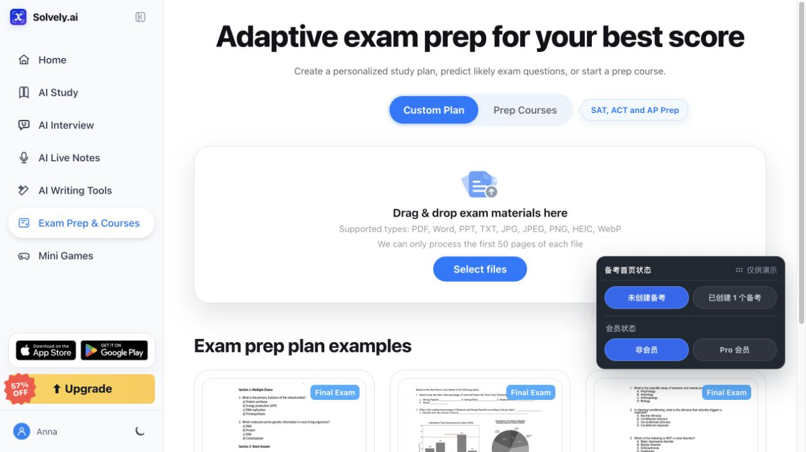

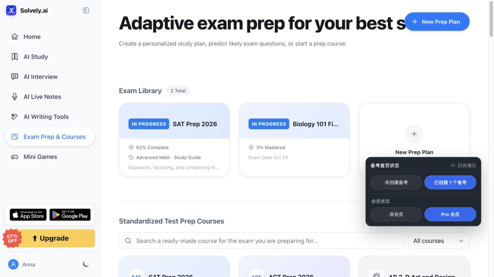

#### 4.3.2 从开始学习到查看结果

课程进度、考试卡片文案、报告权限和异常处理已分别在 4.5–4.8 定义；本节只说明用户实际经历的一条主流程，不重复枚举状态组合。

| 步骤 | 用户看到什么 | 产品行为 |
|---|---|---|
| 1. 浏览课程 | 可以查看课程首页和内容目录，但首页仍不显示学习进度 | 仅浏览不写进度；真正打开 Study Guide、Flashcards、Quiz 或开始考试后，课程才进入 In progress，并出现在 Exam Library |
| 2. 开始测试 | 权限校验通过后进入第 1 题；已做过一部分时从保存位置继续 | 创建或恢复同一场测试；答案、题号、标记与用时自动保存 |
| 3. 提交试卷 | Submit 成功后立即回到 Course Content，测试卡显示 Scoring | 锁定本次作答并启动评分；不展示独立“完成”页面 |
| 4. 等待评分 | 用户仍停留在课程首页；评分完成后卡片自动变为 Results ready | 保存成绩和报告；不会自动跳转，避免打断用户 |
| 5. 查看结果 | 用户主动点击 View Free Results、View Score Report 或 `Unlock test & analysis` | 打开对应 Diagnostic / Full-Length 报告；Free/Pro 差异以 4.8 为唯一规则源 |
| 6. 继续学习 | Question Review 可免费启动 3 题 Mini Quiz；Targeted Practice 按权限进入 | Mini Quiz 在右侧抽屉完成，不进入 Study Plan；Diagnostic Retake 回到 Not started；Full-Length Retake 需二次确认，确认后删除当前结果并开始新测试 |

> 同一用户同一时间只允许进行一场尚未提交的测试。开始另一场测试前需先 Save and Exit；无效直链或冲突请求返回课程页，不展示拼接状态，也不删除已经保存的学习进度或历史报告。

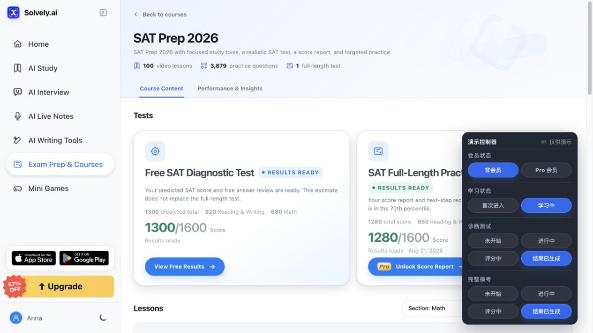

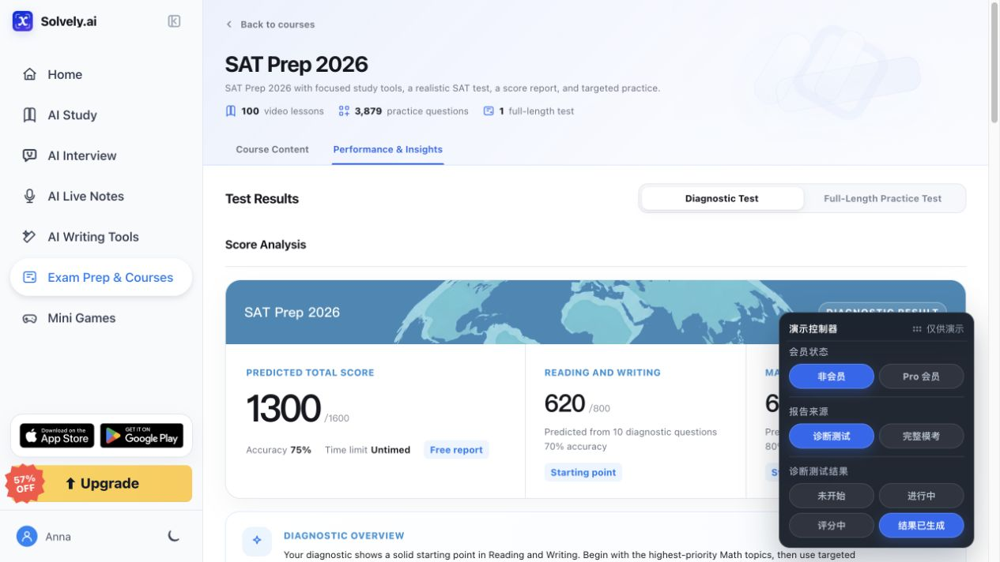

### 4.4 首页与课程发现

#### 4.4.1 首次进入首页

| 项目 | 说明 | 图示 |
|---|---|---|
| 页面头部 | 当用户没有成功创建过 Custom Plan，且没有开始过任何 Prep Course 学习资源或考试时，不展示全页营销主标题。内容区首个标题左对齐展示 **Create your personalized prep plan**，副标题为 `Identify high-yield topics and predict likely exam questions`；标题与下方 Standardized test prep courses 使用一致的模块层级。 | 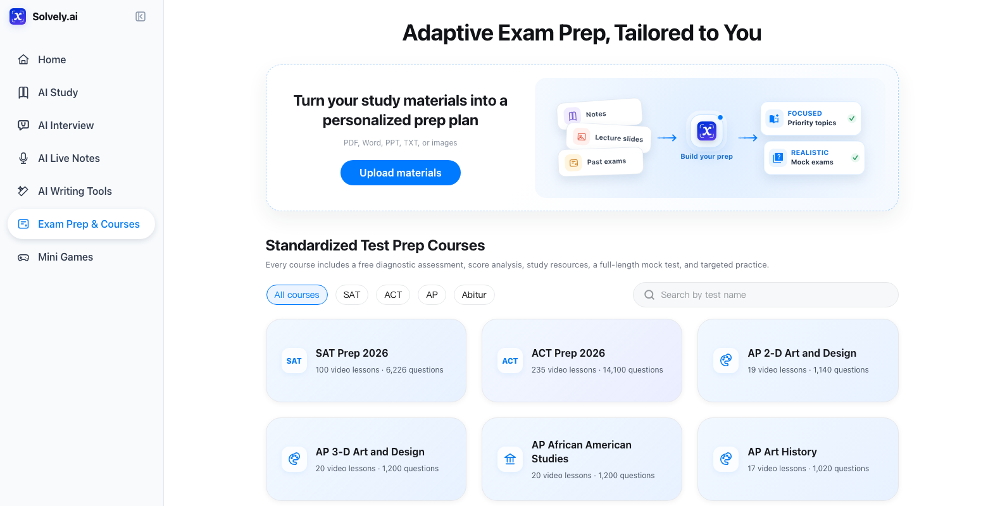 |
| 页面结构 | Custom Plan 上传区与 Standardized test prep courses 同屏纵向展示，不再使用顶部 `Custom Plan / Prep Courses` 切换 Tab，也不展示 `SAT, ACT and AP Prep` 气泡。滚动页面即可浏览课程。 | 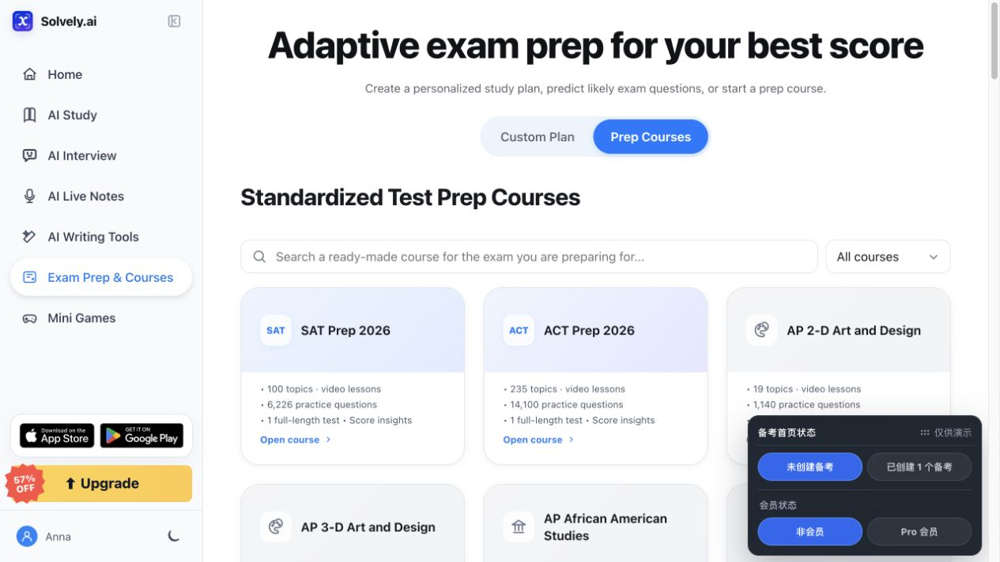 |
| Custom Plan 上传 | 整个虚线区域都可点击、键盘触发或拖拽上传；上传框内不重复标题或副标题，以居中的生成流程插图为主体。格式提示 `PDF, Word, PPT, TXT, or images` 与 CTA `Upload materials` 位于流程图下方居中，且与插图同处一个连续上传面，不再使用独立浅蓝插图底框。不在入口外露页数限制；文件校验时仍按每个文件最多处理 50 页。 |  |
| 上传交互与反馈 | Hover 整个虚线框时，边框与背景呈品牌蓝高亮，鼠标显示可点击；键盘聚焦显示焦点环，Enter/Space 与点击 Upload materials 执行同一上传动作，每次只打开一次文件选择器。拖入文件进入同一校验流程；取消选择不创建计划或进度。选择文件后先进入“已上传文件”中间状态，不直接打开创建弹窗。 | 见 VIS-01 |
| 已上传文件状态 | 虚线入口替换为同宽文件面板。顶部显示 `Files uploaded: {fileCount}/10`；每个文件卡显示文件图标、完整文件名、格式化大小和 Remove；`Add more files` 继续使用同一选择器并最多累计 10 个；右下角 `Continue` 仅在至少 1 个有效文件时可用。Remove 最后一个文件后恢复空上传入口。文件状态本身不创建计划或进度。 | 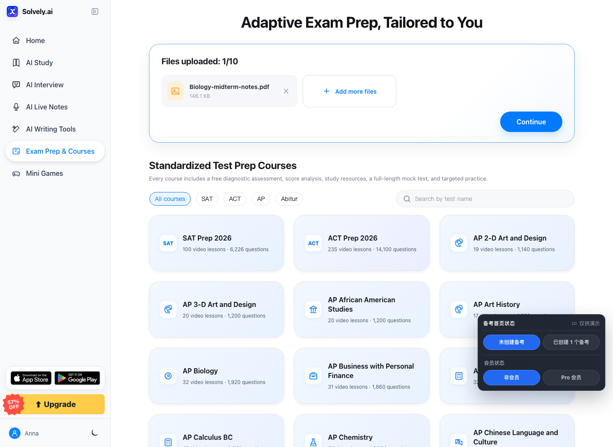 |
| 插图与空间层级 | 桌面端同一虚线框内居中展示代码绘制流程图：Notes、Lecture slides、Past exams → Solvely Logo / Build your prep → FOCUSED / Priority topics、REALISTIC / Mock exams；格式提示与 CTA 紧随其下。插图不表示已生成真实结果，不提供独立操作，也不再使用内嵌卡片底色。上传区约 238px 高，与课程区约 38px 间距；`Create your personalized prep plan` 与课程区标题均约 24px。窄屏自适应缩放并纵向保留操作区，文字完整换行，不裁切或省略；最小文字 12px。 | 见 VIS-01 |
| 示例计划 | 不展示原 3 张 Sample 卡；上传区结束后直接展示 Standardized test prep courses。 |  |
| 创建计划弹窗 | 用户在已上传文件状态点击 `Continue` 后打开。标题 `Sharpen your prediction`；必填 `School Name`（Placeholder：`e.g. University of Georgia`）、必填 `Course Code & Name`（Placeholder：`e.g. BIOL 101 - Principles of Biology`）、必填 `Exam Type`（Midterm Exam / Final Exam / Quiz / Others，单选，默认 Midterm Exam）、可选 `Exam Date`。主 CTA 为 `Create Prep Plan`；X/Escape 关闭并保留本次已上传文件，未提交不生成计划或首页进度。已有计划的 Edit 入口继续使用 Edit prep plan / Save changes。 | 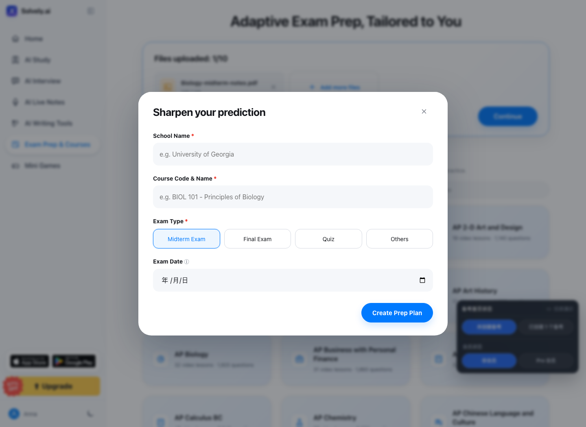 |

#### 4.4.2 已有进度首页

| 项目 | 说明 | 图示 |
|---|---|---|
| 页面头部 | 当用户成功创建至少一个 Custom Plan，或实际开始任一 Prep Course 的 Study Guide、Flashcards、Quiz、Lesson、Diagnostic 或 Full-Length Test 后，标题切换为 **Stay on Track for Your Best Score**；副标题切换为 **Personalized exam prep, all the way to test day**。标题桌面端 36px、700 字重，在 ≤820px / ≤560px 时分别为 34px / 28px；副标题桌面端 15px。右上角展示 `+ New Prep Plan`。仅浏览、搜索、打开课程或取消弹窗不得触发此状态。 | 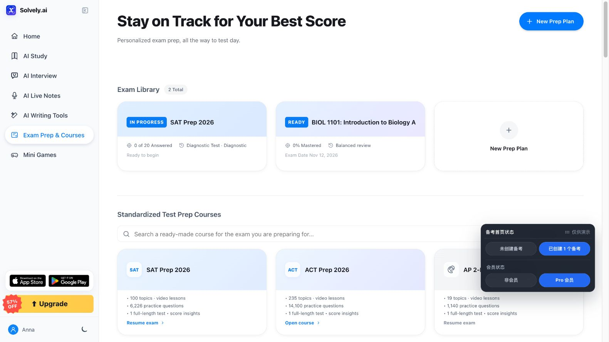 |
| Exam Library | 同时展示用户创建的计划和已经学习的 Prep Course。课程卡显示 `IN PROGRESS`，并固定为两行有效信息：第一行只显示当前工具进度，例如 `24 of 120 answered` 或 `62% complete`；第二行显示工具上下文。Study Guide、Flashcards、Quiz 等学习工具有 Section 时显示 `{Section} · {Tool}`，例如 `Advanced Math · Study Guide`，没有 Section 时只显示 Tool；`Full-length practice test` 和 `Free diagnostic` 一律不显示 Section，第二行只显示工具名。不得再追加第三行或出现重复工具名称。计划卡显示 READY/IN PROGRESS 与考试日期。 |  |
| 继续学习 | 点击课程进度卡，进入上次学习的课程/Topic/工具；点击计划卡进入计划详情。Course 一旦有进度，就必须同步出现在 Exam Library。 |  |
| 侧边栏 | 支持折叠/展开；折叠不改变主内容层级和三列卡片尺寸。 | 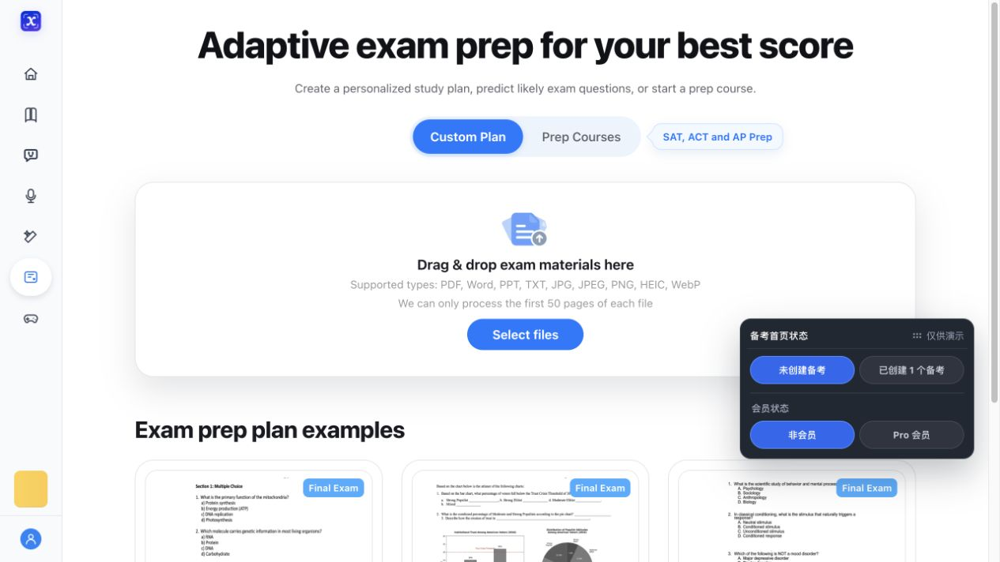 |

#### 4.4.3 Standardized test prep courses

| 项目 | 说明 | 图示 |
|---|---|---|
| 标题与搜索 | 标题：`Standardized test prep courses`；说明：`Free diagnostic, full-length mock test, and targeted practice`；不展示 Total。桌面端标题/副标题位于左侧，搜索框与标题区同一行并靠右，Placeholder 为 `Search by test name`；窄屏时搜索框换到下一行并占满内容宽度。 |  |
| 搜索与 AP 学科筛选 | 不提供 All courses / SAT / ACT / AP / Abitur 考试家族总筛选。搜索按课程名称实时匹配并作用于全部分区；AP 分区单独提供 All subjects、Social Studies、Math、Language、Science、Business、Engineering、Arts，搜索与 AP 学科筛选按 AND 生效，不切换页面或创建进度。 |  |
| 课程分组 | 筛选与搜索之后，非空结果按 `College admission tests`（SAT、ACT）、`Advanced Placement® tests`（全部 AP）、`Abiturprüfungen`（德国 Abitur）分组展示；空分组隐藏。分组标题仅建立信息层级，不改变课程卡片顺序、尺寸、入口权限或进度状态。 |  |
| 卡片网格 | 桌面端一行固定三张；卡片尺寸和间距与首页 Demo 一致。只有两张结果时，仍保持三列中单卡宽度，不拉伸。 |  |
| 卡片信息 | 卡片整体为一个视觉区块，只展示课程名与一行副标题 `{videoLessonCount} video lessons · {practiceQuestionCount} questions`；所有数量以课程当前发布配置为准。卡片不展示 CTA、Total、`score insights` 或上下分区。 |  |
| 卡片入口与权限 | `course_ready=true` 的课程卡可点击，Free 与 Pro 进入相同课程页，入口不得出现 Pro 标识或 Paywall；当前 Demo 为 SAT、ACT、AP Calculus BC、Abitur Mathematik。没有内容数据的卡片 disabled、使用 `Course unavailable: {course}` 无障碍名称且不跳独立占位页。只打开可用课程不创建进度；进入后仅在触发 M-03/M-05/M-06/M-07 的受限动作时校验会员。 | 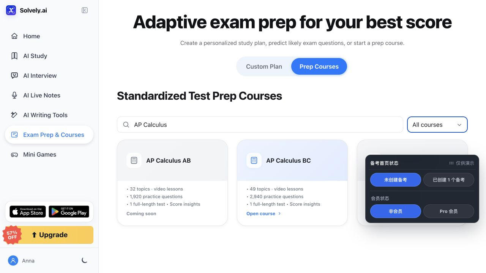 |
| 空结果 | 全局搜索无匹配课程时展示 `No matching courses. Try another exam name.`；AP 学科在当前搜索条件下无结果时展示 `No AP courses match this subject.`。保留搜索框和 AP 学科筛选，不展示旧版 Clear search CTA。 | 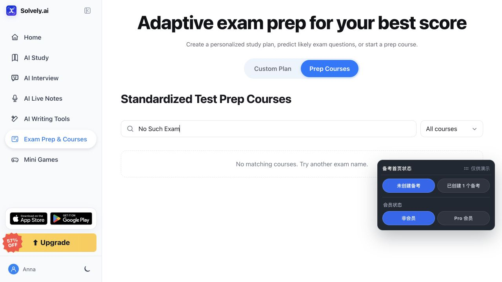 |

### 4.5 统一课程页面与学习内容

SAT、ACT、AP 与 Abitur 的课程页面使用同一个页面模板和同一套交互，不按考试体系另做版式。四类课程都包含统一的课程头部、`Course Content / Performance & Insights`、Tests、Lessons、Topic 学习工具及状态卡。下文表格只列数据与内容配置差异；不得据此改变页面层级、组件尺寸、CTA 位置或导航方式。

#### 4.5.1 SAT / ACT / AP / Abitur 课程头部数据（同一页面结构）

| 项目 | 说明 | 图示 |
|---|---|---|
| SAT | `SAT Prep 2026`；100 video lessons；课程数据层 practice questions 需统一口径；1 full-length test。使用统一课程页面。 | 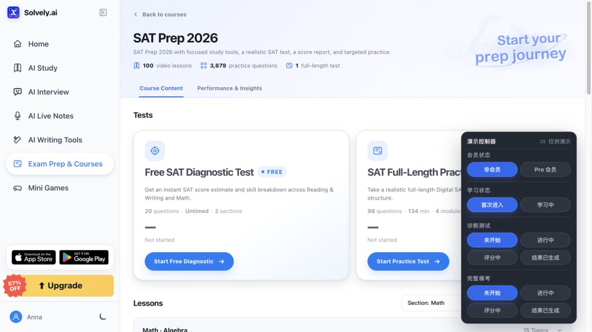 |
| ACT | `ACT Prep 2026`；235 video lessons；6,600 课程练习题；1 full-length test。使用统一课程页面。 | 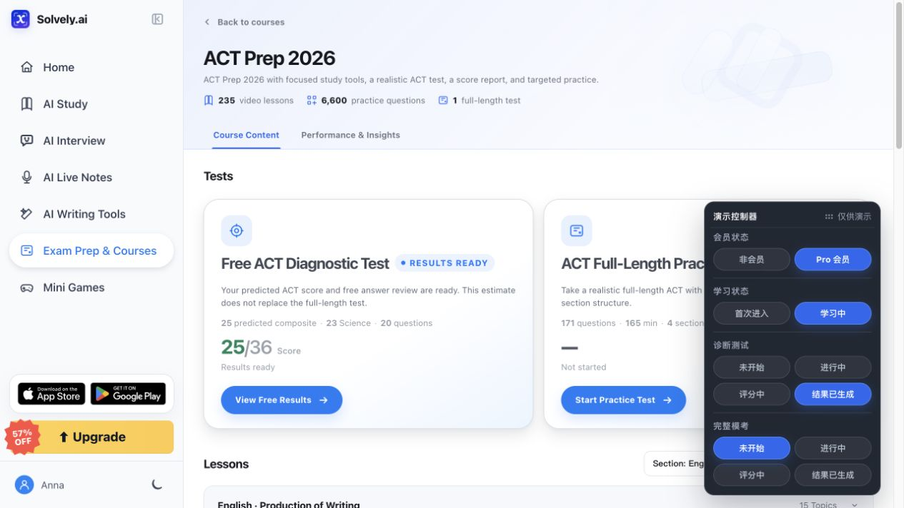 |
| AP Calculus BC | `AP Calculus BC Prep 2027`；49 video lessons；2,940 课程练习题；1 full-length test。页面布局、Tests/Lessons 顺序、状态卡与 CTA 交互和 SAT/ACT 完全一致。 | 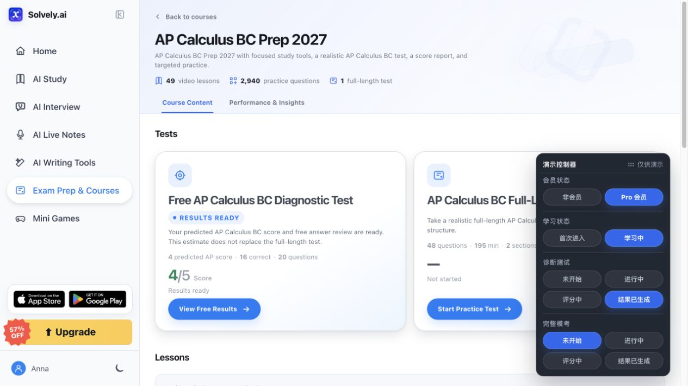 |
| Abitur Mathematik | `Abitur Mathematik Prep 2027`；31 video lessons；2,929 课程练习题；1 full-length test。页面布局、Tests/Lessons 顺序、状态卡与 CTA 交互和 SAT/ACT 完全复用同一组件；只替换课程数据与考试专属术语。 | 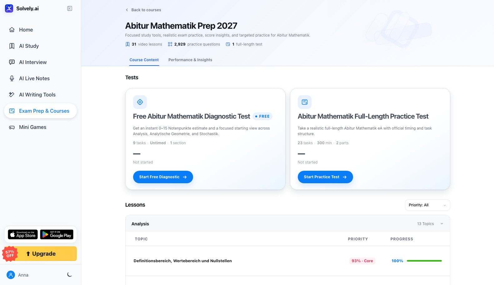 |
| 课程状态 | First visit 右侧展示 `Start your prep journey`；In progress 替换为真实学习进度，不重复展示营销标签。 | 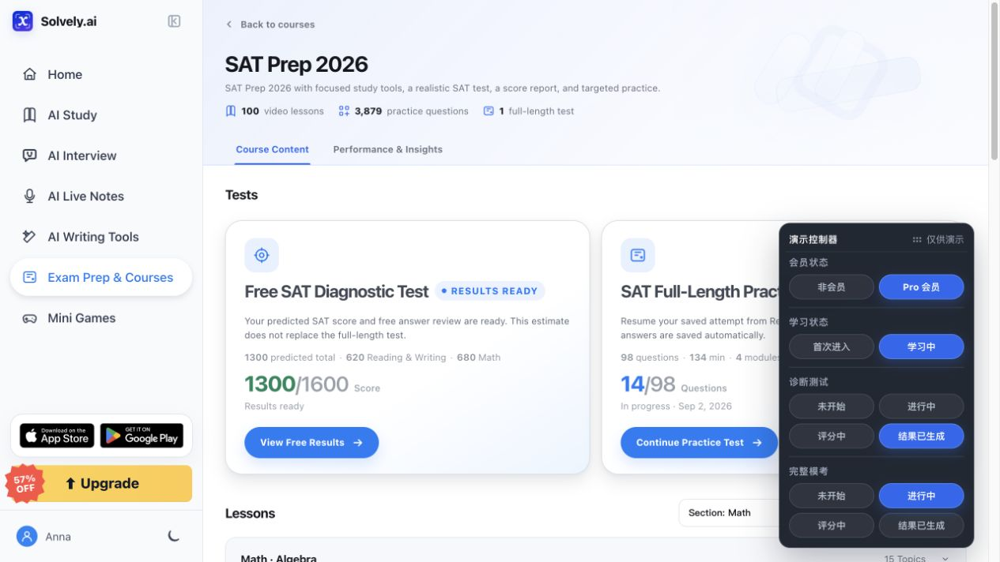 |
| 主 Tab | `Course Content` / `Performance & Insights`。Course Content 包含 Tests 和 Lessons；Performance & Insights 包含报告。 |  |

> AP 与 Abitur 都不新增独立课程页模板。视觉间距、卡片尺寸、Tab、Tests/Lessons 层级、学习工具入口和所有状态交互均跟随 SAT/ACT 课程页；4.6.6–4.6.7 和 4.7.2 仅定义考试数据与报告内容差异。

#### 4.5.2 Lessons

| 项目 | 说明 | 图示 |
|---|---|---|
| SAT | Section 筛选显示 Reading and Writing、Math；Topic 分组标题包含对应 Section/Domain。 | 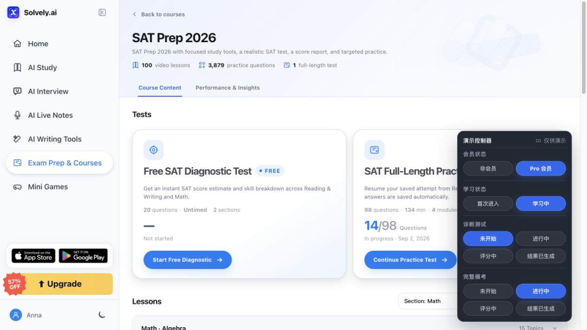 |
| ACT | Section 筛选显示 English、Mathematics、Reading、Science、Writing；Topic 分组按 ACT 官方结构。 |  |
| AP | 复用同一 Lessons 列表、折叠和 Priority 控件；由于 AP 没有 SAT/ACT 的 Section 概念，仅隐藏冗余 Section 下拉框。分组标题为 Unit，Topic 名称不重复 AP Calculus BC；其余布局和交互不变。 | 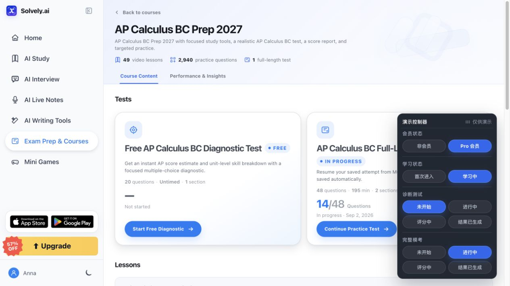 |
| Abitur Mathematik | 复用同一 Lessons 列表与 Priority 控件；当前课程只有 Mathematics，一个冗余 Section 下拉框不展示。内容按 Analysis、Analytische Geometrie/Lineare Algebra、Stochastik 分组，Topic 名称不重复课程名。 | 页面结构与 VIS-11/12 相同；只由课程数据决定分组 |
| Priority | 全部考试支持 All、Core、Likely、Possible；切换后只展示匹配 Topic，并保持分组空态处理。 | 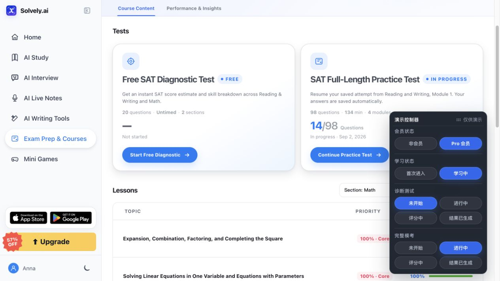 |
| 分组折叠 | 点击分组标题展开/折叠；状态在本次会话保持，且键盘可操作。 | 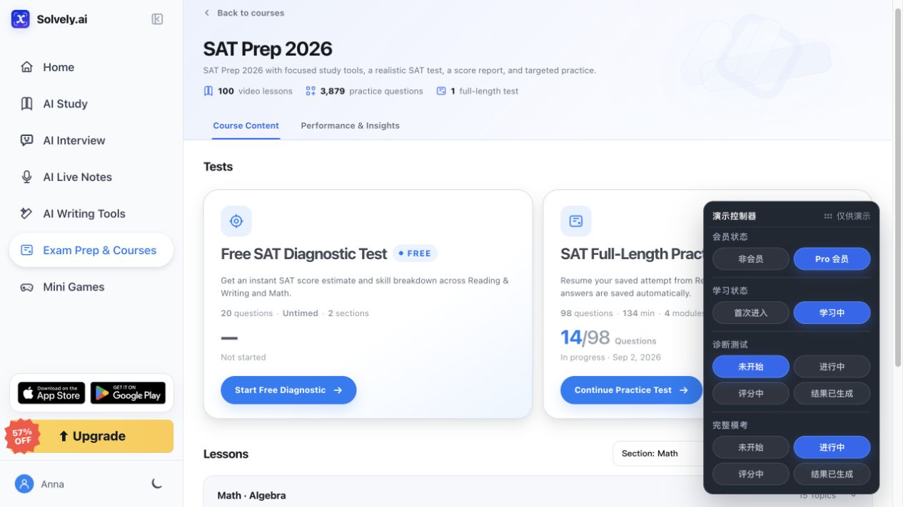 |
| Topic 工具入口 | Hover 或键盘聚焦 Topic 行展示浮层：Study Guide、Flashcards、Quiz。浮层不因移动到浮层内部而消失。 | 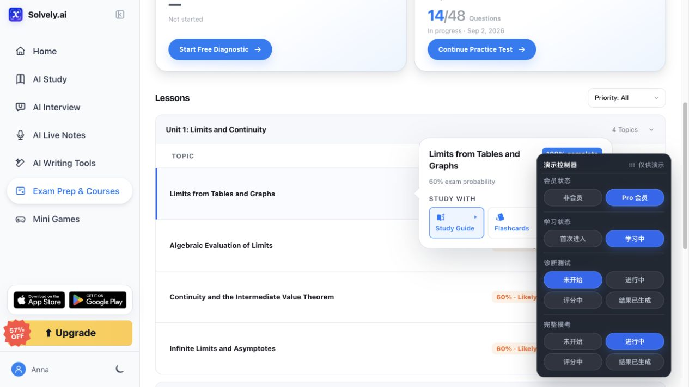 |

#### 4.5.3 Diagnostic Test 卡片状态与文案

Diagnostic 对 Free 与 Pro 均免费，卡片标题固定为 `{exam} Diagnostic Test`，不存在会员专属卡片文案。下表是研发和本地化的唯一完整文案表；`{answeredCount}`、`{date}` 与结果分数字段必须读取真实 attempt/report，Demo 示例值不得写死到生产。

| 考试 | 状态 | 标签 | 完整说明文案 | 指标行 | 进度与状态 | CTA | 点击结果 | 图示 |
|---|---|---|---|---|---|---|---|---|
| SAT | Not started | `Free` | `Get an instant SAT score estimate and skill breakdown across Reading & Writing and Math.` | `20 questions · Untimed · 2 sections` | `—`；`Not started` | `Start Free Diagnostic` | 免费创建 Diagnostic attempt 并进入第 1 题 | 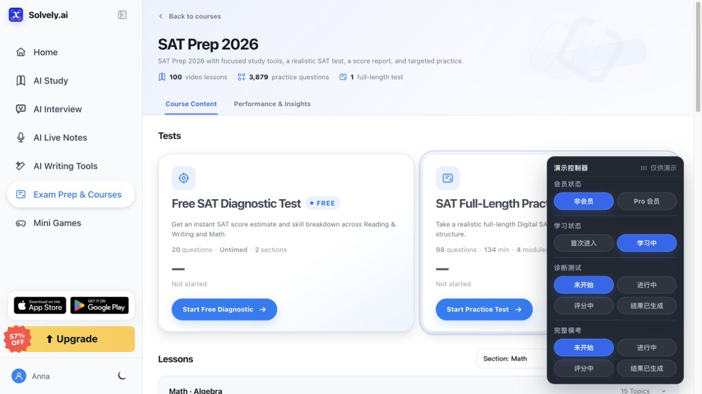 |
| SAT | In progress | `In progress` | `Continue your quick SAT score and skill check. Your answers are saved automatically.` | `20 questions · Untimed · 2 sections` | `{answeredCount}/20 Questions`；`In progress · {date}` | `Continue Diagnostic` | 免费恢复同一 attempt 与已保存题位 | 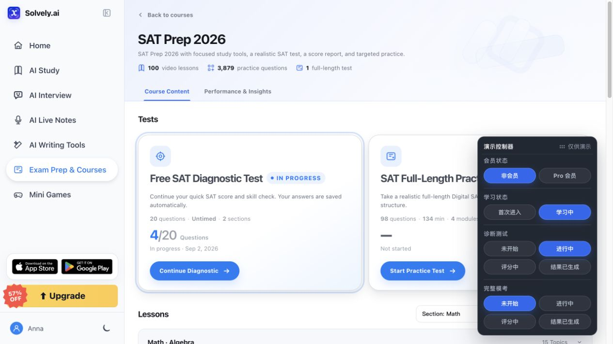 |
| SAT | Scoring | `Scoring` | `Your answers were submitted. We are calculating your total and section score predictions; results are usually ready in a few seconds.` | `20 questions · Untimed · 2 sections` | `20/20 Questions`；`Scoring results…` | `Scoring…`（disabled） | 不可重复提交；评分完成后自动变 Results ready | 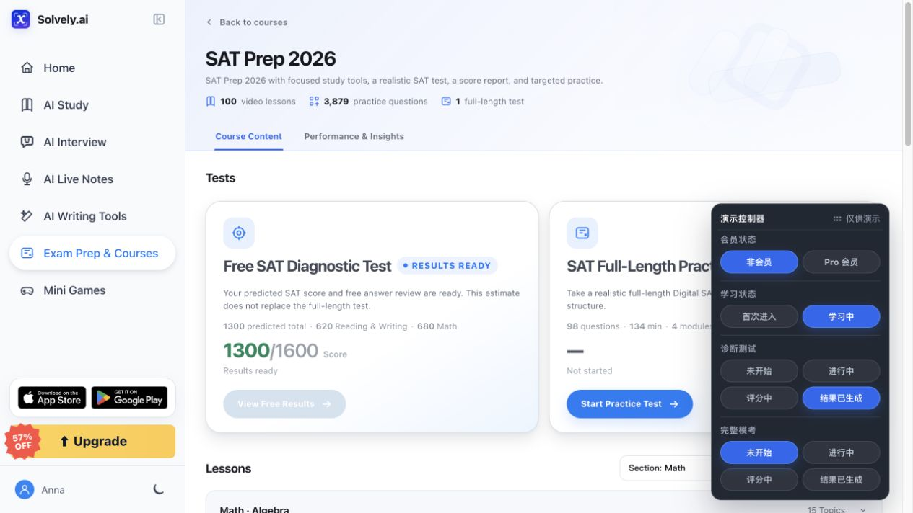 |
| SAT | Results ready | `Results ready` | `Your predicted SAT score and free answer review are ready. This estimate does not replace the full-length test.` | `{predictedTotal} predicted total · {readingWritingScore} Reading & Writing · {mathScore} Math` | `{predictedTotal}/1600 Score`；`Results ready` | `View Free Results` | 免费打开 Diagnostic 报告 | 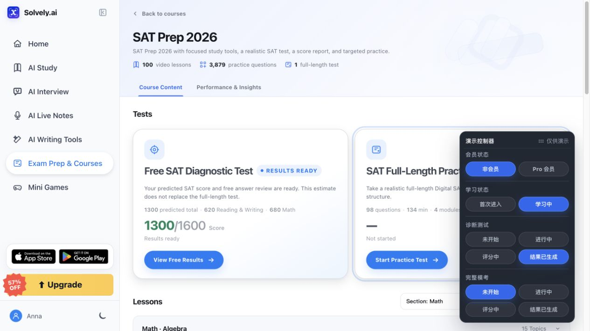 |
| ACT | Not started | `Free` | `Get an instant ACT score estimate and skill breakdown across English, Math, Reading, and Science.` | `33 questions · Untimed · 4 sections` | `—`；`Not started` | `Start Free Diagnostic` | 免费创建 Diagnostic attempt 并进入第 1 题 | 同 VIS-15 布局 |
| ACT | In progress | `In progress` | `Continue your quick ACT score and skill check. Your answers are saved automatically.` | `33 questions · Untimed · 4 sections` | `{answeredCount}/33 Questions`；`In progress · {date}` | `Continue Diagnostic` | 免费恢复同一 attempt 与已保存题位 | 同 VIS-16 布局 |
| ACT | Scoring | `Scoring` | `Your answers were submitted. We are calculating your composite and section score predictions; results are usually ready in a few seconds.` | `33 questions · Untimed · 4 sections` | `33/33 Questions`；`Scoring results…` | `Scoring…`（disabled） | 不可重复提交；评分完成后自动变 Results ready | 同 VIS-17 布局 |
| ACT | Results ready | `Results ready` | `Your predicted ACT score and free answer review are ready. This estimate does not replace the full-length test.` | `{predictedComposite} predicted composite · {scienceScore} Science · 33 questions` | `{predictedComposite}/36 Score`；`Results ready` | `View Free Results` | 免费打开 Diagnostic 报告 | 同 VIS-18 布局 |
| AP Calculus BC | Not started | `Free` | `Get an instant AP score estimate and unit-level skill breakdown with a focused multiple-choice diagnostic.` | `20 questions · Untimed · Multiple Choice` | `—`；`Not started` | `Start Free Diagnostic` | 免费创建 Diagnostic attempt 并进入第 1 题 | 同 VIS-15 布局 |
| AP Calculus BC | In progress | `In progress` | `Continue your quick AP Calculus BC score and skill check. Your answers are saved automatically.` | `20 questions · Untimed · Multiple Choice` | `{answeredCount}/20 Questions`；`In progress · {date}` | `Continue Diagnostic` | 免费恢复同一 attempt 与已保存题位 | 同 VIS-16 布局 |
| AP Calculus BC | Scoring | `Scoring` | `Your answers were submitted. We are calculating your AP score and unit-level performance estimate; results are usually ready in a few seconds.` | `20 questions · Untimed · Multiple Choice` | `20/20 Questions`；`Scoring results…` | `Scoring…`（disabled） | 不可重复提交；评分完成后自动变 Results ready | 同 VIS-17 布局 |
| AP Calculus BC | Results ready | `Results ready` | `Your predicted AP Calculus BC score and free answer review are ready. This estimate does not replace the full-length test.` | `{predictedAPScore} predicted AP score · {correctCount} correct · 20 questions` | `{predictedAPScore}/5 Score`；`Results ready` | `View Free Results` | 免费打开 Diagnostic 报告 | 同 VIS-18 布局 |
| Abitur Mathematik | Not started | `Free` | `Get an instant 0–15 Notenpunkte estimate and a focused starting view across Analysis, Analytische Geometrie, and Stochastik.` | `9 tasks · Untimed · 3 content domains` | `—`；`Not started` | `Start Free Diagnostic` | 免费创建 Diagnostic attempt 并进入第 1 题 | 同 VIS-15 布局 |
| Abitur Mathematik | In progress | `In progress` | `Continue your quick Abitur Mathematik score and skill check. Your answers are saved automatically.` | `9 tasks · Untimed · 3 content domains` | `{answeredCount}/9 Tasks`；`In progress · {date}` | `Continue Diagnostic` | 免费恢复同一 attempt 与已保存题位 | 同 VIS-16 布局 |
| Abitur Mathematik | Scoring | `Scoring` | `Your answers were submitted. We are calculating your BE result, Notenpunkte estimate, and performance by content domain.` | `9 tasks · Untimed · 3 content domains` | `9/9 Tasks`；`Scoring results…` | `Scoring…`（disabled） | 不可重复提交；评分完成后自动变 Results ready | 同 VIS-17 布局 |
| Abitur Mathematik | Results ready | `Results ready` | `Your predicted Abitur Mathematik score and free answer review are ready. This estimate does not replace the full-length test.` | `{predictedNotenpunkte} predicted Notenpunkte · {earnedBE}/{maximumBE} BE · 9 tasks` | `{predictedNotenpunkte}/15 Score`；`Results ready` | `View Free Results` | 免费打开 Diagnostic 报告 | 同 VIS-18 布局；报告差异见 4.7.2 |

Diagnostic 内容基线与图表完整性：

| 考试 | 当前题源与模块 | 题型与选项 | 必须随题保留的材料 |
|---|---|---|---|
| SAT | College Board 样例题中筛选的 Reading & Writing 10 题 + Math 10 题，共 20 题、2 个 Section | R&W 为 A/B/C/D；Math 同时包含 A/B/C/D 与 Student-Produced Response 输入题 | 题目引用的双直线坐标图、手机使用数据表必须在题面显示；公式与符号完整排版。缺图时该题不得发布。 |
| ACT | `0.7. New ACT Mini G` 的计分题：English 10、Mathematics 9、Reading 7、Science 7，共 33 题、4 个 Section | 按源题保留 A/B/C/D 与 F/G/H/J；不得把 `NO CHANGE` 或其他选项拼进题干 | English/Reading 保留完整 passage 与题目引用高亮；Mathematics 保留三角形平行线图；Science 保留实验装置图与两张数据表。缺 passage、图或表时该题不得发布。 |

所有图片使用与题目稳定关联的 `asset_uri` 与描述性 `alt`；桌面端在 passage/题目侧完整可读，窄屏按容器等比缩放，不裁切、不拉伸、不用与源题无关的占位图替换。图像加载失败时显示明确错误并阻止提交该题，避免用户在信息不完整时作答。

#### 4.5.4 Full-Length Practice Test 卡片状态与文案

卡片标题固定为 `{exam} Full-Length Practice Test`。下表写全四类完整 Demo 考试的内容差异；`{answeredCount}`、`{timeUsed}`、`{date}`、`{percentile}`、BE 与分数均读取真实 attempt/report。

| 考试 | 状态 | 标签 | 完整说明文案 | 指标行 | 进度与状态 | 卡片 CTA | 图示 |
|---|---|---|---|---|---|---|---|
| SAT | Not started | 无；Free 用户标题旁有 Pro badge | `Take a realistic full-length Digital SAT with official timing and section structure.` | `120 questions · 164 min · 4 modules` | `—`；`Not started` | `Start Practice Test` | 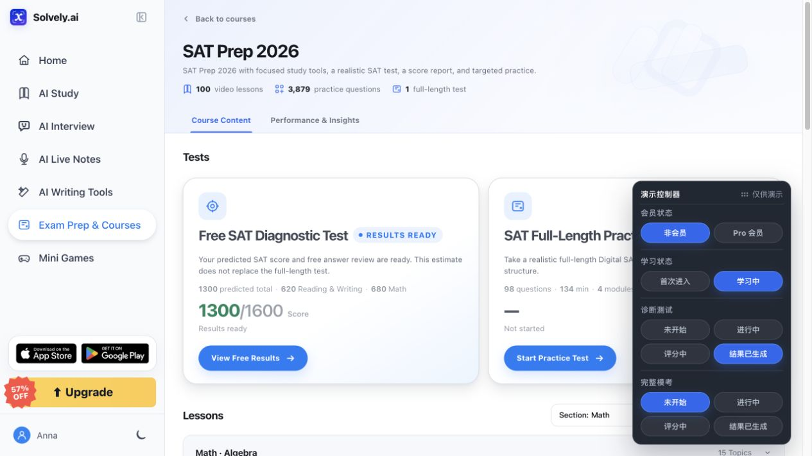 |
| SAT | In progress | `In progress`；Free 用户标题旁有 Pro badge | `Resume your saved attempt from Reading and Writing, Module 1. Your answers are saved automatically.` | `120 questions · 164 min · 4 modules` | `{answeredCount}/120 Questions`；`In progress · {date}` | `Continue Practice Test` | 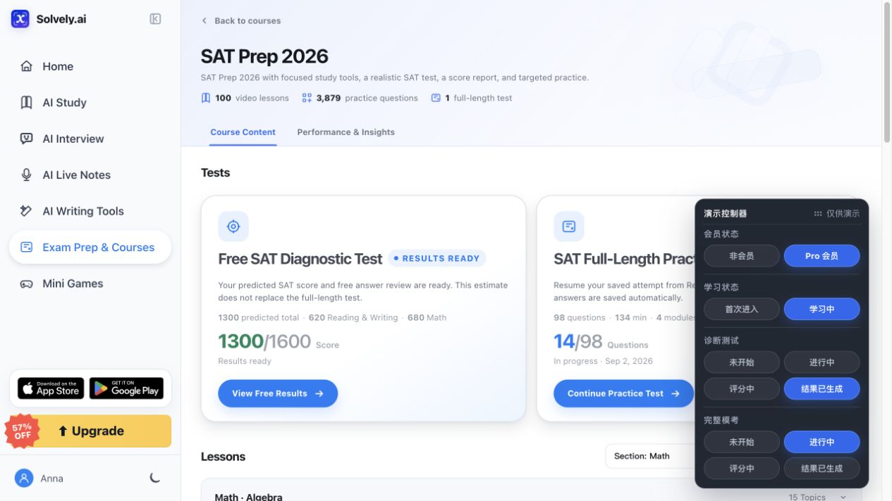 |
| SAT | Scoring | `Scoring`；Free 用户标题旁有 Pro badge | `Your answers were submitted. We are preparing your score report and personalized recommendations; results are usually ready in under a minute.` | `{answeredCount} answered · {timeUsed} time used · 4 modules` | `{answeredCount}/120 Questions`；`Scoring results…` | `Scoring…`（disabled） | 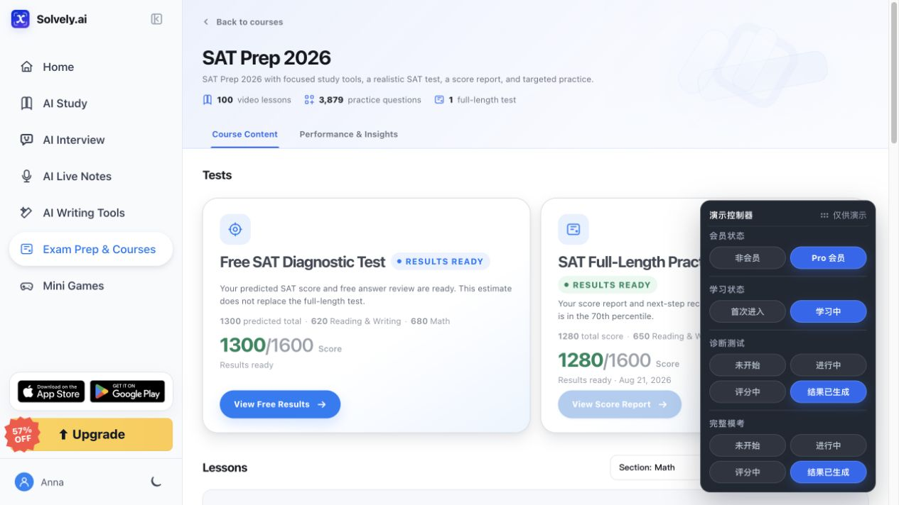 |
| SAT | Results ready | `Results ready`；Free 用户标题旁有 Pro badge | `Your score report and next-step recommendations are ready. Your result is in the {percentile} percentile.` | `{totalScore} total score · {readingWritingScore} Reading & Writing · {mathScore} Math` | `{totalScore}/1600 Score`；`Results ready · {date}` | Pro：`View Score Report`；Free：`Unlock test & analysis` | 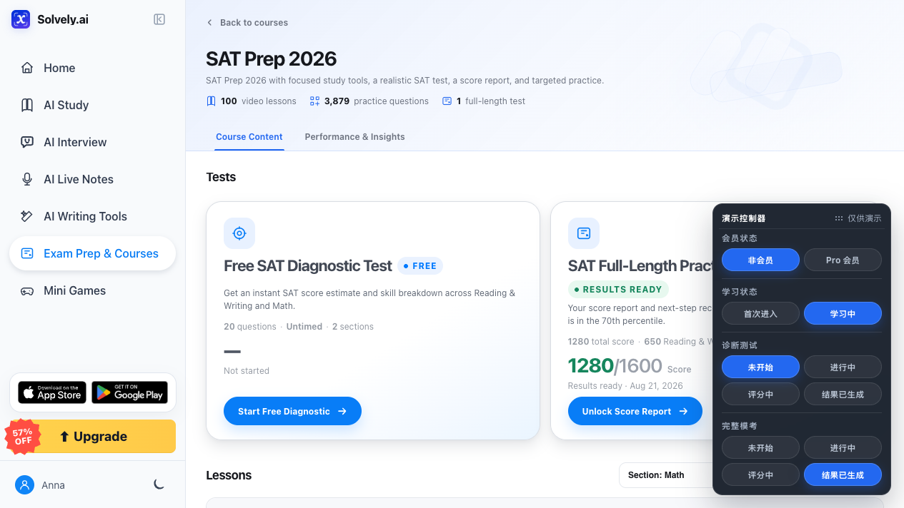 |
| ACT | Not started | 无；Free 用户标题旁有 Pro badge | `Take a realistic full-length ACT with Science and Writing with official timing and section structure.` | `171 + 1 questions + essay · 205 min · 5 sections` | `—`；`Not started` | `Start Practice Test` | 同 VIS-19 布局 |
| ACT | In progress | `In progress`；Free 用户标题旁有 Pro badge | `Resume your saved attempt from English, Section 1. Your answers are saved automatically.` | `171 + 1 questions + essay · 205 min · 5 sections` | `{answeredCount}/171 Questions`；`In progress · {date}` | `Continue Practice Test` | 同 VIS-20 布局 |
| ACT | Scoring | `Scoring`；Free 用户标题旁有 Pro badge | `Your answers were submitted. We are preparing your score report and personalized recommendations; results are usually ready in under a minute.` | `{answeredCount} answered · {timeUsed} time used · 5 sections` | `{answeredCount}/171 Questions`；`Scoring results…` | `Scoring…`（disabled） | 同 VIS-21 布局 |
| ACT | Results ready | `Results ready`；Free 用户标题旁有 Pro badge | `Your score report and next-step recommendations are ready. Your result is in the {percentile} percentile.` | `{compositeScore} composite · {scienceScore} Science · {writingScore} Writing /12` | `{compositeScore}/36 Score`；`Results ready · {date}` | Pro：`View Score Report`；Free：`Unlock test & analysis` | 同 VIS-22 布局 |
| AP Calculus BC | Not started | 无；Free 用户标题旁有 Pro badge | `Take a realistic full-length AP Calculus BC with official timing and exam-part structure.` | `48 questions · 195 min · 2 exam parts` | `—`；`Not started` | `Start Practice Test` | 同 VIS-19 布局 |
| AP Calculus BC | In progress | `In progress`；Free 用户标题旁有 Pro badge | `Resume your saved attempt from Multiple Choice. Your answers are saved automatically.` | `48 questions · 195 min · 2 exam parts` | `{answeredCount}/48 Questions`；`In progress · {date}` | `Continue Practice Test` | 同 VIS-20 布局 |
| AP Calculus BC | Scoring | `Scoring`；Free 用户标题旁有 Pro badge | `Your answers were submitted. We are preparing your score report and personalized recommendations; results are usually ready in under a minute.` | `{answeredCount} answered · {timeUsed} time used · 2 exam parts` | `{answeredCount}/48 Questions`；`Scoring results…` | `Scoring…`（disabled） | 同 VIS-21 布局 |
| AP Calculus BC | Results ready | `Results ready`；Free 用户标题旁有 Pro badge | `Your score report and next-step recommendations are ready. Your result is in the {percentile} percentile.` | `{apScore} AP score · {percentile} percentile · 2 exam parts` | `{apScore}/5 Score`；`Results ready · {date}` | Pro：`View Score Report`；Free：`Unlock test & analysis` | 同 VIS-22 布局 |
| Abitur Mathematik | Not started | 无；Free 用户标题旁有 Pro badge | `Take a realistic full-length Abitur Mathematik eA with official timing and task structure.` | `23 tasks · 300 min · 2 parts` | `—`；`Not started` | `Start Practice Test` | 同 VIS-19 布局 |
| Abitur Mathematik | In progress | `In progress`；Free 用户标题旁有 Pro badge | `Resume your saved attempt from Prüfungsteil A. Your answers are saved automatically.` | `23 tasks · 300 min · 2 parts` | `{answeredCount}/23 Tasks`；`In progress · {date}` | `Continue Practice Test` | 同 VIS-20 布局 |
| Abitur Mathematik | Scoring | `Scoring`；Free 用户标题旁有 Pro badge | `Your answers were submitted. We are preparing your score report and personalized recommendations; results are usually ready in under a minute.` | `{answeredCount} tasks scored · {timeUsed} time used · 2 parts` | `{answeredCount}/23 Tasks`；`Scoring results…` | `Scoring…`（disabled） | 同 VIS-21 布局 |
| Abitur Mathematik | Results ready | `Results ready`；Free 用户标题旁有 Pro badge | `Your score report and next-step recommendations are ready. Your result is in the {percentile} percentile.` | `{notenpunkte} Notenpunkte · {earnedBE}/{maximumBE} BE · 2 parts` | `{notenpunkte}/15 Score`；`Results ready · {date}` | Pro：`View Score Report`；Free：`Unlock test & analysis` | 同 VIS-22 布局；报告差异见 4.7.2 |

Full-Length 卡片的权益交互统一如下。Free 用户可能出现 In progress、Scoring、Results ready，仅限用户在 Pro 期间已创建 attempt、随后权益到期；历史进度不能被重置。

| 状态 | Pro 点击结果 | Free 点击结果 | Free Paywall 价值表达 |
|---|---|---|---|
| Not started | 创建 attempt 并进入测试 | 点击 `Start Practice Test` 后打开 Paywall；校验通过前不创建 attempt | `Unlock test & analysis` |
| In progress | 恢复同一 attempt | 点击 `Continue Practice Test` 后打开 Paywall；不推进题位 | `Unlock test & analysis` |
| Scoring | CTA disabled；等待原评分任务 | CTA disabled；报告页仍可点击统一解锁入口 | `Unlock test & analysis` |
| Results ready | 点击 `View Score Report` 打开真实报告 | 卡片显示并点击 `Unlock test & analysis`；打开 Paywall | `Unlock test & analysis` |

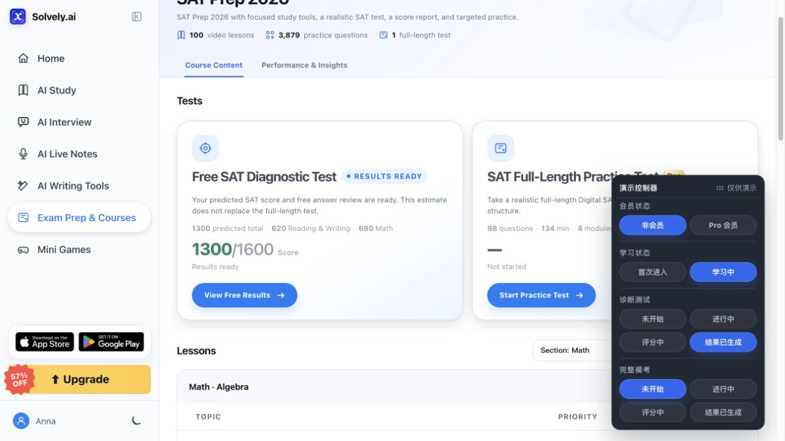

#### 4.5.5 Study Guide

| 项目 | 说明 | 图示 |
|---|---|---|
| 页面结构 | 保留课程侧栏、Topic 标题、学习工具 Tab；主体包含 Video lesson、Exam essentials、Worked examples、Quick Practice。 | 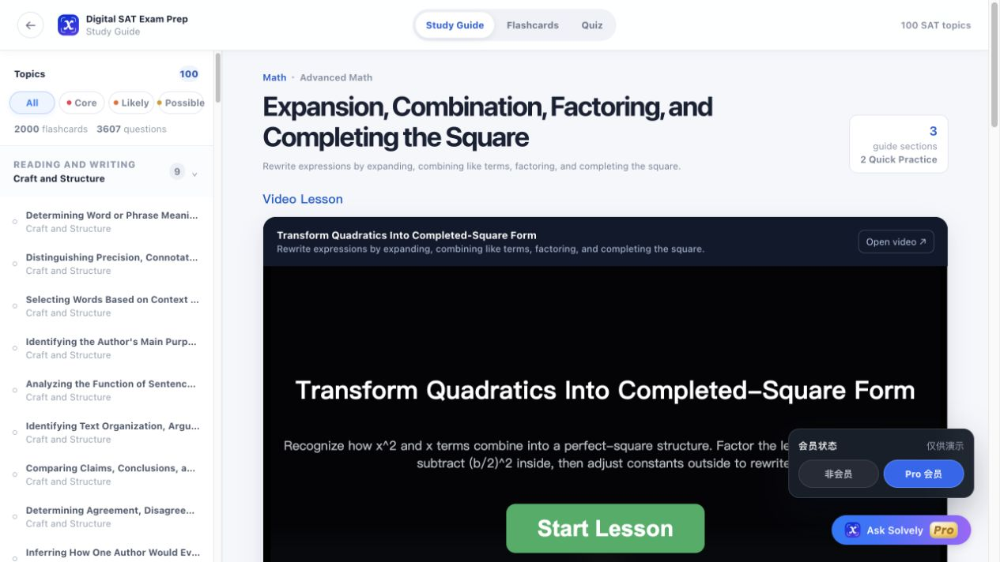 |
| 视频课 | 可播放、暂停、拖动进度、全屏；完成阈值写入 Topic 学习进度。视频加载失败时显示 Retry 和文字版内容入口。 |  |
| Quick Practice | 支持 Multiple Choice 与 Written Response；未作答前 Submit disabled。 | 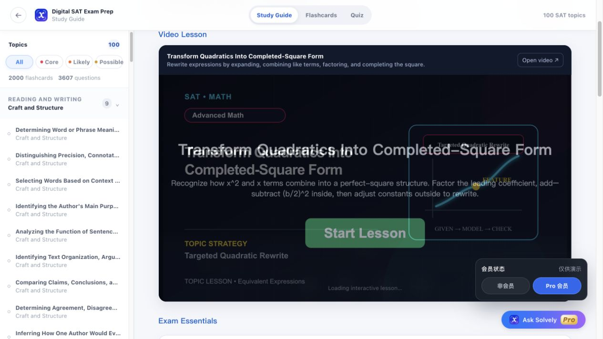 |
| 反馈 | 提交后在原位显示 Correct/Incorrect、正确答案与解释；提供 Try Another 和 Next Topic。 | 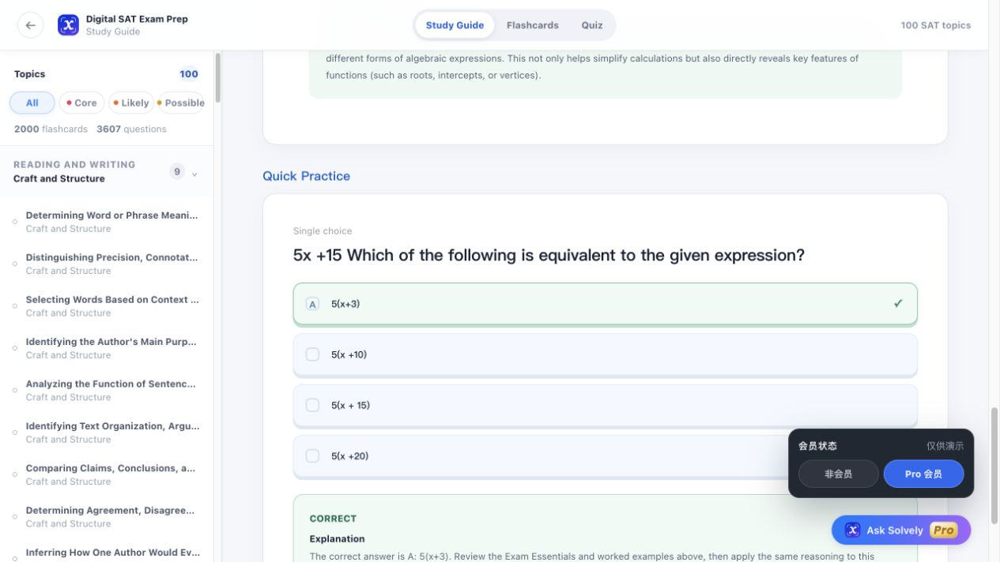 |

#### 4.5.6 Flashcards

| 项目 | 说明 | 图示 |
|---|---|---|
| Card 模式 | 默认展示正面；点击卡片或按 Space 翻面；Previous/Next 支持连续浏览；显示当前位置。 | 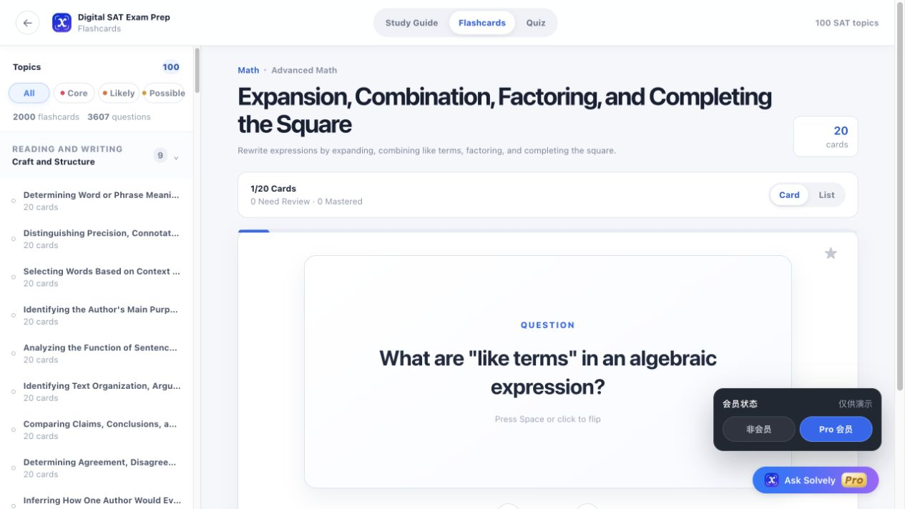 |
| 翻面 | 背面展示答案/解释；翻转动效支持 reduced-motion。 | 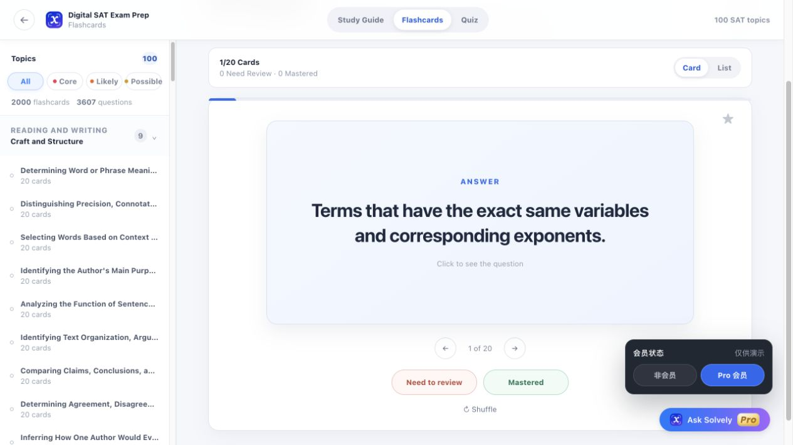 |
| 学习动作 | Star、Need to review、Mastered、Shuffle。状态保存到 Topic 级进度。 |  |
| List 模式 | 一次查看全部卡片及掌握状态；可返回 Card 模式。 | 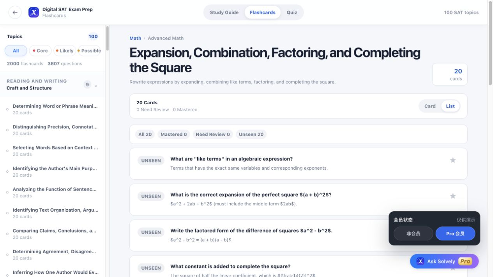 |

#### 4.5.7 Topic Quiz 与 Targeted Practice Quiz

| 项目 | 说明 | 图示 |
|---|---|---|
| Topic Quiz | 课程 Topic 内 Quiz 保留课程侧栏和 Study Guide/Flashcards/Quiz Tab；显示题号、进度、题干和选项/输入框。 | 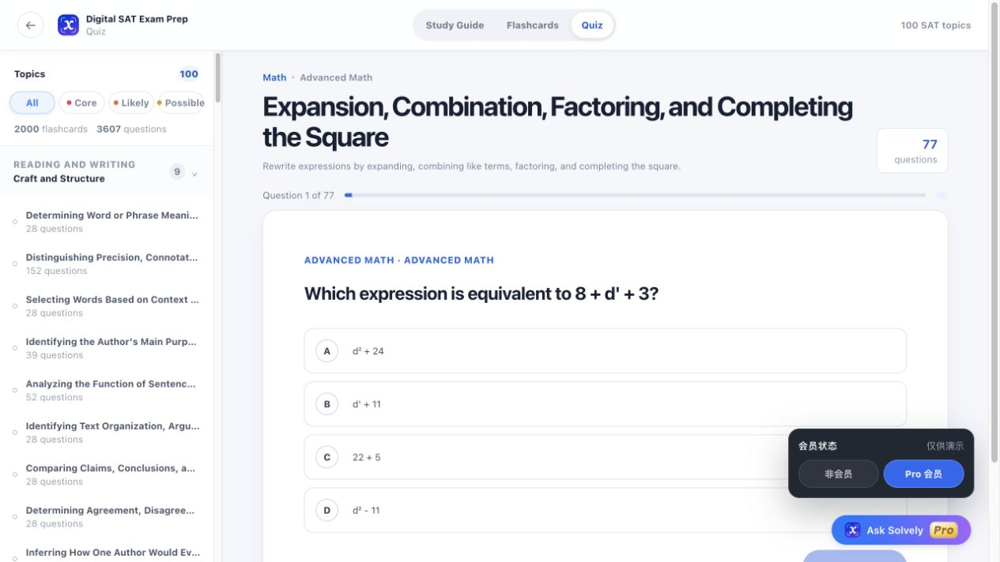 |
| 选项渲染 | 选项标签来自题目数据。ACT 必须正确展示 F/G/H/J，不能强制映射成 A/B/C/D。无选项题渲染输入框，不创建空选项。 | 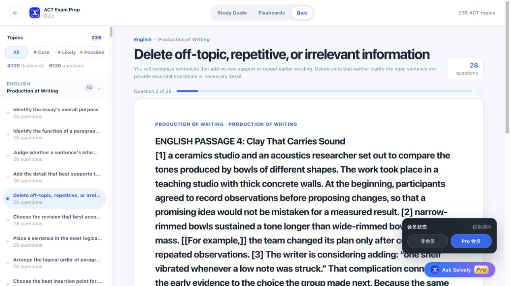 |
| 答题反馈 | 提交后显示正确性、解释、View Study Guide、Next；重新进入可恢复已作答状态。 | 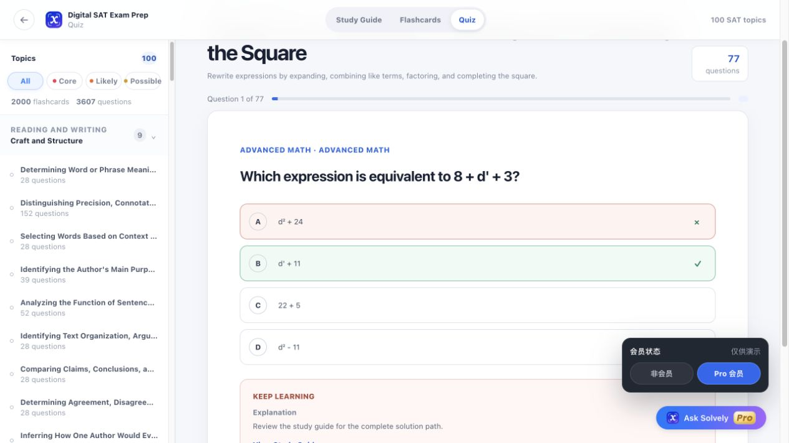 |
| Targeted Practice Quiz | 从报告点击 Practice/Continue/Review 后进入纯 Quiz 页面，仅包含答题所需内容，不展示课程侧栏、学习工具 Tab 或额外说明。 | 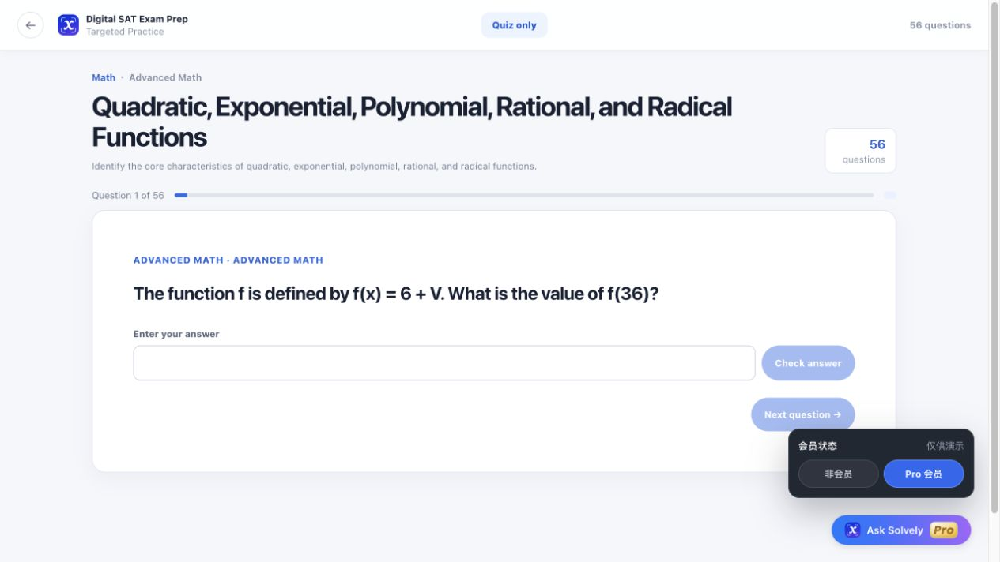 |

#### 4.5.8 Ask Solvely

| 项目 | 说明 | 图示 |
|---|---|---|
| Pro 入口 | Study Guide、Flashcards、Quiz 页面均可显示 Ask Solvely + Pro badge。Free 点击弹商业化弹窗；不阻断页面其他免费学习功能。 |  |
| 对话面板 | Pro 点击打开右侧可调整宽度的对话面板；携带当前课程、Topic、题目和作答上下文；支持 New Chat、发送文本、关闭。 | 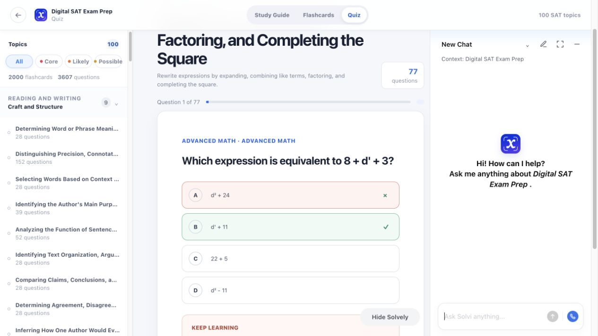 |
| 连续对话 | 消息区区分用户/AI；发送中显示 loading；失败消息支持 Retry。 | 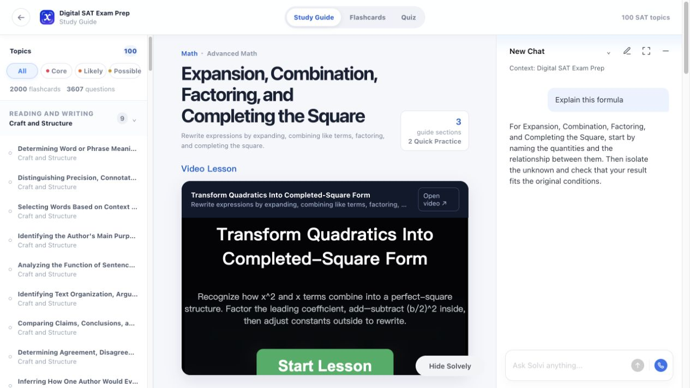 |
| 语音 | 支持 Connecting、Listening、Mute、End；麦克风权限失败时给出浏览器设置指引并保留文字输入。 | 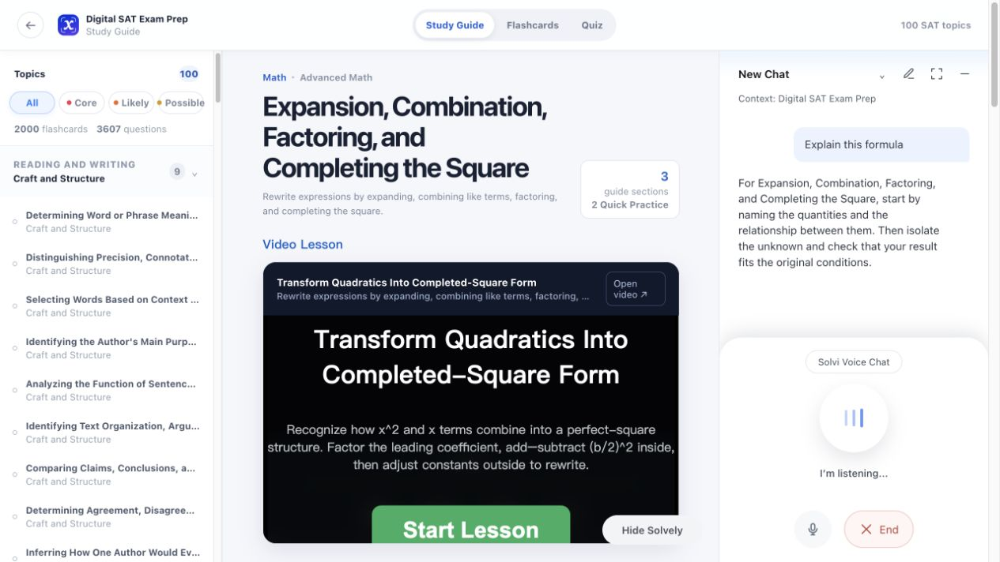 |
| 浮动模式 | 支持 Dock/Float；浮窗保持在视口内并可拖动、调整大小，最小尺寸仍可操作。 |  |

### 4.6 模考体验

#### 4.6.1 共用考试壳层

| 项目 | 说明 | 图示 |
|---|---|---|
| 顶部栏 | 左侧 Solvely 标识；中间 Section/Module 与计时；右侧按考试和题型显示 Calculator、Reference、Highlight、Line Reader、More。Diagnostic 显示已用时间，Full-Length 倒计时。 | 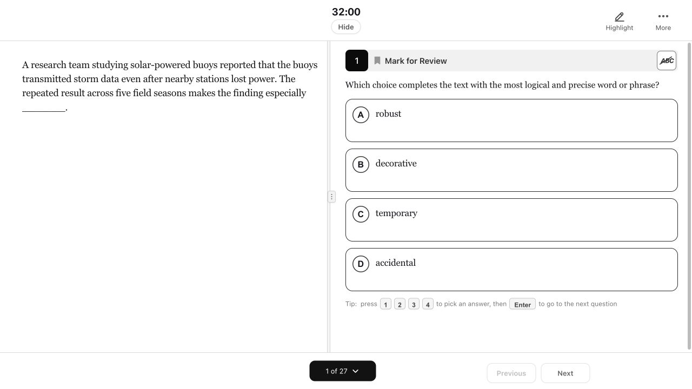 |
| 选择答案 | 点击整行或标签选择；品牌蓝选中态强度与 Hover 接近；选中后可改选。Mark for Review 独立保存。 | 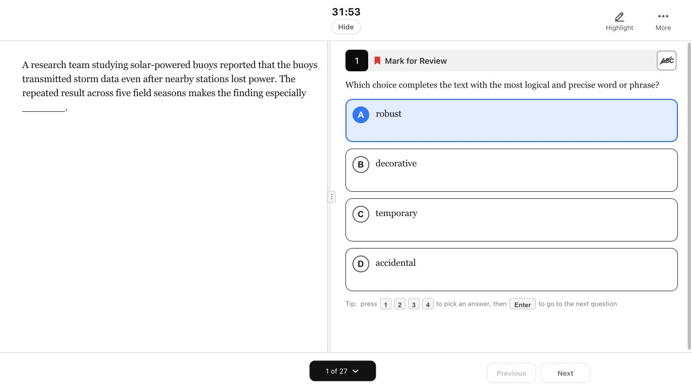 |
| 划掉选项 | 点击 cross-out 图标进入/退出排除态；工具激活时图标为黑色；被划掉的选项仍可恢复。Hover Tooltip：`Cross out answer choices you think are wrong`。 | 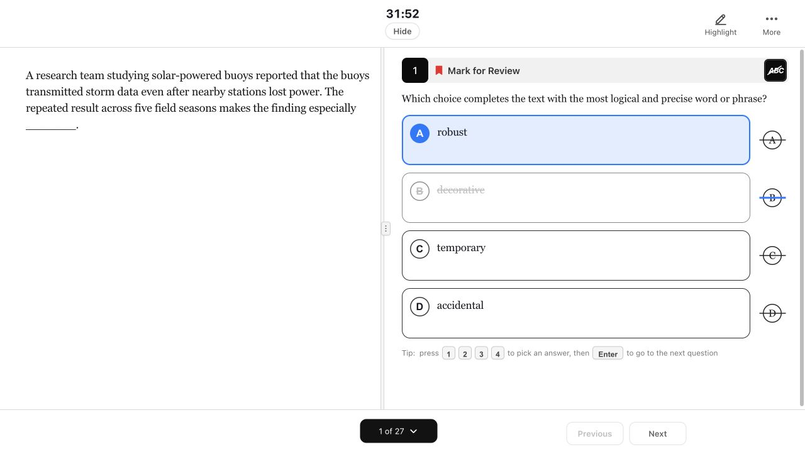 |
| Highlight | 点击即 On；选中文字后高亮并可维护批注。选中态使用品牌蓝；Hover Tooltip：`Highlight and annotate text`。 | 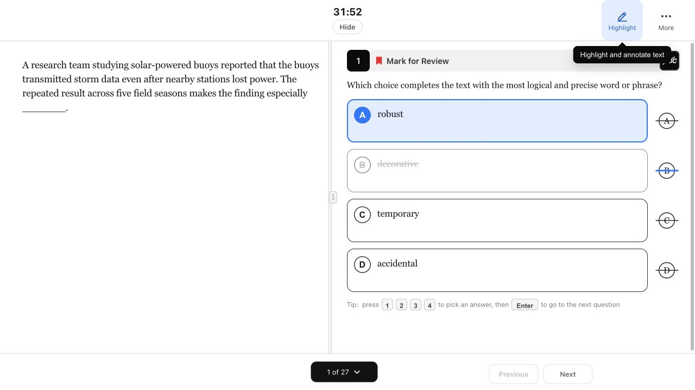 |
| Question Navigator | 点击底部题号打开；区分 Current、Answered、Unanswered、Marked；可直接跳题，不提交考试。 | 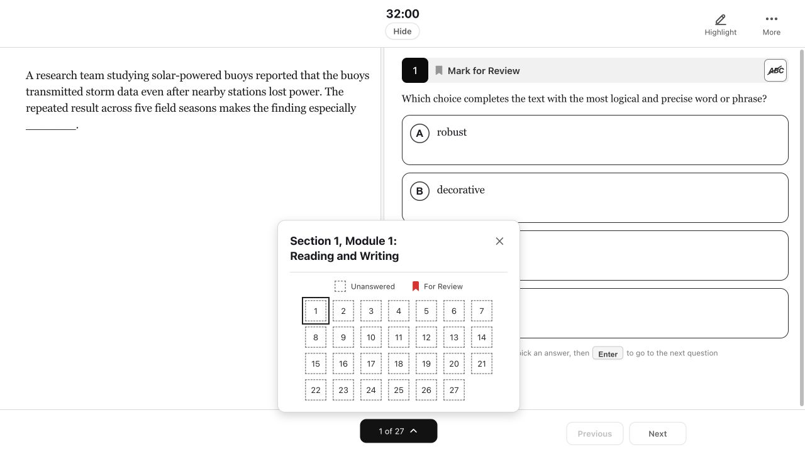 |
| More | 菜单包含 Save and Exit、Fullscreen、Keyboard shortcuts、Report an issue、Dark mode。模考外部不显示独立旗子或 Report 文案。 | 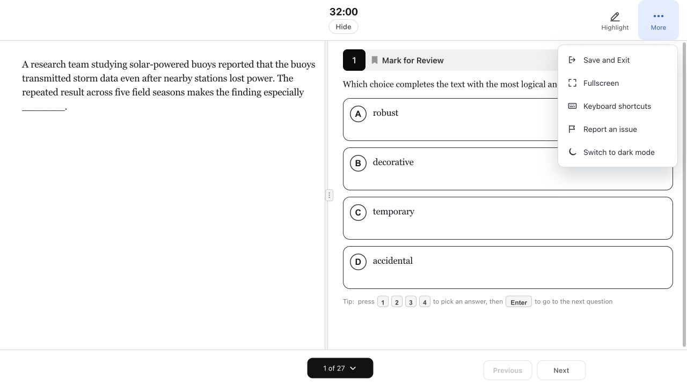 |
| Keyboard shortcuts | 弹窗按当前 Demo 列出 `Previous question`、`Next question`、`Select answer choice`、`Move selected choice`、`Cross out answer choice`、`Open keyboard shortcuts`；Escape 或右上角关闭。不展示未实现的快捷键。 | 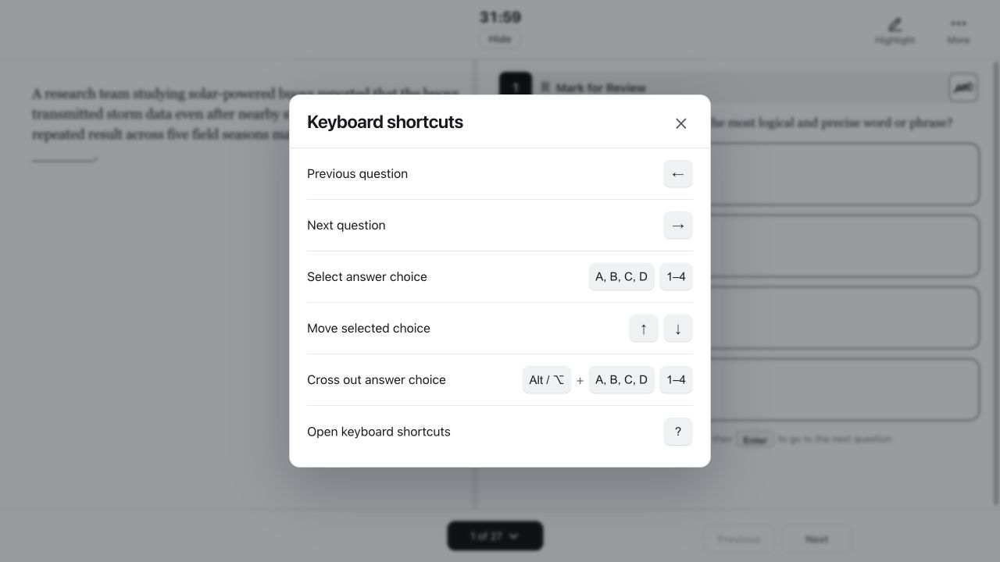 |
| Report an issue | 从 More 打开；弹窗标题 `Report an issue`，问题为 `What went wrong?`，原因固定为 `Problem with the question wording`、`Answer choices are incorrect or incomplete`、`Question content is missing`、`Image or graph did not load`、`Page is stuck or not responding`、`Other issue`。用户可在 `Additional details (optional)` 中补充说明；成功 Toast 为 `Thank you for helping us improve!`，失败保留原因与文字输入。 | 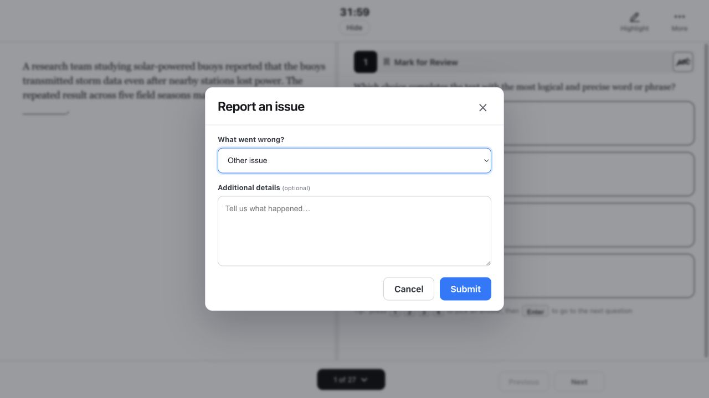 |
| 题目图像失败 | 题目必需图像未加载时，原位显示 `Figure unavailable` 和 `Reload the page before answering this question.`，禁用作答。用户在 Review 提交该 Section 时自动返回缺图题，Toast 为 `A required figure did not load. Reload the page before submitting this section.` | 错误态复用当前题目页布局 |
| 加载与入口失败 | 考试题源未返回时显示 `Loading Free {examName} Diagnostic Test…` 或 `Loading {examName} Full-Length Practice Test…`；加载失败显示 `Unable to load this practice test`、具体错误与 `Back to {examName} package`，不进入空白作答页。 | 同一错误卡结构 |
| Dark mode | 影响考试壳层、题目、工具、弹窗和浮层；品牌蓝与正确/错误色保持对比度。 | 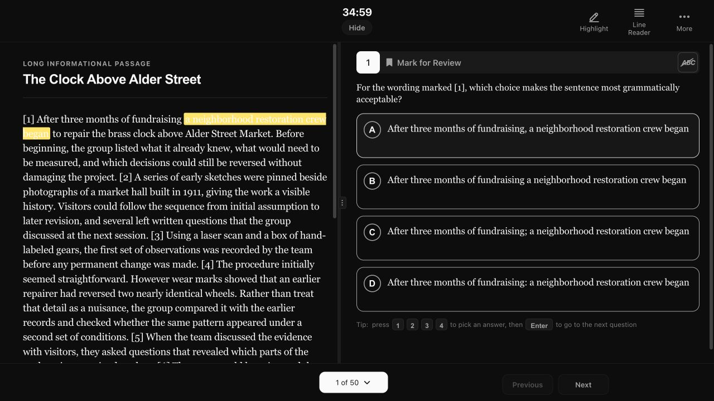 |
| Check Your Work | 每个 Module/Section 结束后展示题号网格和未答/已答/Marked 状态；Back 返回检查；Next Module/Section 进入下一阶段。 | 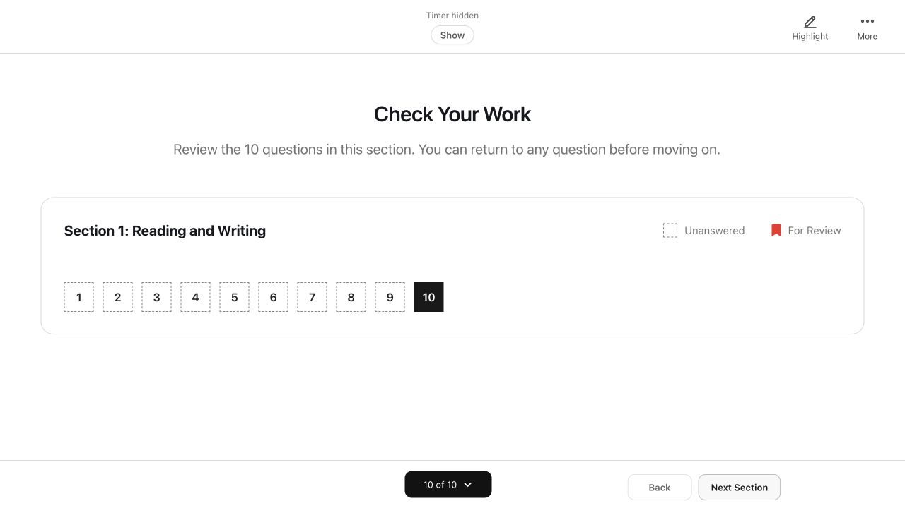 |
| 最终交卷与评分等待 | 最后一个考试阶段的 Review CTA：Diagnostic 为 `Submit Diagnostic`，Full-Length 为 `Finish Test`。提交成功立即返回课程首页的 Course Content，当前测试卡进入 Scoring。评分成功后卡片自动切为 Results ready；Diagnostic CTA 为 `View Free Results`，Full-Length 按 M-07 显示查看或解锁入口。 |

#### 4.6.2 阅读材料引用与 Line Reader

| 项目 | 说明 | 图示 |
|---|---|---|
| 引用高亮 | 当题目指向文章中的单词、短语、句子或行号时，在 Passage 中自动突出对应内容；换题后自动滚动到相关位置。用户自己的 Highlight 与系统引用高亮可叠加但视觉可区分。 | 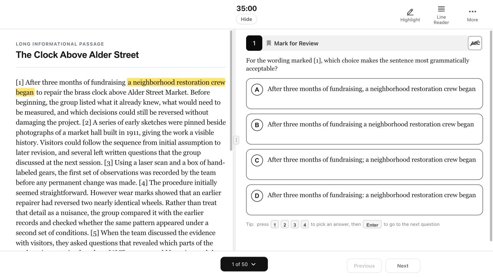 |
| Line Reader | 直接替换原 Tools 入口，点击即 On；以阅读窗口帮助聚焦当前行，可拖动/键盘移动；再次点击关闭。Hover Tooltip 说明用途；激活色使用品牌蓝。 | 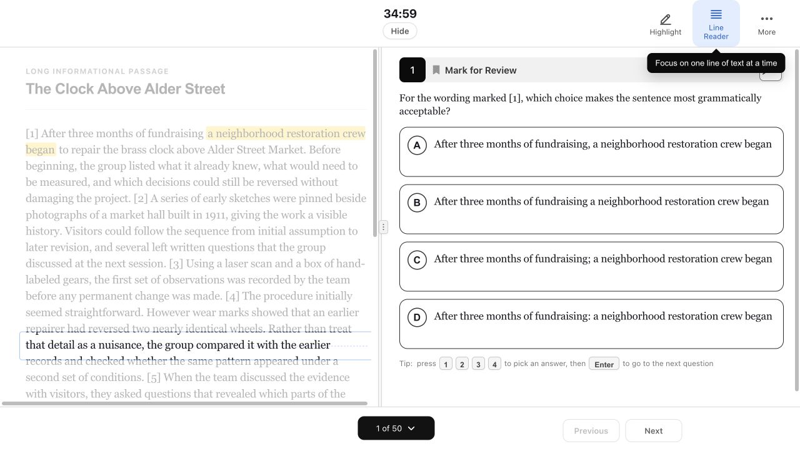 |

#### 4.6.3 Math / Calculator / Reference

| 项目 | 说明 | 图示 |
|---|---|---|
| Student-Produced Response | SAT Math 和 AP FRQ/数值题无选项时，显示响应输入组件及格式说明；输入不转成虚假选项。 | 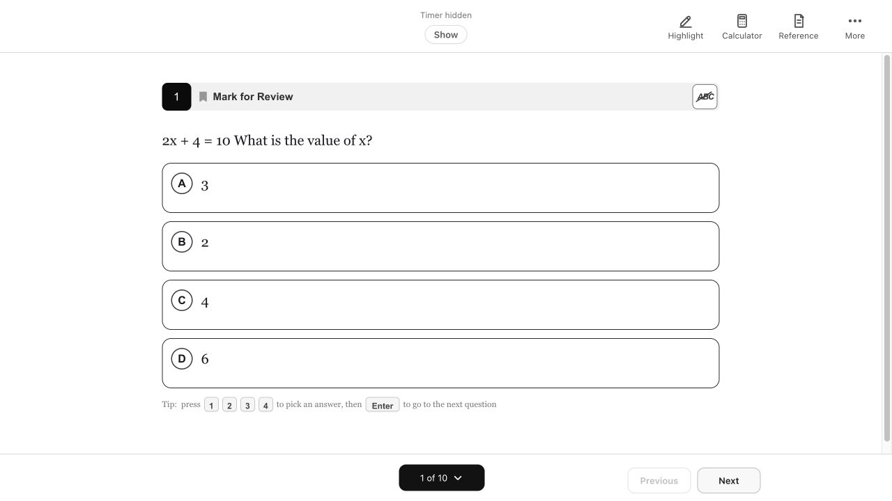 |
| Calculator | Math 相关部分提供内嵌计算器；答案区仍可独立操作。 | 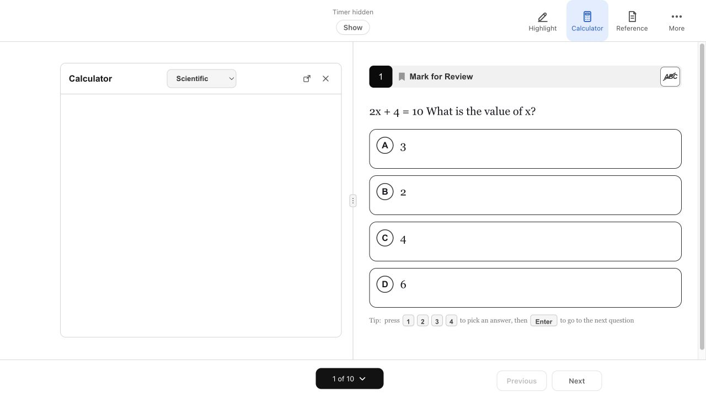 |
| Calculator 浮窗 | 支持 Pop out、拖动、缩放、关闭，保持输入状态。 | 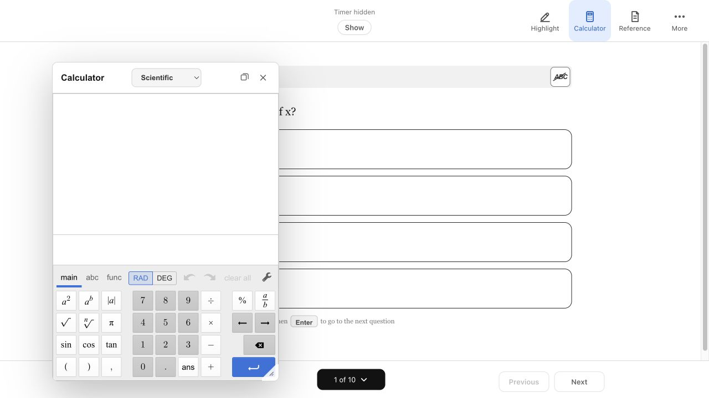<br>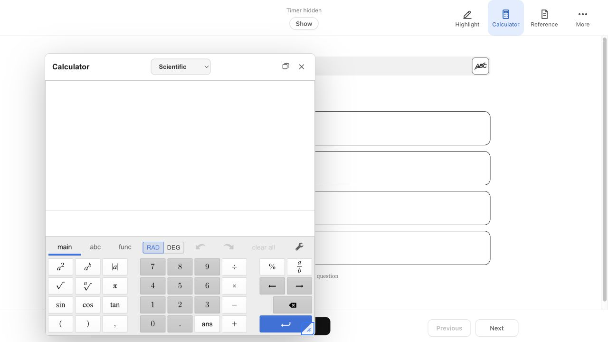 |
| SAT Math Reference | 点击 Reference 打开公式面板，支持折叠和关闭；不离开考试。 | 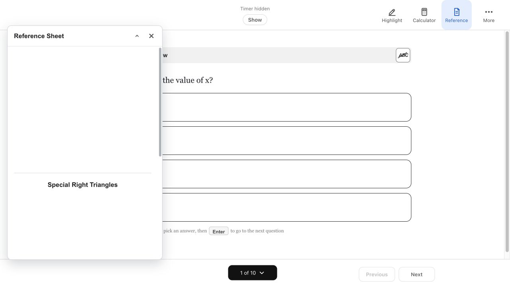 |

#### 4.6.4 SAT 考试结构

| 类型 | 结构 | 题量/时间 | 阶段交互 |
|---|---|---|---|
| Diagnostic | Reading & Writing 10 + Math 10 | 20 题；Untimed | 各 Section Review 后继续；完成回课程评分 |
| Full-Length | R&W Module 1 33、R&W Module 2 33、Math Module 1 27、Math Module 2 27 | 120 题；164 分钟；4 Modules | R&W Module 2 后 10 分钟 Break；可 Continue Break 提前结束；每个 Module 后 Review |

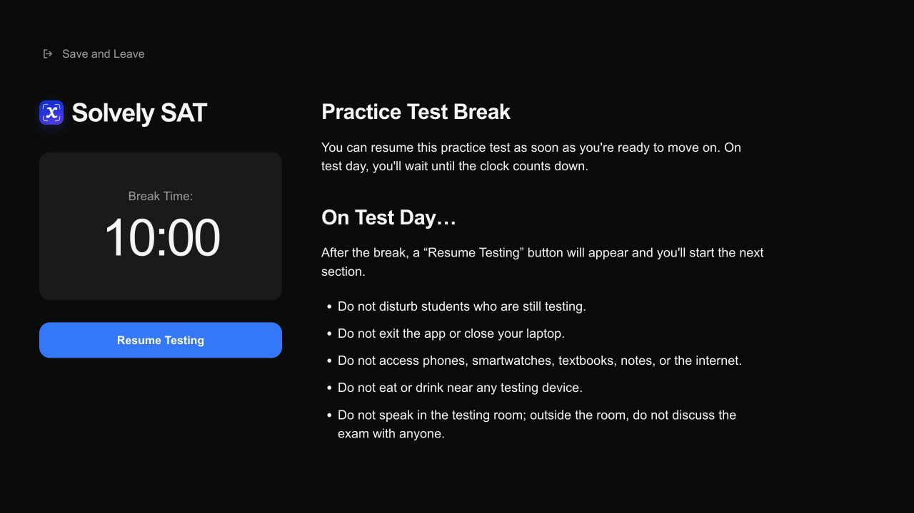

#### 4.6.5 ACT 考试结构

| 类型 | 结构 | 题量/时间 | 选项规则 |
|---|---|---|---|
| Diagnostic | English 10、Mathematics 9、Reading 7、Science 7 | 33 题；Untimed；4 Sections | 选项标签按题目数据；图、表格与 Passage 按 4.5.3 题源契约完整渲染 |
| Full-Length | English 50/35m、Mathematics 45/50m、Reading 36/40m、Science 40/40m、Writing 1 essay/40m | 171 道计分选择题 + 1 篇 essay；205 分钟；5 Sections | 题目可使用 A/B/C/D 或 F/G/H/J；原样渲染；Mathematics Review 后进入 15 分钟 Break，再继续 Reading |

当前 Demo 在 Mathematics Review 后进入 15 分钟 `Practice Test Break`，可点击 `Resume Testing` 提前继续。Writing 延续其他 Section 的黑白文字与分栏设计，不增加额外 Banner 或独立配色；固定展示 `Read and carefully consider these perspectives. Each suggests a particular way of thinking about the question above.`、`Essay Task`、`Write your essay`、`Type your response here…`、`{wordCount} words` 与 `Auto-saved`。

#### 4.6.6 AP 考试结构与 Reference

| 项目 | 说明 | 图示 |
|---|---|---|
| AP Diagnostic | 20 题 Multiple Choice、Untimed；报告按 AP 1–5 分制，页面不显示 Section 概念或筛选。 | 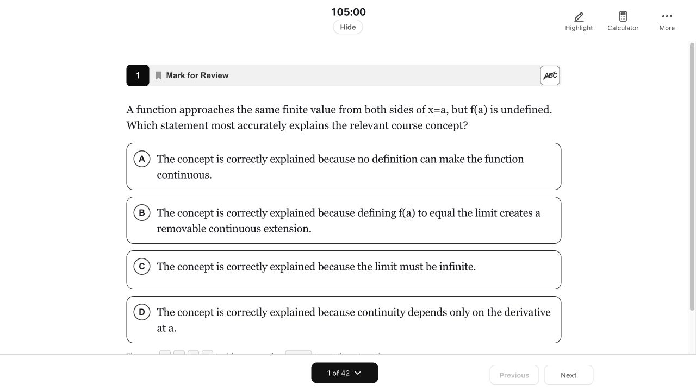 |
| AP Full-Length | Multiple Choice 42 题/105m；Free Response 6 题/90m；总计 48 题/195m。 | <br>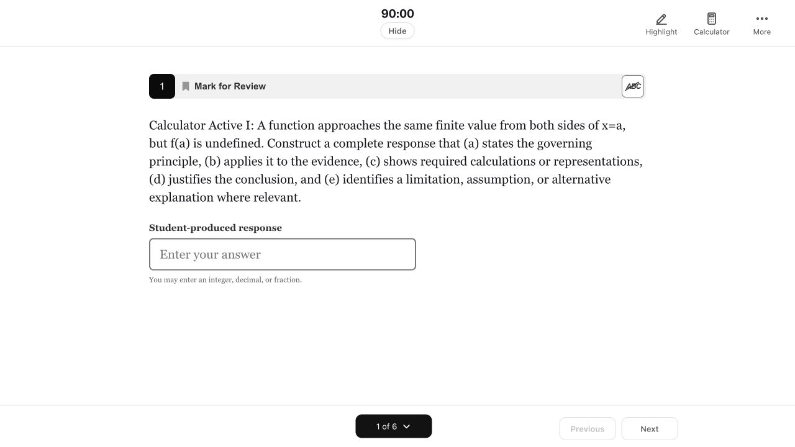 |
| AP Break | Multiple Choice Review 后进入 10 分钟 Break，再开始 Free Response。 | 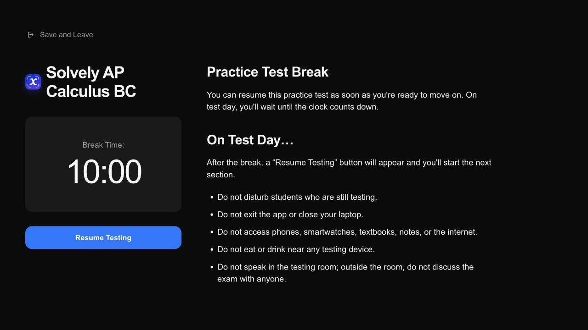 |
| AP 页面筛选 | 课程 Lessons、Question Review、Targeted Practice 均不展示 Section 筛选。 |
| AP Reference | 仅当考试配置了官方 Reference Sheet 时显示右上角 Reference；点击后在考试内嵌 PDF，支持折叠/关闭。其他 AP 考试完全不显示入口。AP Calculus BC 当前没有配置 PDF，因此当前课程模考不显示此入口。 | 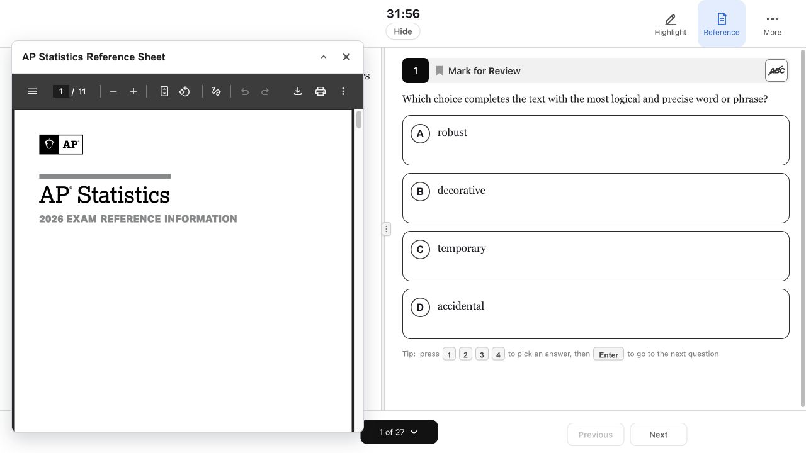 |

允许展示 AP Reference 的考试清单：

| 考试 | PDF 页数 |
|---|---:|
| AP Biology | 3 |
| AP Chemistry | 4 |
| AP Computer Science A | 3 |
| AP Computer Science Principles | 7 |
| AP Physics 1: Algebra-Based | 3 |
| AP Physics 2: Algebra-Based | 5 |
| AP Physics C: Electricity and Magnetism | 5 |
| AP Physics C: Mechanics | 4 |
| AP Statistics | 11 |

#### 4.6.7 Abitur Mathematik 考试结构

| 项目 | 说明 | 图示 |
|---|---|---|
| Diagnostic | 从 Analysis、Analytische Geometrie/Lineare Algebra、Stochastik 各取 3 题，共 9 tasks；Untimed；用于预测 0–15 Notenpunkte 与三个内容领域的起点。 |  |
| Full-Length | 23 tasks、120 BE、300 分钟；Prüfungsteil A 10 题、Prüfungsteil B 13 题。题目与评分 rubric 读取 Abitur Mathematik 试卷配置。 | 沿用 VIS-54 的自由作答能力；不复用 AP 题目或分制 |
| 作答 | 支持 Multiple Choice 与书面解答；书面题显示 `Write your solution`、`Rechenweg und Begründung…`，提交后展示 model answer 与 rubric。 | 不把自由作答内容渲染为选项 |
| 页面筛选 | 仍使用 SAT/ACT 同一课程页组件。当前 Abitur Mathematik 只有一个 Mathematics 学科，因此隐藏冗余 Section 下拉框；课程按三个内容领域组织，模考流程按 Prüfungsteil A/B 组织。 | 课程 Topic 与考试 Part 是两个独立维度，不构成独立页面模板 |
| Reference | 本期 Abitur Mathematik 未配置 AP Reference Sheet 入口；不得复用 AP 白名单或 SAT Math 公式面板。 | 无入口即不产生 Reference 加载事件 |

### 4.7 Performance & Insights / Report

#### 4.7.1 报告入口与商业化门槛

| 项目 | 说明 | 图示 |
|---|---|---|
| 来源切换 | 顶部 `Diagnostic Test` / `Full-Length Practice Test`。切换只改变当前课程的报告来源，不创建新考试。 |  |
| Diagnostic 免费报告 | Results ready 后，Free 用户可查看预测分数、Section/Unit 表现、Question Review；页面说明它不替代 Full-Length。 | 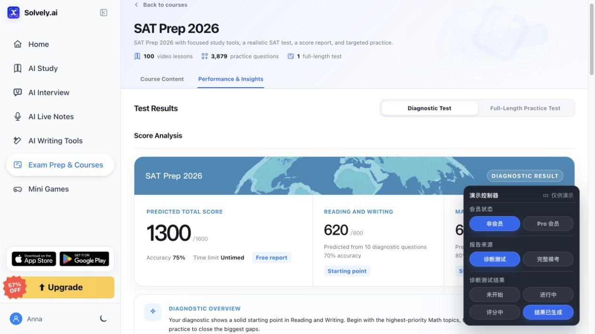 |
| 预生成报告结构预览 | Diagnostic / Full-Length 为 Not started、In progress、Scoring，或 Full-Length 已出分但 Free 未解锁时，背景保留该考试对应的完整报告封面与模块排布。Score Analysis、Knowledge & Skills、Performance details、Question Review、Targeted Practice 等报告模块分别覆盖独立锁定层；不是页面级单一锁。模板预览不代表用户成绩，除各模块锁定 CTA 外不可交互，也不进入成绩埋点口径。 | 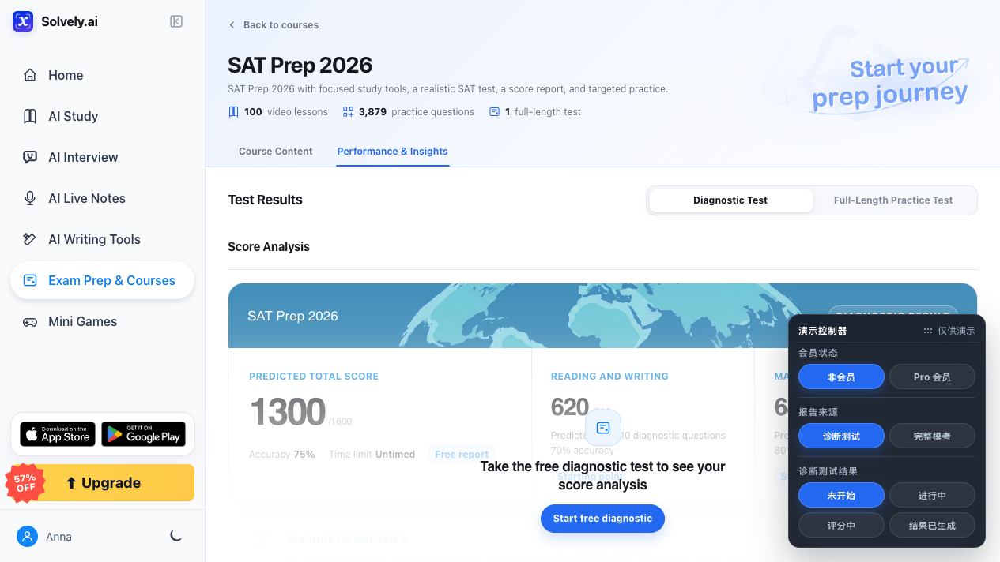<br>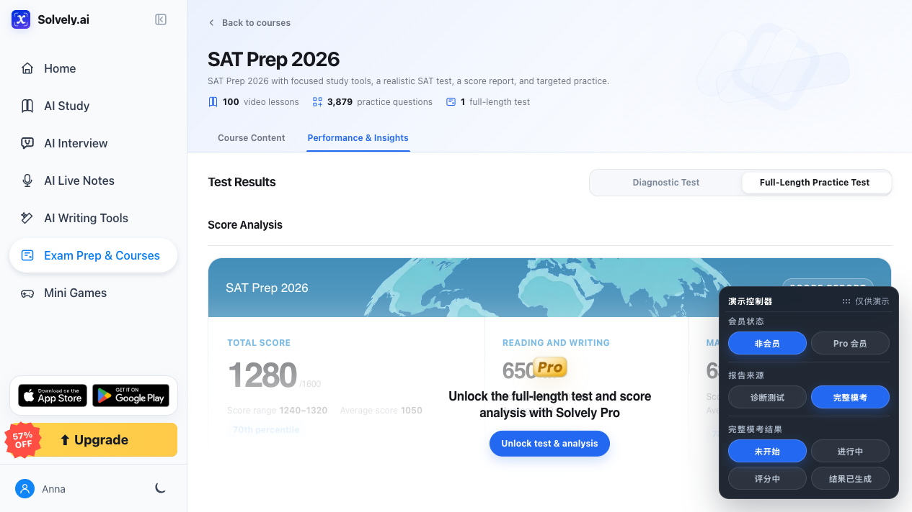<br>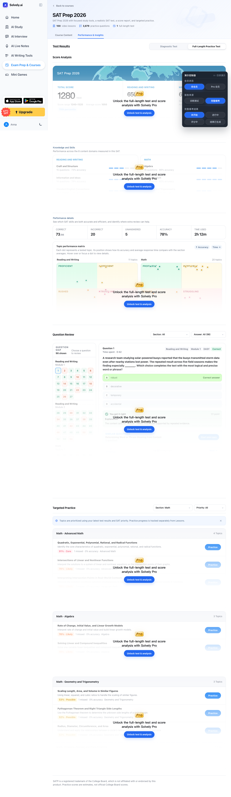 |
| Diagnostic Targeted Practice 锁定 | Free 用户仍能看到报告和题目解析，且 `Similar questions` 的 `Start mini quiz` 保持免费；只有 Targeted Practice 区域锁定。锁定层仅保留 48px 品牌 Pro 徽标、标题 `Unlock targeted practice with Solvely Pro` 与 CTA `Unlock practice`；不显示灰锁底框、说明小字或按钮内重复 Pro。 | 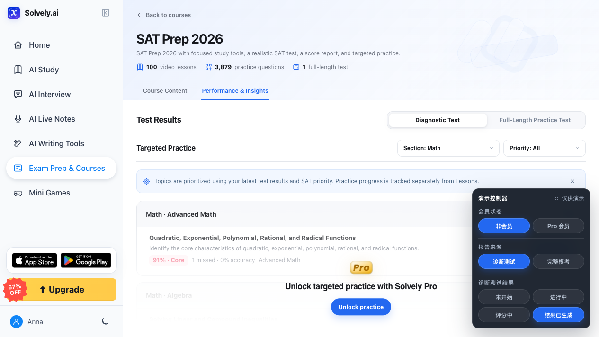 |
| Full-Length 前置未完成 | 仅 Pro 用户展示前置状态：Not started 为 `Take the full-length practice test to see your score analysis`；In progress 为 `Finish your full-length practice test to see your score analysis`；Scoring 为 `Your full-length practice test is being scored`。Free 用户由下方商业门槛优先覆盖。 |  |
| Full-Length 免费锁定 | Free 用户无论 Full-Length 为 Not started、In progress、Scoring 或 Results ready，进入报告预览时都由同一 Pro 门槛优先：各报告模块独立锁定，不展示考试前置 icon 或灰锁底框。每层只保留 48px Pro icon、标题 `Unlock the full-length test and score analysis with Solvely Pro` 与 CTA `Unlock test & analysis`，不显示说明小字。购买成功后再按测试记录状态执行 Start/Continue/等待评分/展示真实结果。 | <br>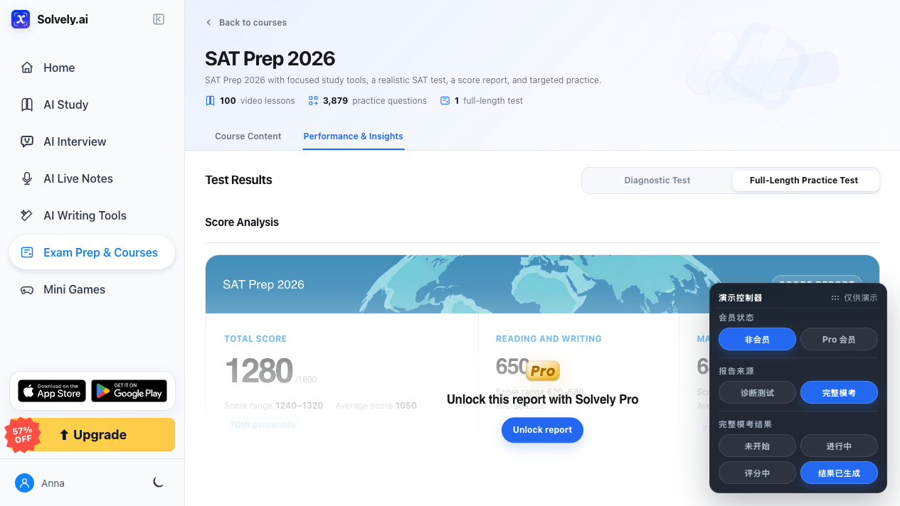<br> |
| Paywall | 点击锁定入口展示同一 Solvely Pro 付费弹窗；上下文参数区分 full-length test、score report、targeted practice、Ask Solvely。 | 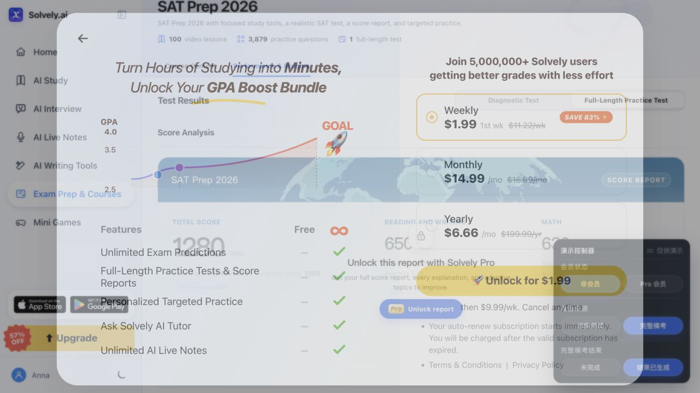 |

以下是 Diagnostic 与 Full-Length 报告的完整状态/权益矩阵。每个锁定的报告模块都使用该行同一套前景内容；背景始终是当前考试体系的预生成封面和完整报告模块结构。表中没有列出的状态组合不得自行生成新文案。

| 报告来源 | Attempt 状态 | 权益 | 可见内容 | Pro/前置图标 | 单一标题 | CTA | 点击或自动流转 |
|---|---|---|---|---|---|---|---|
| Diagnostic | Not started | Free / Pro | 预生成报告结构；所有模块不可交互 | 考试前置 icon | `Take the free diagnostic test to see your score analysis` | `Start free diagnostic` | 免费创建 Diagnostic attempt，进入第 1 题 |
| Diagnostic | In progress | Free / Pro | 预生成报告结构；所有模块不可交互 | 考试前置 icon | `Finish your diagnostic test to see your score analysis` | `Continue diagnostic` | 免费恢复同一 attempt 与保存题位 |
| Diagnostic | Scoring | Free / Pro | 预生成报告结构；所有模块不可交互 | 考试前置 icon | `Your diagnostic test is being scored` | 无 | 等待同一评分任务；成功后自动进入 Results ready，失败走 Retry |
| Diagnostic | Results ready | Free | Score Analysis、Section/Unit、Performance details、Question Review、Similar questions 均显示真实结果；`Start mini quiz` 免费；仅 Targeted Practice 锁定 | 仅 Targeted Practice 显示 Pro icon | `Unlock targeted practice with Solvely Pro`（只出现在 Targeted Practice） | `Unlock practice`（只出现在 Targeted Practice） | Mini quiz 直接打开 3 题 Drawer，不弹 Paywall；Targeted Practice 点击才弹 Paywall |
| Diagnostic | Results ready | Pro | 全部真实报告、Question Review、免费 Mini quiz、Targeted Practice | 无 | 无锁定标题 | 报告内正常操作 CTA | Mini quiz 打开 3 题 Drawer；Targeted Practice 进入独立 Quiz 页面 |
| Full-Length | Not started | Free | 预生成报告结构；每个模块独立锁定 | 每个模块显示 Pro icon | `Unlock the full-length test and score analysis with Solvely Pro` | `Unlock test & analysis` | 打开 Paywall；购买成功后创建 attempt 并进入测试 |
| Full-Length | In progress | Free（仅会员到期后可达） | 预生成报告结构；每个模块独立锁定；历史进度保留 | 每个模块显示 Pro icon | `Unlock the full-length test and score analysis with Solvely Pro` | `Unlock test & analysis` | 打开 Paywall；购买成功后恢复同一 attempt |
| Full-Length | Scoring | Free（仅会员到期后可达） | 预生成报告结构；每个模块独立锁定；原评分任务继续 | 每个模块显示 Pro icon | `Unlock the full-length test and score analysis with Solvely Pro` | `Unlock test & analysis` | 打开 Paywall；购买成功后仍等待同一评分任务，不伪造完成 |
| Full-Length | Results ready | Free（仅会员到期后可达） | 预生成报告结构；每个模块独立锁定；不展示真实成绩 | 每个模块显示 Pro icon | `Unlock the full-length test and score analysis with Solvely Pro` | `Unlock test & analysis` | 打开 Paywall；购买成功后展示真实报告 |
| Full-Length | Not started | Pro | 预生成报告结构；所有模块不可交互 | 考试前置 icon | `Take the full-length practice test to see your score analysis` | `Start practice test` | 创建 attempt 并进入测试 |
| Full-Length | In progress | Pro | 预生成报告结构；所有模块不可交互 | 考试前置 icon | `Finish your full-length practice test to see your score analysis` | `Continue practice test` | 恢复同一 attempt 与保存题位 |
| Full-Length | Scoring | Pro | 预生成报告结构；所有模块不可交互 | 考试前置 icon | `Your full-length practice test is being scored` | 无 | 等待同一评分任务；成功后自动进入 Results ready，失败走 Retry |
| Full-Length | Results ready | Pro | 按 SAT / ACT / AP / Abitur 体系展示完整真实报告 | 无 | 无锁定标题 | 报告内正常操作 CTA | 可浏览、筛选、Review、Targeted Practice 或 Retake |

> Free 用户在 Full-Length 的 Not started（未开始）、In progress（进行中）、Scoring（评分中）、Results ready（结果已生成）四种报告状态下都只有一个商业化入口：`Unlock test & analysis`。不存在 `Unlock analysis`、`Unlock report`、`Unlock Score Report` 或 `Unlock to continue…` 分支，因为测试本体与 Score Report 是同一项 Pro 权益。


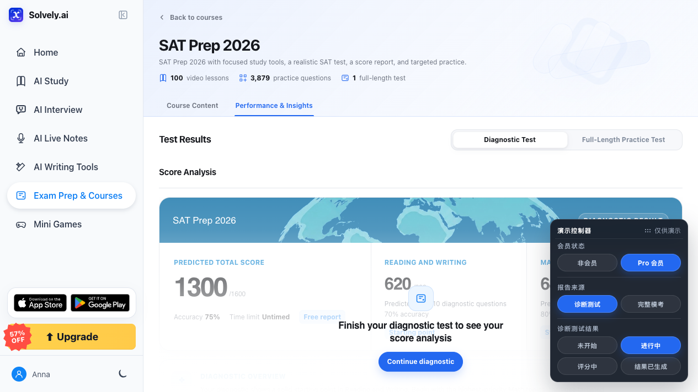

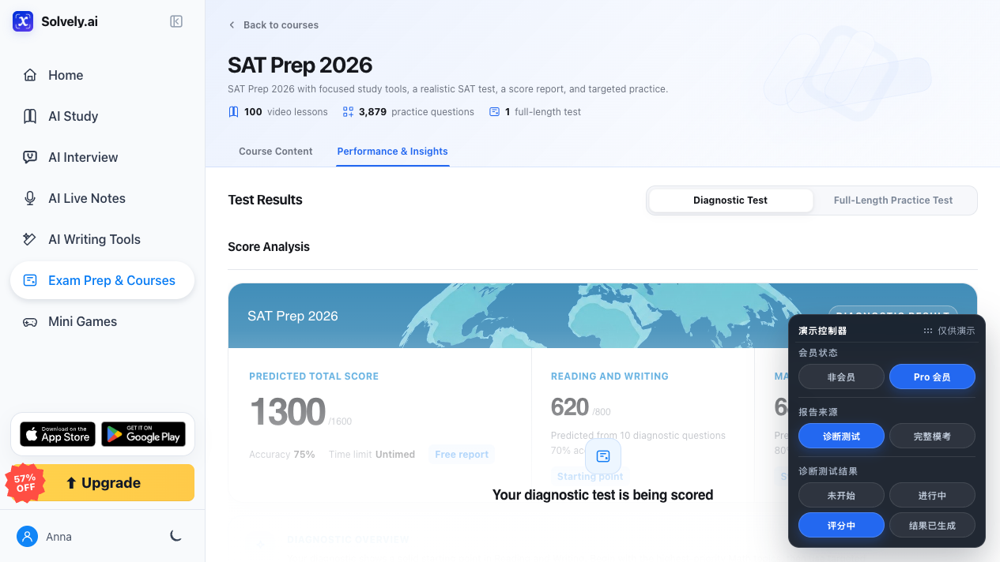

#### 4.7.2 SAT / ACT / AP / Abitur 报告差异

| 模块 | SAT | ACT | AP Calculus BC | Abitur Mathematik |
|---|---|---|---|---|
| 总分 | 400–1600；预测区间；Percentile | Composite /36；预测区间；Percentile | AP Score /5；预测区间；Percentile | 0–15 Notenpunkte；展示 BE 得分、得分率和表现等级 |
| 分项 | Reading & Writing 200–800；Math 200–800 | English、Math、Reading、Science 均为 1–36；STEM = round((Math + Science) ÷ 2)，仅 Math 与 Science 均可用时展示；ELA 仅在 English、Reading、Writing 均可用时按 ACT 批准的映射展示，缺任一项时显示 unavailable | Multiple Choice、Free Response 及 Unit 维度；不套用 SAT/ACT 分项结构 | Analysis、Analytische Geometrie/Lineare Algebra、Stochastik 三个内容领域；按任务 rubric 汇总 BE，不套用美式 Section 分数 |
| 诊断报告 | 20 题，R&W/Math | 33 题：English 10、Math 9、Reading 7、Science 7 | 20 MCQ，AP 1–5 预测 | 9 tasks，每个内容领域 3 题；预测 0–15 Notenpunkte |
| Score Analysis 顶部 | 通用总分封面与 Section 分数 | ACT 专属 Composite、Section 与 STEM/ELA 表达 | AP 专属封面、AP Score 与 AP Overview | 左侧 `Gesamtpunktzahl`、`{score}/15`、`{accuracy}% Trefferquote`、表现等级；右侧 `Abitur-Übersicht` 与最多两个薄弱领域建议 |
| Knowledge & Skills | 展示 Domain/Skill | 展示 Section/Domain/Skill | 不展示 SAT/ACT 风格 Knowledge & Skills 区块，使用 AP Unit/技能表达 | 不展示 `Knowledge and Skills` 区块；三个内容领域通过顶部 Overview、Performance details 与后续练习表达 |
| Section 筛选 | Question Review、Targeted Practice 有 | Question Review、Targeted Practice 有 | 均无 | 均无；不得显示 `Mathematik` Section 下拉框 |
| Question Map | 当前默认 SAT Practice Test 10 为 120 题，按 Module 分组 | 171 道计分选择题按 English/Mathematics/Reading/Science 分组；Writing essay 单独保留作答与 /12 分数 | 48 题，按 Multiple Choice / Free Response 分组 | 23 tasks，按 Prüfungsteil A/B 分组 |
| 改进建议 | Section/Domain/Skill + Targeted Practice | Section/Domain/Skill + Targeted Practice | Unit/Topic + Targeted Practice | 德语 Overview 按领域给出建议；Targeted Practice 按 Topic 进入 |
| 图示 | 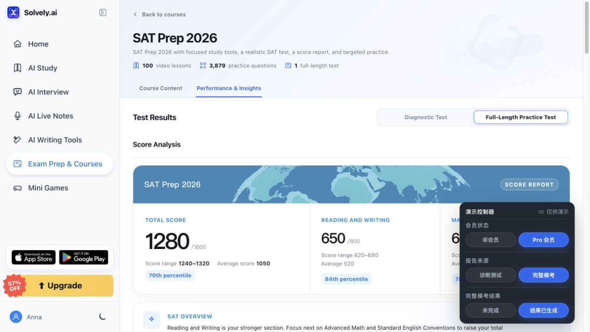 | 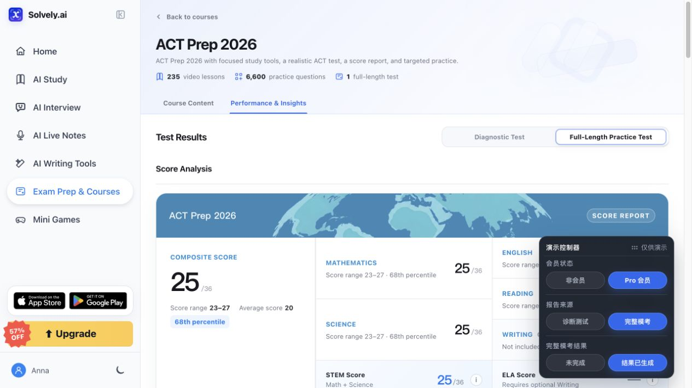 | 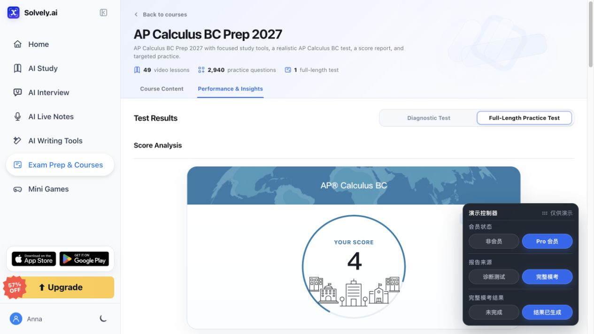 | 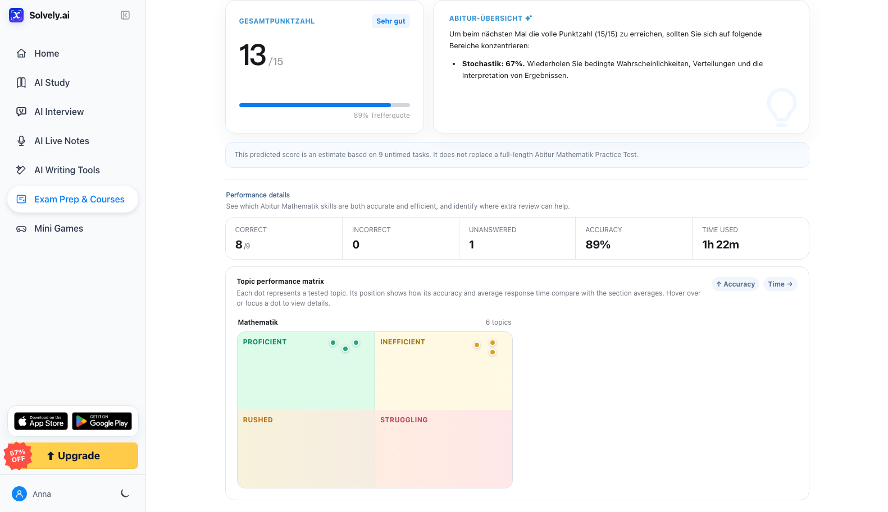 |

Diagnostic 报告也必须按考试体系输出：

| 考试 | 图示 |
|---|---|
| ACT Diagnostic | 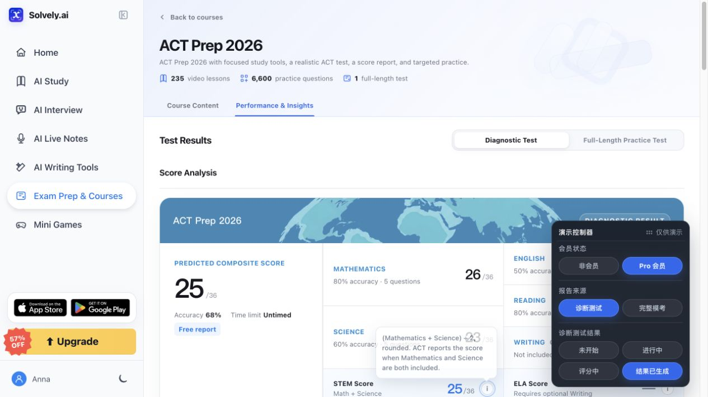 |
| AP Diagnostic | 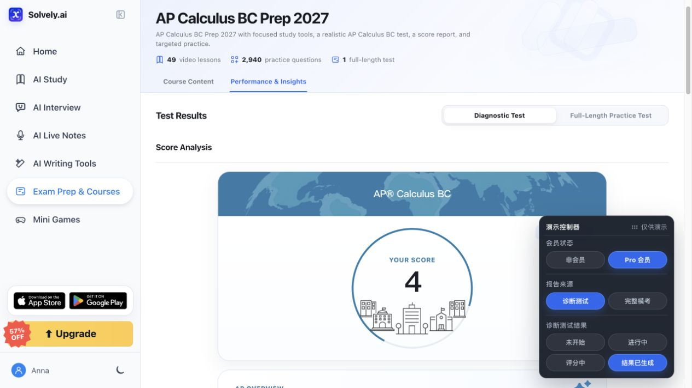 |
| Abitur Mathematik Diagnostic |  |

#### 4.7.3 报告内容顺序

报告为一张连续纵向页面，不拆成额外 Score/Review 子路由：

1. Score Analysis。
2. Overview：SAT/ACT 为 AI Overview，AP 为 AP Overview；Abitur 的 `Abitur-Übersicht` 已与 Score Analysis 顶部并列，不再重复增加第二个 Overview 区块。
3. Performance Details。
4. Topic performance matrix；SAT/ACT 按 Section 分列，AP/Abitur 使用各自单一考试分组且不出现 Section 筛选。
5. Question Review。
6. Targeted Practice。
7. Retake action。

生产实现需保留浏览位置；在 Diagnostic / Full-Length 间切换时回到报告顶部。

##### 4.7.3.1 Web 专属：Performance details

> **平台差异：**Performance details 是本期 Web 备考包相对 iOS 备考包新增的 Score Report 模块；iOS 本期不增加该区域。SAT、ACT、AP Calculus BC 与 Abitur Mathematik 均使用同一 Web 信息结构，但标题文案、分组和 Accuracy 数据口径按考试体系配置，不跨考试复用分数。

| 项目 | 说明 | 图示 |
|---|---|---|
| 页面目标 | 帮助用户同时理解答对多少、作答是否完整、正确率如何、时间花在哪里，并判断每个 Topic 是准确且高效，还是需要进一步复习。 | SAT 沿用 VIS-59；Abitur 见 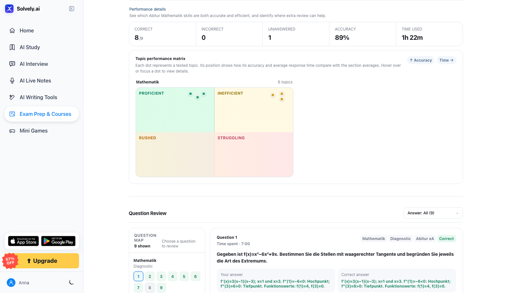 |
| 展示文案 | `See which {examName} skills are both accurate and efficient, and identify where extra review can help.` | SAT 示例：Correct **73/98**、Incorrect **20**、Unanswered **5**、Accuracy **78%**、Time used **2h 12m** |
| Topic performance matrix | `Each dot represents a tested topic. Its position shows how its accuracy and average response time compare with the section averages. Hover over or focus a dot to view details.` | SAT/ACT 按 Section；AP 单组；Abitur 为 Mathematik 单组 |
| 关键交互 | Hover 或键盘 Focus 某点，展示 Topic、Section、Accuracy、Average response time、Answered questions、相对 Section 平均值和象限；Escape/移出焦点关闭。 | 重叠点可视觉偏移或聚合，但真实值和象限不变 |
| 状态与边界 | Loading 使用 Skeleton；无可用 Topic 显示 `Not enough topic data yet.`；缺 topic 映射不生成点并记录数据错误；报告失败显示 Retry，不回退到 Demo 固定值。 | 本期只在 Web 展示 |
| 埋点与指标 | 沿用 `web_ep_report_view`：`assessment_type=diagnostic|full_length`、`access=full|prerequisite|pro_locked`、`report_type=sat|act|ap|abitur`；不对每次 Hover/Focus 上报。 | 数据一致性由服务端日志和专项用例验证 |

###### Performance details 计算契约

**数据来源与一致性**

- Score Report、Performance details、Question Review、Targeted Practice 必须读取同一 `report_id`，禁止跨 attempt 拼接。
- `attempt_id`、`exam_form_id` 唯一定位已提交考试和试卷版本；所有题目状态、用时和换算表均绑定该版本。
- 服务端必须保存 `scoring_policy_version`，报告生成后不可静默漂移。
- 每题且只能归一化为 `CORRECT | INCORRECT | UNANSWERED` 之一；Abitur 数据源中的 `OMITTED` 在 Web 展示与汇总时映射为 `UNANSWERED`。空字符串、仅空格或未提交答案统一为 `UNANSWERED`。
- Abitur 每个 task 还必须保存 `earned_raw_points` 与 `maximum_raw_points`；部分得分属于 `INCORRECT` 的已作答任务，但仍按 rubric 获得相应 BE。
- 矩阵每题必须有一个 `primary_topic_id` 和一个 `section_id`；附加标签不可重复计数。缺映射题仍进入汇总指标，但不生成 Topic 点。
- `active_time_seconds` 来源于服务端确认的有效考试计时；排除 Instructions、Break、暂停、后台挂起、加载失败和离线重复片段，按 `progress_version` 去重。

**汇总指标公式**

| 指标 | 计算逻辑 | 展示与边界 |
|---|---|---|
| Report item count | 当前报告题目集合去重 `question_id` 的数量，必须读取 `exam_form_id` 对应的版本化试卷配置；当前默认 SAT Practice Test 10 为 120，Abitur Full-Length 为 23 tasks | Correct 的展示分母和总量校验基准；不得从页面常量读取。本文 73/98 是独立 98 题报告 fixture 的计算示例，不代表当前默认 SAT 试卷题量 |
| Correct | `count(status=CORRECT)`；Abitur 表示拿满该 task 全部 BE | `{correct}/{report_item_count}`；SAT 示例 **73/98** |
| Incorrect | `count(status=INCORRECT)`；Abitur 包含部分得分和已作答但 0 BE 的 task | SAT 示例 **20** |
| Unanswered | `count(status=UNANSWERED)` | SAT 示例 **5**；看过但未提交答案仍为 Unanswered |
| 总量校验 | `Correct + Incorrect + Unanswered = report_item_count` | 示例 73 + 20 + 5 = 98；不守恒时内部原因 `data_inconsistent`，上报 `web_ep_exam_scoring_result(result=failure,error_code=data_inconsistent)`，不得展示部分汇总 |
| Answered | `Correct + Incorrect` | SAT/ACT/AP 用于 Accuracy 与平均答题时间分母；Abitur 仅用于平均答题时间与任务计数，Accuracy 使用 BE；SAT 示例为 93 |
| Accuracy | SAT/ACT/AP：`Correct ÷ Answered × 100%`，Unanswered 不进入分母；Abitur：`sum(earned_raw_points) ÷ sum(maximum_raw_points) × 100%` | 四舍五入为整数；SAT 73 ÷ 93 = 78.49%，展示 **78%**。Abitur 顶部同值标为 `Trefferquote`；最大 BE 为 0 时展示 `—` |
| Time used | `sum(valid active_time_seconds)`；计时片段去重且不超过各 Module 有效上限 | 秒数向下取整到整分钟，再格式化；7,920 秒展示 **2h 12m**，小于 1 小时显示 `Xm` |

**Topic 与 Section 聚合**

1. Topic answered = topic correct + topic incorrect；只有 Unanswered 的 Topic 不进入矩阵。
2. SAT/ACT/AP Topic accuracy = topic correct ÷ topic answered × 100%；Abitur Topic accuracy = Topic earned BE ÷ Topic maximum BE × 100%。后端保留未取整值用于定位和象限，Tooltip 展示整数百分比。
3. Topic average response time = Topic 已作答题有效 `response_time_seconds` 总和 ÷ topic answered；Unanswered 不进入分母。
4. SAT/ACT/AP Section accuracy = Section 全部已作答报告题的 correct 总数 ÷ answered 总数；Abitur 的 Mathematik 基线 = 全部有效 Topic 的 earned BE ÷ maximum BE。均按题目/分值加权，不能简单平均各 Topic accuracy。
5. Section average response time = Section 全部已作答题有效 response time 总和 ÷ answered 总数；按题目加权，不能简单平均 Topic average time。

| 矩阵值 | 公式 | 含义 |
|---|---|---|
| Y：准确率百分点差（`accuracy_delta_pp`） | `topic_accuracy - section_accuracy` | 单位为百分点（pp）；≥ 0 表示准确率达到或高于 Section 平均 |
| X：`time_delta_pct` | `(topic_average_time ÷ section_average_time - 1) × 100%` | ≤ 0 表示同速或更快；> 0 表示更慢 |
| 绘图位置 | 按相对值映射；超出可视范围时仅将绘图坐标限制在图表边界内（clamp） | Tooltip 必须展示限制前的真实值；视觉偏移不得改变象限 |

**四象限定义**

| 象限 | Accuracy 条件 | Time 条件 | 产品解释 |
|---|---|---|---|
| **Proficient** | `topic_accuracy ≥ section_accuracy` | `topic_average_time ≤ section_average_time` | 准确且高效；保持练习节奏 |
| **Inefficient** | `topic_accuracy ≥ section_accuracy` | `topic_average_time > section_average_time` | 答案准确但耗时偏长；需要提升速度和解题路径 |
| **Rushed** | `topic_accuracy < section_accuracy` | `topic_average_time ≤ section_average_time` | 速度快但准确率偏低；可能过快作答或检查不足 |
| **Struggling** | `topic_accuracy < section_accuracy` | `topic_average_time > section_average_time` | 准确率偏低且耗时偏长；优先复习和 Targeted Practice |

边界规则：Accuracy 等于 Section 平均时按“达到平均”处理；Time 等于 Section 平均时按“同速或更快”处理，因此准确率百分点差和作答时间百分比差都为 0 时归入 Proficient。

- 每个 `report_id + section_id + primary_topic_id` 恰好一个点；SAT/ACT 禁止跨 Section 比较，AP/Abitur 只与当前考试单一分组基线比较。
- 至少有 1 道已作答题才生成点；Tooltip 必须展示 Answered questions 以提示样本量。
- Topic 点必须可 Tab Focus；Focus 与 Hover 内容一致，象限不能只用颜色表达。
- SAT/ACT/AP Section 无已作答题，或 Abitur 分组的 maximum BE 为 0 时，不计算基线，显示 `Not enough topic data yet.`。
- 重复 `question_id`、缺 `section_id`、非法 response time、总量不守恒或跨 `report_id` 时，报告内部原因记为 `data_inconsistent`，并上报 `web_ep_exam_scoring_result(result=failure,error_code=data_inconsistent)`。

###### SAT / ACT / AP / Abitur 量尺分计算边界

| 考试 | 生产计算规则 | 禁止的 Demo 简化 |
|---|---|---|
| SAT | R&W 与 Math 由服务端按 `exam_form_id`、题目参数、Module route 和 `scoring_policy_version` 计算 200–800；Total=两 Section 之和，范围 400–1600；Diagnostic 必须标记 Predicted/Estimate 并输出校准区间 | 不得使用 `Accuracy × 600 + 200`、固定 ±30 或 Correct/98 线性换算；Demo 固定值仅用于界面演示 |
| ACT | Section 用版本化 raw-to-scale 表转 1–36；Enhanced Composite=`round((English+Math+Reading)÷3)`，Science 不进入 Composite；STEM=`round((Math+Science)÷2)`；ELA 缺任一所需分项时 unavailable | 不得使用 baseScore 与 accuracy 启发式；不得把 Writing 原始 2–12 分直接和 1–36 Section 简单平均 |
| AP | MCQ raw=答对题数且答错/未答不倒扣；FRQ raw=rubric points；按考试配置归一化加权，AP Calculus BC 当前报告为 MCQ 50% + FRQ 50%；用版本化 cut-score 表转 1–5 | 不得把 Accuracy 直接映射 1–5，也不得永久写死某一年的 cut score；Diagnostic 缺 FRQ 时只能输出预测分和区间 |
| Abitur Mathematik | 每个 task 按 rubric 汇总 `earned_raw_points`，Full-Length 当前 `maximum_raw_points=120 BE`；`raw_percent=earned BE÷maximum BE×100%`。再按 `scoring_policy_version` 的阈值换算 0–15 Notenpunkte：95/90/85/80/75/70/65/60/55/50/45/40/33/27/20% 分别对应 15/14/13/12/11/10/9/8/7/6/5/4/3/2/1，低于 20% 为 0。Diagnostic 标记为预测结果 | 不得用答对 task 数替代 BE；不得把 23 题简单线性映射到 15 分；阈值必须由版本化评分策略返回，不在前端静态计算 |

口径来源：[Web 备考包参考 PRD](https://pf6xrzskv9.feishu.cn/docx/BlLsdKlvRozzZ6x6HjNcWG7YnKb)、[College Board SAT scoring](https://satsuite.collegeboard.org/scores/what-scores-mean/how-scores-calculated)、[ACT Enhanced Composite](https://www.act.org/content/act/en/products-and-services/the-act-postsecondary-professionals/scores/multi-scores.html)、[College Board AP scoring](https://apstudents.collegeboard.org/help-center/how-are-ap-exams-scored)。

#### 4.7.4 Question Review

| 项目 | 说明 | 图示 |
|---|---|---|
| Section 与状态筛选 | SAT/ACT：Section: All + Answer: All/Correct/Incorrect/Skipped；AP/Abitur 只显示 Answer 筛选，不显示冗余 Section 下拉框。筛选后 Question Map 与详情同步。 | 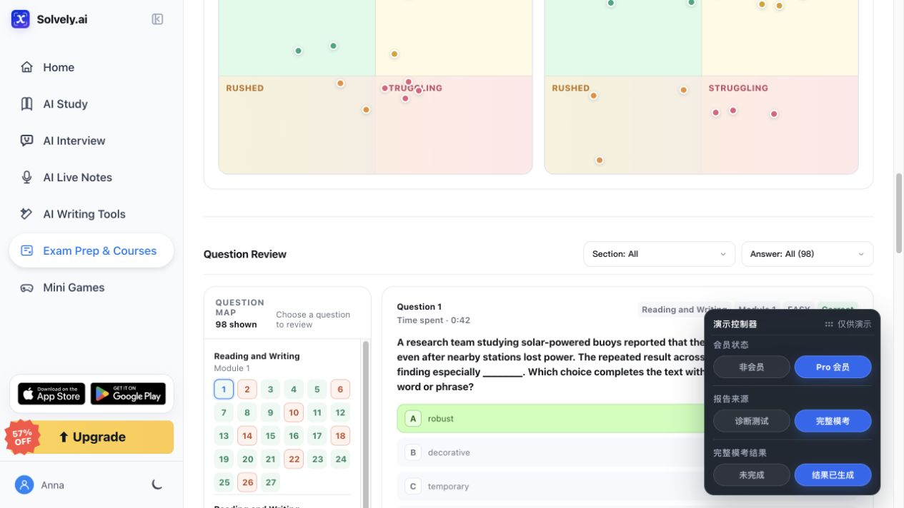<br>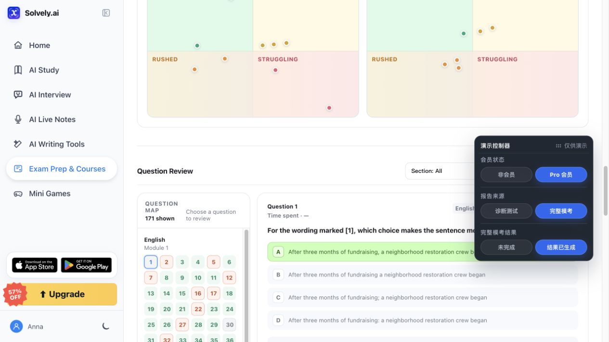<br>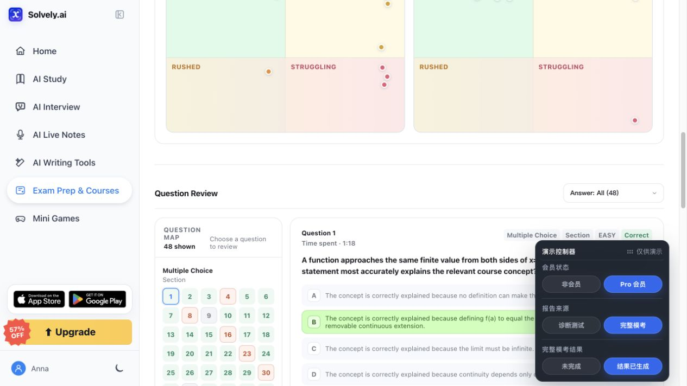<br>Abitur 结构见 VIS-95 |
| Question Map | 题号显示 Current、Correct、Incorrect、Skipped、Marked；点击更新右侧详情，保持当前筛选。 |
| 题目详情 | 展示题干、图片/Passage、全部结构化选项、用户答案、正确答案、Explanation、Time spent、Section/Module、Difficulty、Result。 |
| Similar questions | Explanation 下方仅展示小标题 `Similar questions`、Topic 名称、`3 questions`、CTA `Start mini quiz`。该入口对 Free / Pro 都免费，不做 entitlement 校验、不弹 Paywall；不增加学习目标、预计用时或计划进度等额外信息。 |

#### 4.7.5 Similar Questions Mini Quiz

Mini Quiz 是 Diagnostic 免费 Question Review 的延伸练习，对 Free / Pro 均免费；它不属于 Targeted Practice，也不写入 Study Plan。点击 `Start mini quiz` 必须直接发起 3 题加载并打开 Drawer，不能经过商业化拦截。

| 状态 | 交互与文案 | 图示 |
|---|---|---|
| Loading | 从右侧打开 Drawer；标题 `Mini quiz`；仅显示 `Loading questions…`。 | 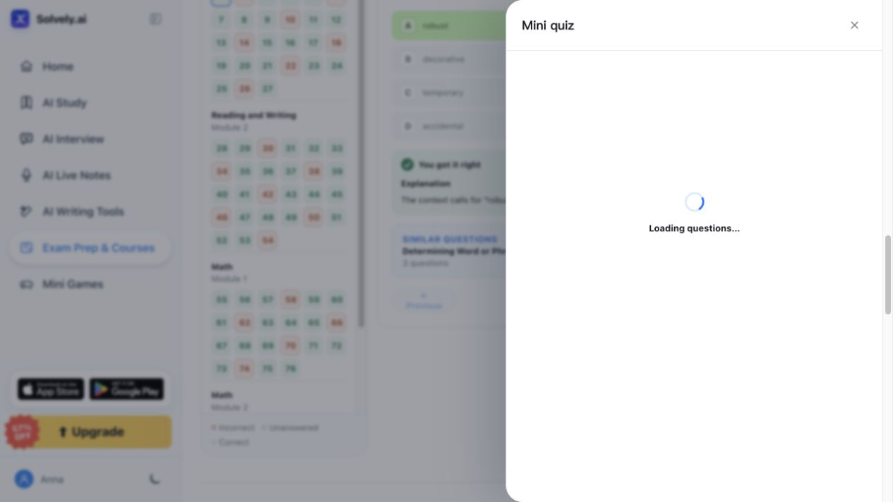 |
| Load error | `Questions unavailable` + 错误信息 + `Try again`；关闭后原报告位置不变。 |
| Question | 固定 3 题；显示 `Question {n} of 3`、进度条、题目和选项/输入框；Drawer 内不展示来源、学习计划或额外解释卡。 | 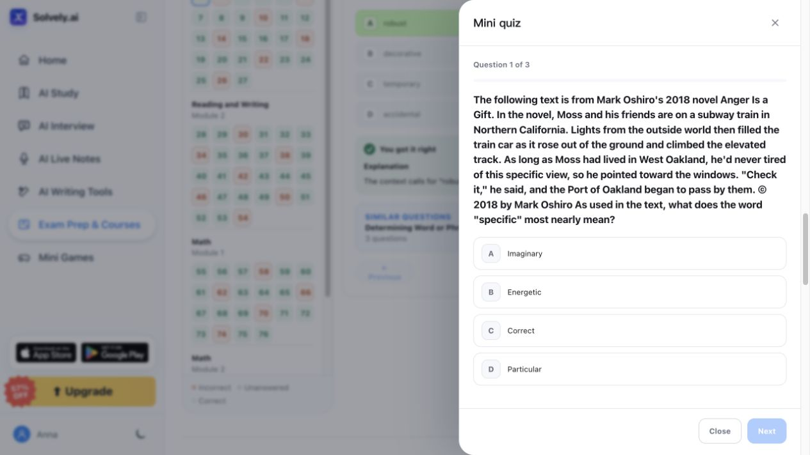 |
| Feedback | 作答后显示 Correct/Incorrect、Explanation 和 Next；反馈态仍属于当前题。 | 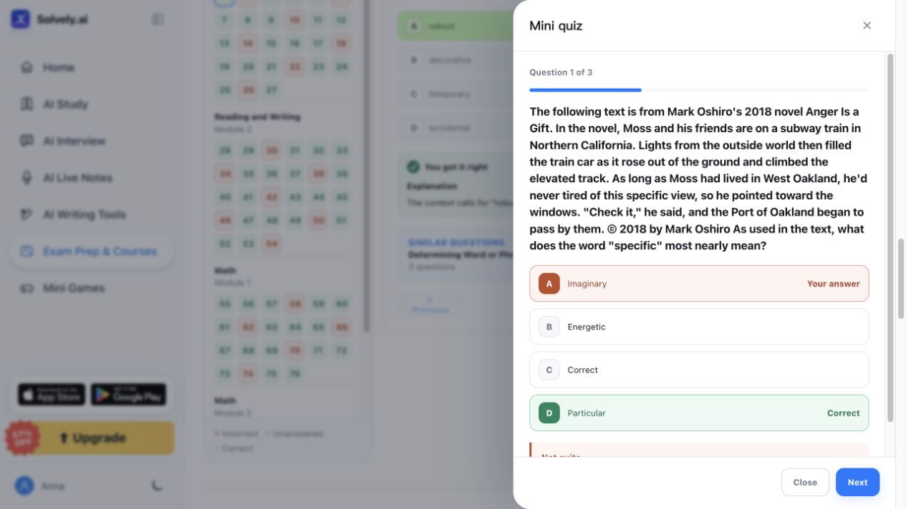 |
| Result 3/3 | `Flawless! 🏆`；`Perfect score! You've truly locked it in.` | 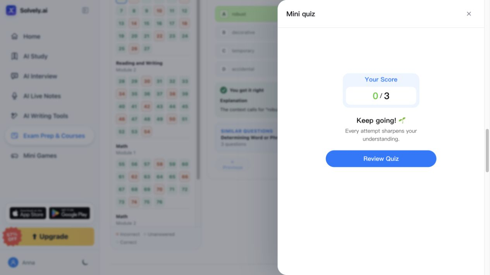 |
| Result 2/3 | `So close! ⭐`；`Almost perfect — a quick recap and you'll ace it.` | 同结果页布局 |
| Result 1/3 | `Nice effort! 💪`；`Solid start — a quick review and you'll nail it.` | 同结果页布局 |
| Result 0/3 | `Keep going! 🌱`；`Every attempt sharpens your understanding.` | 同结果页布局 |
| Result CTA | 只有 `Review Quiz`；点击回到第 1 题 review 模式。不得出现 Create more quiz。 |

#### 4.7.6 Targeted Practice

| 项目 | 说明 | 图示 |
|---|---|---|
| 数据来源 | 基于当前报告的错题、正确率、Topic 和考试优先级生成；Mini quiz 的作答不计入这里。 |
| 筛选 | SAT/ACT 支持 Section 和 Priority；AP/Abitur 仅 Priority，不显示冗余 Section 下拉框。这是同一组件按考试数据显隐筛选项，不是独立页面。 | 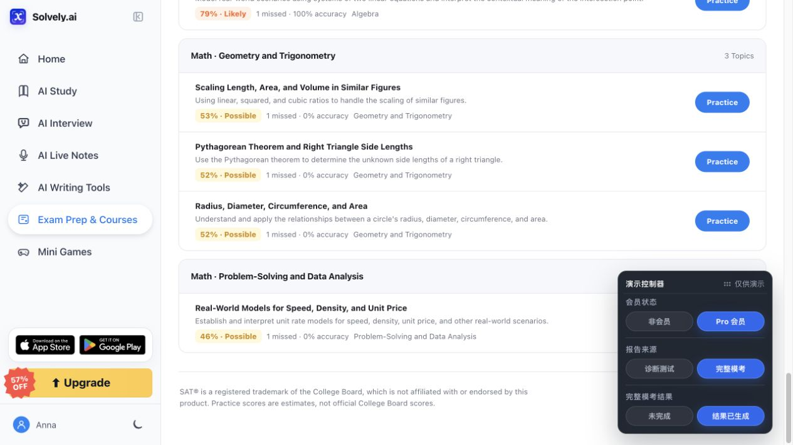<br>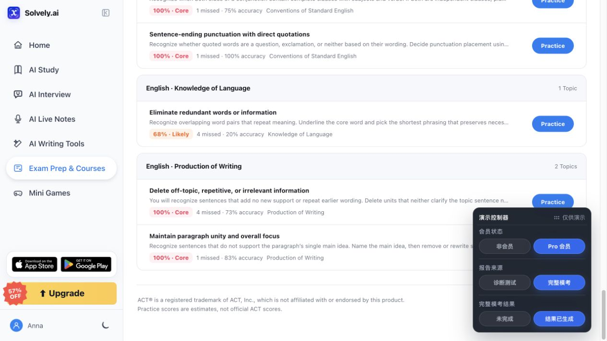<br>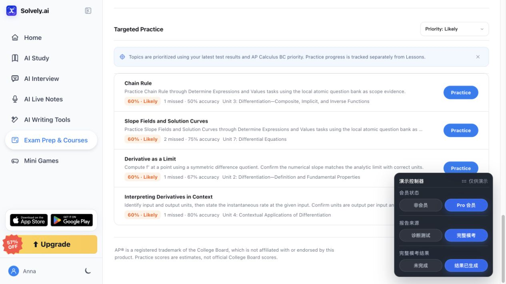 |
| 行内容 | Topic 名称、简短学习目标、Priority、missed/accuracy、Domain/Unit、动作按钮。 |
| 动作状态 | 未开始显示 Practice；有未完成练习显示 Continue；完成后显示 Review。进度与 Topic Quiz 分开保存。 |
| 权限 | 统一引用 M-05 与 M-07；本节不另行定义 Free/Pro 差异。 |

#### 4.7.7 Retake

| 来源 | 交互 | 图示 |
|---|---|---|
| Diagnostic | 点击 `Retake Diagnostic Test` 直接将当前 Diagnostic 回到 Not started，跳回 Course Content；不弹二次确认。 |
| Full-Length | 点击 `Retake Full-Length Practice Test` 后弹确认框：标题 `Retake This Practice Test?`，说明 `Retaking this practice test will permanently delete your current result, answers, and score analysis. This can’t be undone.`。`Cancel` 保留当前报告；`Retake Test` 确认后永久删除当前结果、答案与分数分析，建立新 attempt 并进入第 1 题。 |  |

### 4.8 商业化与权限（唯一规则源）

此节是 Free/Pro 差异的唯一规则源。课程免费开放的目的，是用完整且专业的学习体验建立长期信任与回访；商业化只发生在用户产生更强的个性化解题、诊断后训练、正式模考或深度分析意图时。入口提前展示 Pro 标识，避免点击后产生“突然被拦截”的感受。

| ID | 功能/动作 | Free | Pro | 前置与触发时机 | 购买成功 | 取消/失败 | 入口标识 |
|---|---|---|---|---|---|---|---|
| M-01 | Custom Plan | 沿用主产品免费额度 | 沿用主产品权益 | 只有超出既有额度时按主产品规则触发；本期不新增门槛 | 恢复创建动作 | 保留已填表单 | 沿用主产品 |
| M-02 | Ready course entry / Study Guide / Flashcards / Topic Quiz | 已就绪课程均可进入；学习工具完整免费 | 同 Free | 点击 `course_ready=true` 的课程卡或学习工具时不弹 Paywall；只打开课程不写进度。未就绪卡片 disabled 是内容状态，不是会员限制 | 不适用 | 内容加载失败按 4.10 Retry，不得改为会员拦截 | 可用课程入口与学习工具均无 Pro 标识 |
| M-03 | Ask Solvely | 不可用 | 可用 | 点击 Ask Solvely 时校验 | 打开原 Topic/题目上下文的对话面板 | 留在原学习位置，上下文不丢失 | Pro badge |
| M-04 | Diagnostic Test | 免费开始/继续/重做 | 可用 | 不弹 Paywall | 不适用 | 不适用 | `Free` 标签，不是 Pro |
| M-05 | Diagnostic Targeted Practice | 不可进入 | 可用 | 报告点击 Unlock practice / Practice / Continue / Review 时校验 | 恢复同一 Topic、同一 action | 留在同一报告与滚动位置 | 48px Pro + 单一标题 + CTA；无说明小字、灰锁底框或按钮内重复 Pro |
| M-06 | Full-Length Practice Test | 不可开始或继续 | 可用 | 点击 Start/Continue、或直达模考 URL 时校验；校验通过前不创建/推进 attempt | 只恢复一次 pending Start/Continue 并进入保存位置 | 回到原课程卡；attempt 保持原状态 | 卡片标题旁 Pro badge；不得显示 Free；Start/Continue/Results CTA 内不重复 Pro |
| M-07 | Full-Length Test & Score Report | 任一测试进度下都可预览模板化封面与完整报告模块结构，但每个报告模块独立锁定；Not started、In progress、Scoring、Results ready 全部只显示标题 `Unlock the full-length test and score analysis with Solvely Pro` 与 CTA `Unlock test & analysis` | 完整可见；结果生成前展示对应前置状态，Results ready 时展示真实报告 | Free 点击任一报告模块的 `Unlock test & analysis` 时校验；不存在仅解锁 analysis/report 的子权益 | 刷新权益、解除全部报告模块锁，再按同一测试进度开始、继续、等待评分或打开真实报告 | 保留锁定报告、当前报告模块与滚动位置 | 48px Pro + 单一标题 + CTA；无说明小字、考试/灰锁 icon 或按钮内重复 Pro |
| M-08 | Scoring | 课程卡的 Scoring 状态可见；Full-Length 报告预览仍按 M-07 使用统一 `Unlock test & analysis` | 状态与只读评分中报告前置可见 | 评分期间不允许重复提交；Free 解锁只处理整项权益，不伪造评分完成 | 购买成功后继续等待同一评分任务 | 超时按评分恢复逻辑 | 无新增状态标签 |
| M-09 | Diagnostic Score / Section or Unit / Question Review / Similar Questions Mini Quiz | 免费可见与可做；`Start mini quiz` 直接打开 3 题 Drawer，不弹 Paywall | 可用 | Diagnostic=Results ready 后直接展示 | 不适用 | 数据加载失败仅在 Drawer 内 Retry | 无 |
| M-10 | 会员到期后的历史进度 | 免费内容和历史状态保留；受限动作重新校验 | 可继续 | 权益必须在每次受限动作执行前实时校验，不以进入页面时缓存为准 | 恢复原动作 | 不删除答案、进度或报告 | 按对应 M-03/05/06/07 |

统一 Paywall 恢复协议：

1. 触发前保存 `pending_action`、`course_id`、`attempt_id/topic_id`、`entry_source`、当前 URL 与滚动锚点。
2. Paywall 打开不得提前修改 attempt、课程进度或 Quiz 进度。
3. 购买成功刷新服务端 entitlement 后，仅幂等执行一次 `pending_action`，随后立即清除。
4. Cancel、关闭、支付失败或权限刷新失败时回到原页面与原位置；展示可重试反馈，不跳首页。
5. 前端路由守卫与服务端接口都必须校验 M-03/05/06/07；前端隐藏入口不能替代服务端鉴权。

### 4.9 内容与数据完整性

#### 4.9.1 课程目录

| 分类 | 数量 | 当前可用 | 其他状态 |
|---|---:|---|---|
| SAT | 1 | 1 门可进入 | Demo 完整学科数据：SAT Prep 2026 |
| ACT | 1 | 1 门可进入 | Demo 完整学科数据：ACT Prep 2026 |
| AP | 43 | 1 门可进入、42 门 disabled | Demo 完整学科数据：AP Calculus BC；其他课程无数据时不跳占位页，也不得错误复用 Calculus 内容 |
| Abitur | 7 | 1 门可进入、6 门 disabled | Demo 完整学科数据：Abitur Mathematik；其他课程无数据时不跳占位页，也不得错误复用 Mathematik 内容 |
| 合计 | 52 | 4 门可进入、48 门 disabled | 卡片目录完整保留；可进入状态只由内容 readiness 决定，与 Free/Pro 无关 |

#### 4.9.2 题目渲染契约

```ts
type Question = {
  id: string
  prompt: string
  responseType: 'Multiple Choice' | 'Student-Produced Response' | 'Free Response'
  options?: Array<{ label: string; content: string }>
  correctAnswer: string | number
  explanation: string
  section?: string
  module?: string
  domain?: string
  topicId: string
}
```

- Multiple Choice 必须有至少 2 个结构化选项，UI 使用 `option.label` 原样渲染。
- Student-Produced Response / Free Response 不渲染选项容器。
- 导入数据需拒绝把 `A.`、`B.`、`F.` 等行内文本误拼进 prompt。
- 当前 Demo 数据审计结果：6 份考试数据、830 份 Study Plan/Quiz 文档、13,449 道题（其中 12,840 道 Study Plan/Targeted Practice/Mini Quiz）、47,033 个可渲染选项均通过结构完整性校验；ACT F/G/H/J 各 340 个标签正确保留。Diagnostic 专项校验另确认 SAT 20 题、ACT 33 题及 4 个必需图表资源全部存在。
- 数据 CI 必须运行 `npm run verify:data`；失败则阻断发布。

#### 4.9.3 iOS 备考物料复用基线与契约

截至 2026-09-09，iOS 物料文档 revision 1460 可作为 Web 内容迁移的输入索引，但不能成为生产运行时依赖。所有附件必须先进入受控内容仓库，转换为统一 manifest、完成版权和质量校验，再由版本化 API 发布。

| 考试体系 | 课程/学科记录 | Topic | Topic Quiz | Practice Quiz | 题目合计 | 已盘点物料 |
|---|---:|---:|---:|---:|---:|---|
| SAT | 1 | 100 | 3,000 | 3,226 | 6,226 | 2 套 mock CSV；1 份 100 Topic 的 Study Guide/Flashcard 合并 CSV（每 Topic 20 条）；1 份含封面与 HTML 视频链接的 manifest |
| ACT | 1 | 235 | 7,050 | 7,050 | 14,100 | 2 套 mock CSV；1 份 235 Topic 的 Study Guide/Flashcard 合并 CSV（每 Topic 20 条）；1 份视频 manifest |
| AP | 43 | 1,192 | 35,760 | 35,760 | 71,520 | 42 份逐课程 mock CSV + 1 份 master workbook + 1 份语言音频 manifest；43 份 Study Guide/Flashcard CSV；43 份 Topic Quiz CSV；8 份按学科组组织的视频 manifest |
| 德国高考 | 7 | 177 | 5,310 | 6,514 | 11,824 | 7 份逐学科 mock CSV；7 份 Study Guide/Flashcard CSV；1 份 Quiz master；1 份视频 manifest |
| 合计 | 52 | 1,704 | 51,120 | 52,550 | 103,670 | 课程总数仅用于内部完整性校验，首页仍不展示“52 Total” |

> AP 的 43 条课程记录包含 **AP Networking (Pilot)**。当前物料盘点只有 42 份逐课程 mock CSV，Networking Pilot 缺独立 Full-Length。首页课程副标题包含 Full-length mock test，因此生产全量发布前必须补齐并通过 QA；否则 AP Networking (Pilot) 不得进入可点击的生产目录。`course_ready`、`diagnostic_ready` 与 `full_length_ready` 仍必须分别配置，不得伪造 Ready。

| 复用等级 | 内容 | Web 要求 |
|---|---|---|
| 可直接复用内容 | 考试纲要、Topic 树、课程元数据、题库、Study Guide、Flashcards、Video manifest、mock 数据及版本化算分/报告规则 | 通过 schema、版权、内容审核与 checksum 后导入；沿用稳定 `course_id/topic_id/question_id`，不得直接读取飞书附件 token |
| 复用内容、重做体验 | Study Guide 排版、Flashcards 操作、Quiz/Mock 答题、视频播放器、Report、Paywall | 内容一致，但采用本 PRD 的 Web 响应式布局、键盘/无障碍、状态恢复、商业化和埋点；不得照搬 iOS 页面层级、手势或本地状态 |
| 仅作内部校验 | AP questions/answers PDF、样例题与 master workbook | 默认不向用户展示；只有版权负责人标记 `publishable=true` 且完成脱敏/授权后才可进入生产 |
| 不可复用实现 | iOS 组件、导航、客户端缓存、Paywall 判断、客户端算分常量、旧埋点实现 | Web 必须接统一服务端状态和版本化接口重新实现 |

生产 manifest 至少包含：`source_document_id`、`source_revision`、`content_version`、`course_id`、`exam_family`、`subject_id`、`topic_id`、`asset_type`、`asset_uri`、`locale`、`checksum`、`review_status`、`publish_status`、`diagnostic_ready`、`full_length_ready`、`scoring_policy_version`、`license_status`、`updated_at`。

导入与发布规则：

1. 附件原件进入 staging；记录源文档 revision、文件 checksum 和导入批次，不在浏览器暴露飞书 token。
2. 转换器按显式 schema 读取字段，不解析文件名推断题量。SAT 文件名中的 `3879`、ACT 文件名中的 `6600` 与最新汇总口径不一致时，以去重后的 manifest 行数和本节汇总为验收基线，并生成差异告警。
3. 所有题目经过 `responseType/options/correctAnswer/topic_id` 校验；A/B/C/D、F/G/H/J 等标签原样保留，选项不得并入题干。
4. Study Guide 与 Flashcards 共用合并 CSV 时，以资产类型映射到各自字段和 UI，不得把同一内容重复渲染两次或跨 Topic 串用。
5. 视频/封面/音频链接发布前验证状态码、MIME、跨域、HTTPS、时长和可播放性；HTML 视频必须使用受限 iframe/sandbox 与 CSP。单个资源失效只降级对应工具，不得导致整门课程空白。
6. Full-Length 仅在题目、Section/Module、计时、评分、报告、必要音频/Reference 全部就绪时设为 Ready；Diagnostic 可从已审核 Quiz 池按配置抽题，但必须独立通过题量、分布与算分 QA。
7. Course Catalog API 返回全部 52 门课程；只有满足最低课程发布契约的课程设置 `course_ready=true` 并允许进入，Free/Pro 使用同一入口。当前 Demo 只有 SAT、ACT、AP Calculus BC、Abitur Mathematik 为 true；其余卡片 disabled 且不创建占位页。单项非核心资产可用 `asset_ready=false` 降级，但缺少课程首页、Diagnostic、学习内容或必要题图时不得标记为 ready；发布采用整批原子切换，失败回滚上一内容版本。
8. Web 与 iOS 可共享内容 ID 和服务端进度，但各端 UI 状态不互相推导；跨端同步只接受服务端 `progress_version` 较新的记录。

### 4.10 错误、空态与恢复

| 场景 | 需求 |
|---|---|
| 首页课程加载失败 | 保留标题、上传入口、搜索框和 AP 学科筛选，展示 Retry；不把错误当成 0 门课程。 |
| 上传失败 | 显示文件名、失败原因、Retry/Remove；其他已成功文件不丢失。 |
| 不支持的文件 | 在上传前拦截并说明支持格式；超过 50 页说明只处理前 50 页。 |
| Course/Topic 不存在 | 展示 Course unavailable，并提供 Back to courses；不进入空白页。 |
| Topic 内容加载失败 | 单个工具区域 Retry，不清空其他已加载内容。 |
| 答案保存失败 | 本地暂存并显示 Unsaved/Retry；恢复网络后自动重试。 |
| 考试断网 | 本地队列保存答案和剩余时间；重连后同步；冲突以服务端较新 revision 为准。 |
| 评分超时 | Scoring 状态轮询；超过 SLA 显示 Still scoring 和 Refresh/Contact support，不伪造分数。 |
| Report 数据部分缺失 | 只保留服务端中间结果；前端继续显示 Scoring/Retry，不展示部分报告。所有必需 Module 和总量校验通过后才能 Results ready；Retry 复用原 attempt_id。 |
| Mini quiz 加载失败 | Drawer 内显示 Questions unavailable + Try again，关闭后报告位置不变。 |
| AP Reference PDF 加载失败 | 面板显示 Reference sheet unavailable + Retry/Close；不影响考试作答。 |
| Paywall/购买失败 | 保留原上下文，显示失败原因与 Retry；关闭后回到触发位置。 |

### 4.11 功能交互与埋点覆盖清单

本表用于确认每个用户可见功能都有明确入口、操作结果、返回位置和数据记录，不重复 4.4–4.10 的完整文案与状态矩阵。详细视觉、字段、权限和错误文案仍以对应章节为准；没有独立分析价值的细粒度动作明确标为“不单独埋点”，由页面到达或进度服务记录结果。

| 功能 | 入口与前置条件 | 用户操作、结果与返回位置 | 埋点与异常处理 |
|---|---|---|---|
| 侧边栏与首页 | 点击侧边栏 `Exam Prep & Courses`；首页状态由真实计划和课程活动推导 | 进入首页；无进度时上传区与课程库同屏展示，有进度时先展示 Exam Library、再展示课程库 | `Web_EP_Tab` 记录入口，`web_ep_home_view` 记录实际到达；加载失败按 4.10 Retry |
| Custom Plan 文件上传 | 首次进入首页顶部上传区 | 点击整个虚线区、键盘触发、拖拽或点击 CTA 选择文件；校验后切换为 `Files uploaded: {fileCount}/10` 文件清单，可 Remove、Add more files；选到文件不自动开弹窗，也不创建计划或进度 | 复用 Picker/Drag/Remove 旧事件；服务端终态报 `web_ep_plan_upload_result`，客户端校验失败报 `web_ep_plan_file_validation_result` |
| Custom Plan 创建与编辑 | 已上传文件状态点击 `Continue`，或已有进度首页点击 `New Prep Plan` | 创建表单使用 School Name、Course Code & Name、Exam Type、可选 Exam Date；CTA `Create Prep Plan`。提交成功进入 Plan Detail；关闭/失败保留文件与已填内容且不生成进度。已有计划 Edit 使用原编辑字段与 Save changes | `web_ep_plan_create_view`、`web_ep_plan_create_submit`、`web_ep_plan_create_result` 由 `request_id` 关联；`entry_point=upload/new_plan/existing_plan`；失败不生成计划或首页进度 |
| Exam Library | 至少有一个真实计划或已开始课程 | 点击计划卡进入 Plan Detail；点击课程卡恢复最近 Topic/工具；返回后保留首页滚动位置 | 计划复用 `Web_EP_Exam_Click`，课程报 `web_ep_course_open(entry_point=exam_library)` |
| 课程库搜索与筛选 | 首次进入上传区下方，或有进度首页课程区 | 输入搜索词、切换 AP 学科；Free/Pro 点击任一已就绪课程都进入对应课程页，未就绪卡片不可点击，空结果可 Clear search | `web_ep_course_catalog_view`、`web_ep_course_search`、`web_ep_ap_subject_filter`、`web_ep_course_open`；课程入口不做会员校验，readiness 或加载失败不得伪装成 Paywall |
| 课程首页与主 Tab | 进入任一已就绪课程 | Course Content/Performance & Insights 切换；只打开课程不写进度，打开学习资源或开始考试后才写 In progress | `web_ep_course_view` 记录课程到达；`web_ep_performance_insights_view` 仅在 Performance & Insights 首屏成功显示后记录；不存在或未就绪课程时停留/返回课程库，不得用 Paywall 代替内容错误 |
| Lessons 与 Topic 工具 | Course Content 的 Lessons 区 | 按 Section（仅 SAT/ACT）和 Priority 筛选，展开分组；Hover/Focus Topic 后打开 Study Guide、Flashcards 或 Quiz | 工具实际打开时报 `web_ep_topic_tool_open`；筛选和折叠不单独埋点，空组显示明确空态 |
| Study Guide | Topic 工具入口 | 播放视频、阅读内容、完成 Quick Practice；提交后原位显示结果，可 Try Another 或 Next Topic | 答案保存报 `web_ep_topic_answer_submit`；内容失败只重试当前区域 |
| Flashcards | Topic 工具入口 | 点击或 Space 翻面，Previous/Next、Star、Need to review、Mastered、Shuffle、Card/List 切换；返回时保留 Topic 进度 | 细粒度翻卡不单独埋点，状态由 Topic 进度服务保存；失败不影响其他学习工具 |
| Topic Quiz | Topic 工具入口 | 选择结构化选项或填写自主答案；提交后显示解释，支持 View Study Guide 和 Next；重新进入恢复进度 | 答案保存报 `web_ep_topic_answer_submit(tool=quiz)`；选项契约失败阻断发布并记录数据错误 |
| Ask Solvely | 三种免费学习工具页面 | Pro 打开带当前上下文的右侧对话面板；Free 打开 Paywall；关闭后回到原学习位置 | `web_ep_ask_solvely_open`；消息或语音失败在面板内 Retry，不清空上下文 |
| Diagnostic Test | 课程 Tests 区或报告前置 CTA；Free/Pro 均可用 | Start/Continue 进入测试，Submit 后回课程卡等待评分，Results ready 后点击 View Free Results；状态和文案见 4.5.3/4.7.1 | `web_ep_exam_card_view`、`web_ep_exam_start_success`、`web_ep_exam_resume_success`、`web_ep_exam_submit_success`、`web_ep_exam_scoring_result`；失败按 4.10 恢复同一测试记录 |
| Full-Length Practice Test | 课程 Tests 区或报告前置 CTA；开始/继续前实时校验 Pro | Pro 执行 Start/Continue；Free 打开 Paywall 且不创建或推进测试；提交后回课程等待评分，出分后主动查看报告 | 与 Diagnostic 共用上述五个考试事件，以 `assessment_type` 区分；商业化按 M-06/M-07 |
| 模考作答与导航 | 已创建或恢复真实测试记录 | 点击选项/输入答案、切题、Mark、Question Navigator、Save and Exit；答案、题位、标记与有效用时自动保存 | `web_ep_exam_question_answer`、`web_ep_exam_question_mark`、`web_ep_exam_resume_success`；同步异常报 `web_ep_exam_answer_sync_failure` |
| 模考辅助工具 | 对应考试和题型允许时显示 | 划掉、Highlight、Line Reader、Calculator、Reference、Dark mode 均支持开启/关闭；Hover/Focus 显示用途说明 | 状态改变报 `web_ep_exam_tool_toggle`；资源失败只降级当前工具 |
| More 与问题上报 | 模考右上角 More | 打开快捷键、全屏、Save and Exit、Dark mode 或 Report an issue；上报成功 Toast，失败保留输入 | 成功报 `web_ep_exam_issue_submit_success`；详情文本由反馈服务保存，分析平台只记录是否填写 |
| Review、Break 与最终提交 | 完成当前 Module/Section 或最后一题 | Check Your Work 可回题修改；按考试配置进入下一阶段/Break；最终 Submit 成功后返回 Course Content | `web_ep_exam_section_review_view`、`web_ep_exam_break_view`、`web_ep_exam_submit_success`；重复提交需幂等 |
| SAT/AP Reference | SAT Math 或配置了 PDF 的 AP 考试 | 在考试内打开公式或 PDF 面板，支持折叠/关闭，不离开作答；未配置的 AP 和 ACT 不显示入口 | 工具切换报统一 Toggle；最终加载失败报 `web_ep_exam_reference_load_failure` |
| 报告来源与结构预览 | Performance & Insights | 切换 Diagnostic/Full-Length；无真实结果时仅显示不可交互的预生成结构，切换后回报告顶部 | `web_ep_report_source_switch`、`web_ep_report_view`；模板预览不计为真实成绩查看 |
| Score Report 与 Performance details | 测试 Results ready 且通过对应权限 | 浏览分数、技能、时间、Topic 矩阵；Hover/Focus 查看点详情；SAT/ACT/AP/Abitur 按各自体系展示 | `web_ep_report_view(access=full)`；矩阵 Hover 不单独埋点，数据不守恒时不得展示部分报告 |
| Question Review | Diagnostic 免费报告或已解锁完整报告 | 筛选答案状态和 Section（仅 SAT/ACT）、点题号查看答案和解释；切题保留筛选 | `web_ep_report_question_select`；题目详情加载失败保留 Question Map 并 Retry |
| Similar Questions Mini Quiz | Question Review 解释下方，Free/Pro 均可 | Start mini quiz 打开右侧 3 题 Drawer；完成后只显示鼓励文案和 Review Quiz，关闭后回原报告位置 | `web_ep_mini_quiz_load_result`、`web_ep_mini_quiz_start_success`、`web_ep_mini_quiz_complete`；失败在 Drawer 内 Try again |
| Targeted Practice | Diagnostic/Full-Length 报告的对应 Topic | Pro 进入纯 Quiz；Free 点击当前 Practice/Continue/Review 后打开 Paywall；完成进度与 Topic Quiz 分开保存 | `web_ep_targeted_practice_open`；购买成功恢复同一 Topic 和动作 |
| Retake | 已生成的 Diagnostic 或 Full-Length 报告 | Diagnostic 直接回到 Not started；Full-Length 先确认，`Cancel` 留在原报告，`Retake Test` 永久删除当前结果/答案/分析并创建新测试 | 确认后复用考试 Start 事件并生成新 `attempt_id`；只允许删除当前 Full-Length attempt，重复点击不得创建多场测试 |
| Paywall 与购买恢复 | Ask Solvely、Diagnostic Targeted Practice、Full-Length Test/Report 受限入口 | 保存原动作和页面位置后打开；成功只恢复一次原动作，取消/失败回原位置，会员到期不删除历史数据 | `web_ep_paywall_view`、`web_ep_paywall_unlock_click`、`web_ep_purchase_result`；恢复协议与异常处理见 4.8 |

## 5. 埋点需求

### 5.1 全局参数

除特别说明外，以下参数由公共 SDK 自动补充：`user_id`、`anonymous_id`、`session_id`、`platform`、`app_version`、`locale`、`timezone`、`timestamp`、`page_path`、`referrer`、`experiment_ids`。

考试/课程事件统一补充：

- `exam_family`: `sat | act | ap | abitur | custom`
- `course_id`: 标准化课程 ID；Custom Plan 为空
- `plan_id`: Custom Plan ID；标准化课程为空
- `membership`: `free | pro`
- `assessment_type`: `diagnostic | full_length`（仅考试相关事件）
- `attempt_id`: 一次考试 attempt 的稳定 ID（考试开始后必填）
- `topic_id`: Topic 级事件必填

### 5.2 事件协议原则

> **旧事件不等于新漏斗阶段。** `Web_EP_Tab`、`Web_EP_Create_Exam` 只表示入口动作；`Web_EP_Choose_File` 只表示打开文件选择器；`Web_EP_File_Picker` / `Web_EP_File_Drag` 发生在客户端校验与上传之前。它们不得当作页面曝光、文件上传成功或计划创建成功。旧 `Web_EP_Predict_Click` 在校验前触发，`Web_EP_Predict_Success` 只表示旧创建请求返回成功，均不得替代新的 Submit/Result 协议。

> **新增 Web 事件命名规则：** 全部使用小写 snake_case，并以 `web_` 开头，例如 `web_ep_home_view`。新增事件不得使用 `Web_`、`FC_Web_`、CamelCase 或大小写混排；只有 5.4 中经核验且 `类型=复用` 的历史事件保留原始名称，避免破坏既有数据口径。

> **V1 参数最小化：** 参数只服务于功能渗透、做题/工具使用深度、关键漏斗关联和失败归因。固定值、可见文案、正确率、搜索词长度、结果数量及可由公共字段或其他事件推导的值不重复上报。

- `web_ep_plan_create_submit`：仅在客户端校验通过且创建/编辑请求已发出时记录。
- `web_ep_plan_create_result`：由服务端记录权威结果；使用与 Submit 相同的 `request_id` 一对一关联。
- `action=create|edit` 在 Submit 与 Result 中必须一致；`result=success|failure` 只存在于 Result。
- SAT、ACT、AP、Abitur 与 Custom Plan 使用 `exam_family` 分层；不为每个考试体系复制事件名。
- 购买相关两行使用 `subscription_period` 表示套餐周期，不得复用 `plan_id`；`plan_id` 只表示 Custom Plan ID。

### 5.3 新增事件主表（37 条）

| 事件描述（业务价值与触发场景） | Event_Name | 类型 | Params (key/value) | 备注 | 埋点端 |
|---|---|---|---|---|---|
| 业务价值：作为首页主漏斗分母，区分首次进入与已有真实进度。<br>触发场景：首页标题与首个主模块成功渲染；同一 page_view_id 一次。 | `web_ep_home_view` | 新增 | 1. `key=home_state`<br>　`value=first_entry \| active` | 状态必须由服务端真实计划与课程活动计算；Demo 控制器或 URL 参数不得进入生产上报。 | 客户端 |
| 业务价值：建立创建/编辑表单真实曝光分母。<br>触发场景：标题、必填字段和主 CTA 完整可见；每次弹窗展示一次。 | `web_ep_plan_create_view` | 新增 | 1. `key=action`<br>　`value=create \| edit`<br>2. `key=entry_point`<br>　`value=upload_continue \| home_header \| exam_library_card \| plan_edit` | Continue 只打开表单；不表示请求已提交。 | 客户端 |
| 业务价值：衡量通过客户端校验后的真实上传成功率和失败原因。<br>触发场景：上传服务对单个 upload_id 返回最终成功或失败；自动重试不得产生多个最终结果。 | `web_ep_plan_upload_result` | 新增 | 1. `key=upload_id`<br>　`value=服务端上传任务 ID`<br>2. `key=result`<br>　`value=success \| failure`<br>3. `key=error_code`<br>　`value=null on success \| network_error \| storage_error \| parse_error \| virus_detected \| service_error` | 不上报文件名、文件类型、大小、页数、文件内容或可逆文件路径。 | 服务端 |
| 业务价值：建立创建请求分母。<br>触发场景：表单校验通过且创建/编辑请求实际发出；每个 `request_id` 一次。 | `web_ep_plan_create_submit` | 新增 | 1. `key=request_id`<br>　`value=客户端生成并传给服务端的 UUID`<br>2. `key=action`<br>　`value=create \| edit` | 禁止上报 School Name、Course Code & Name 原文；校验失败不报。 | 客户端 |
| 业务价值：计算权威创建成功率。<br>触发场景：服务端创建/编辑请求结束；每个 `request_id` 幂等一次。 | `web_ep_plan_create_result` | 新增 | 1. `key=request_id`<br>　`value=与 Submit 相同`<br>2. `key=action`<br>　`value=create \| edit`<br>3. `key=result`<br>　`value=success \| failure`<br>4. `key=error_code`<br>　`value=null on success \| quota_exceeded \| invalid_input \| upload_unavailable \| generation_error \| service_error` | 成功后 `plan_id` 作为共享业务上下文写入；不得用旧 Predict 事件替代。 | 服务端 |
| 业务价值：建立课程目录曝光分母。<br>触发场景：标题、搜索框及至少一张课程卡进入视口 50% 且持续 1 秒；同一 page_view_id 一次。 | `web_ep_course_catalog_view` | 新增 | 1. `key=home_state`<br>　`value=first_entry \| active` | 首屏未滚动到课程目录时不触发；查询变化不重复制造目录曝光。 | 客户端 |
| 业务价值：衡量课程搜索功能使用渗透。<br>触发场景：停输 500ms 或按 Enter；同一稳定搜索结果 5 秒内去重。 | `web_ep_course_search` | 新增 | — | V1 不分析搜索原文、长度或结果数量。 | 客户端 |
| 业务价值：衡量 AP 学科筛选渗透与选择分布。<br>触发场景：用户选择新的 AP 学科；默认 All subjects 首次渲染不触发。 | `web_ep_ap_subject_filter` | 新增 | 1. `key=subject`<br>　`value=all \| social_studies \| math \| language \| science \| business \| engineering \| arts` | 只过滤 Advanced Placement® tests；不得把 SAT/ACT 或 Abitur 作为筛选值。 | 客户端 |
| 业务价值：衡量已就绪课程成功打开。<br>触发场景：Free 或 Pro 激活 content_ready=true 的课程卡且路由成功进入。 | `web_ep_course_open` | 新增 | 1. `key=entry_point`<br>　`value=first_entry \| catalog \| exam_library` | disabled 卡片不触发；课程入口不产生 Paywall 事件。 | 客户端 |
| 业务价值：作为课程工具使用和考试启动的有效访问分母。<br>触发场景：课程头部与 Tests/Lessons 主内容成功渲染；同一 page_view_id 一次。 | `web_ep_course_view` | 新增 | — | 打开课程但尚未学习时不得因此写课程进度。 | 客户端 |
| 业务价值：作为 Performance & Insights 页面到达率及页面内功能点击率的统一曝光分母。<br>触发场景：页面标题、报告来源切换器及首个内容模块成功渲染；Tab、刷新、返回和深链进入均适用，同一 page_view_id + course_id 一次。 | `web_ep_performance_insights_view` | 新增 | — | 只点击 Tab 但页面加载失败时不触发；恢复页面焦点不重复上报。 | 客户端 |
| 业务价值：衡量免费学习资源的真实启动。<br>触发场景：Study Guide、Flashcards 或 Topic Quiz 成功打开并显示首屏内容。 | `web_ep_topic_tool_open` | 新增 | 1. `key=tool_type`<br>　`value=study_guide \| flashcards \| topic_quiz` | 入口点击失败不计为 open；三个工具对 Free/Pro 均免费。 | 客户端 |
| 业务价值：衡量学习练习作答渗透与工具内做题深度。<br>触发场景：服务端接受并保存一次 Study Guide、Topic Quiz 或 Targeted Practice 答案；同一 answer_revision_id 幂等一次。 | `web_ep_topic_answer_submit` | 新增 | 1. `key=answer_revision_id`<br>　`value=服务端答案版本 ID`<br>2. `key=question_id`<br>　`value=题目 ID`<br>3. `key=source_tool`<br>　`value=study_guide \| topic_quiz \| targeted_practice` | 以 distinct question_id 衡量做题深度；不得上传答案原文或正确性结果。 | 服务端 |
| 业务价值：衡量 Ask Solvely 意图与商业化拦截。<br>触发场景：点击入口并得到 opened/paywall 结果；每次一次。 | `web_ep_ask_solvely_open` | 新增 | 1. `key=topic_id`<br>　`value=Topic ID`<br>2. `key=source_tool`<br>　`value=study_guide \| flashcards \| quiz`<br>3. `key=access_result`<br>　`value=opened \| paywall` | 原 PRD：`ep_ask_solvely_open`。 | 客户端 |
| 业务价值：建立考试卡曝光分母。<br>触发场景：卡片进入视口 50% 且停留 1 秒；同状态每页一次。 | `web_ep_exam_card_view` | 新增 | 1. `key=assessment_type`<br>　`value=diagnostic \| full_length`<br>2. `key=assessment_state`<br>　`value=not_started \| in_progress \| scoring \| results` | 原 PRD：`exam_assessment_card_view`；不传可变 CTA 文案。 | 客户端 |
| 业务价值：提供新建测试与 Retake 成功的权威起点。<br>触发场景：服务端创建新 attempt 且可进入第 1 题；同一 attempt_id 一次。 | `web_ep_exam_start_success` | 新增 | 1. `key=assessment_type`<br>　`value=diagnostic \| full_length`<br>2. `key=start_type`<br>　`value=first_start \| retake` | `attempt_id` 使用共享业务上下文；Free Full-Length Paywall 前不得创建 attempt。 | 服务端 |
| 业务价值：衡量长考试恢复。<br>触发场景：已有 attempt 与保存位置成功加载；每次恢复一次。 | `web_ep_exam_resume_success` | 新增 | 1. `key=attempt_id`<br>　`value=attempt ID`<br>2. `key=saved_question_index`<br>　`value=恢复题序`<br>3. `key=answered_count`<br>　`value=已答数` | 原 PRD：`exam_assessment_resume`。 | 客户端 |
| 业务价值：衡量答题进度与选项数据质量。<br>触发场景：答案成功保存；每次状态变化一次。 | `web_ep_exam_question_answer` | 新增 | 1. `key=attempt_id`<br>　`value=attempt ID`<br>2. `key=question_id`<br>　`value=题目 ID`<br>3. `key=response_type`<br>　`value=choice \| student_produced`<br>4. `key=option_label`<br>　`value=选择题原标签；主观题为空`<br>5. `key=question_index`<br>　`value=题序` | 原 PRD：`exam_question_answer`。F/G/H/J 原样上报；不上传主观答案原文。 | 客户端 |
| 业务价值：衡量 Mark for Review 使用。<br>触发场景：标记状态成功改变；勾选/取消各一次。 | `web_ep_exam_question_mark` | 新增 | 1. `key=attempt_id`<br>　`value=attempt ID`<br>2. `key=question_id`<br>　`value=题目 ID`<br>3. `key=marked`<br>　`value=true \| false` | 原 PRD：`exam_question_mark`。 | 客户端 |
| 业务价值：衡量辅助工具使用。<br>触发场景：工具状态实际改变后一次。 | `web_ep_exam_tool_toggle` | 新增 | 1. `key=tool`<br>　`value=highlight \| line_reader \| calculator \| reference \| dark_mode`<br>2. `key=enabled`<br>　`value=true \| false`<br>3. `key=question_id`<br>　`value=题内工具必填；全局工具可空` | 原 PRD：`exam_tool_toggle`。 | 客户端 |
| 业务价值：衡量题目问题反馈渗透、问题类型与文字补充率。<br>触发场景：Report an issue 提交成功；每次成功提交一次。 | `web_ep_exam_issue_submit_success` | 新增 | 1. `key=issue_id`<br>　`value=反馈工单 ID`<br>2. `key=question_id`<br>　`value=题目 ID`<br>3. `key=issue_reason`<br>　`value=wording \| answer_choices \| content_missing \| media_load \| page_unresponsive \| other`<br>4. `key=has_description`<br>　`value=true \| false` | 原 PRD：`exam_issue_submit`。自由文本由问题反馈服务随工单保存，分析平台不上传原文；失败由服务日志监控，不增加分析事件。 | 服务端 |
| 业务价值：衡量 Section 完成与检查行为。<br>触发场景：进入 Check Your Work；每次进入一次。 | `web_ep_exam_section_review_view` | 新增 | 1. `key=attempt_id`<br>　`value=attempt ID`<br>2. `key=section`<br>　`value=Section ID`<br>3. `key=module`<br>　`value=无 Module 时为空`<br>4. `key=answered_count`<br>　`value=已答数`<br>5. `key=marked_count`<br>　`value=标记数` | 原 PRD：`exam_section_review_view`。 | 客户端 |
| 业务价值：衡量标准休息流程到达。<br>触发场景：Break 页面渲染完成；每次 Break 一次。 | `web_ep_exam_break_view` | 新增 | 1. `key=attempt_id`<br>　`value=attempt ID`<br>2. `key=after_section`<br>　`value=上一 Section ID`<br>3. `key=duration_seconds`<br>　`value=配置的休息时长` | 原 PRD：`exam_break_view`。SAT/AP 默认 600 秒，ACT 默认 900 秒；均以考试版本配置为准。 | 客户端 |
| 业务价值：提供完整交卷成功和考试完成率的权威分子。<br>触发场景：服务端接受最终 Submit、锁定 attempt 并创建 scoring job；同一 submission_id/attempt_id 幂等一次。 | `web_ep_exam_submit_success` | 新增 | 1. `key=submission_id`<br>　`value=最终交卷请求 ID`<br>2. `key=assessment_type`<br>　`value=diagnostic \| full_length` | `attempt_id` 使用共享上下文；触发后返回 Course Content 并进入 Scoring。 | 服务端 |
| 业务价值：监控评分成功率与耗时。<br>触发场景：评分任务终态；每个 attempt/result 组合幂等一次。 | `web_ep_exam_scoring_result` | 新增 | 1. `key=attempt_id`<br>　`value=attempt ID`<br>2. `key=result`<br>　`value=success \| failure`<br>3. `key=latency_ms`<br>　`value=提交至评分终态耗时`<br>4. `key=error_code`<br>　`value=失败时必填` | 原 PRD：`exam_scoring_result`。权威服务端结果；客户端不得重复上报。 | 服务端 |
| 业务价值：衡量报告查看及锁定曝光。<br>触发场景：报告首个有效模块渲染完成；来源切换后可再次报。 | `web_ep_report_view` | 新增 | 1. `key=attempt_id`<br>　`value=无真实 attempt 的模板预览为空`<br>2. `key=assessment_type`<br>　`value=diagnostic \| full_length`<br>3. `key=access`<br>　`value=full \| prerequisite \| pro_locked`<br>4. `key=report_type`<br>　`value=sat \| act \| ap \| abitur` | 原 PRD：`exam_report_view`。预生成模板不可计为真实成绩查看，须按 access 分层。 | 客户端 |
| 业务价值：衡量 Diagnostic/Full-Length 报告偏好。<br>触发场景：来源成功切换且内容更新后一次。 | `web_ep_report_source_switch` | 新增 | 1. `key=from_source`<br>　`value=diagnostic \| full_length`<br>2. `key=to_source`<br>　`value=diagnostic \| full_length`<br>3. `key=target_state`<br>　`value=not_started \| in_progress \| scoring \| results` | 原 PRD：`exam_report_source_switch`。 | 客户端 |
| 业务价值：衡量 Question Review 浏览。<br>触发场景：Question Map 选择新题后一次。 | `web_ep_report_question_select` | 新增 | 1. `key=attempt_id`<br>　`value=attempt ID`<br>2. `key=question_id`<br>　`value=题目 ID`<br>3. `key=answer_status`<br>　`value=correct \| incorrect \| unanswered` | 原 PRD：`exam_question_review_select`。 | 客户端 |
| 业务价值：衡量 Similar Questions 加载成功率与不可用原因。<br>触发场景：服务端完成固定 3 题读取/生成请求并返回最终结果；同一 load_request_id 一次。 | `web_ep_mini_quiz_load_result` | 新增 | 1. `key=load_request_id`<br>　`value=加载请求 ID`<br>2. `key=result`<br>　`value=success \| failure`<br>3. `key=error_code`<br>　`value=null on success \| insufficient_pool \| generation_error \| timeout \| service_error` | 重试生成新的 load_request_id；不上传题目文本。 | 服务端 |
| 业务价值：提供 Mini Quiz 完成率的权威起点。<br>触发场景：3 题均已准备、quiz_session_id 创建成功且第 1 题可见；同一 session 一次。 | `web_ep_mini_quiz_start_success` | 新增 | 1. `key=quiz_session_id`<br>　`value=Mini Quiz 会话 ID` | Free/Pro 均可触发，不做 entitlement 或 Paywall 校验。 | 服务端 |
| 业务价值：衡量固定 3 题 Mini Quiz 的完成渗透与使用时长。<br>触发场景：第 3 题答案保存成功并生成结果页；同一 quiz_session_id 一次。 | `web_ep_mini_quiz_complete` | 新增 | 1. `key=quiz_session_id`<br>　`value=Mini Quiz 会话 ID`<br>2. `key=duration_seconds`<br>　`value=整数，≥0` | 不上报 correct_count 或固定 question_count；Review Quiz 不重复触发 complete。 | 服务端 |
| 业务价值：衡量 Targeted Practice 使用与付费意图。<br>触发场景：点击 Practice/Continue/Review 并得到 opened/paywall 结果。 | `web_ep_targeted_practice_open` | 新增 | 1. `key=attempt_id`<br>　`value=来源考试 attempt ID`<br>2. `key=topic_id`<br>　`value=Topic ID`<br>3. `key=action`<br>　`value=start \| continue \| review`<br>4. `key=access_result`<br>　`value=opened \| paywall` | 原 PRD：`exam_targeted_practice_open`。 | 客户端 |
| 业务价值：建立商业化曝光分母。<br>触发场景：Paywall 完整展示；每次 impression 一次。 | `web_ep_paywall_view` | 新增 | 1. `key=paywall_context`<br>　`value=ask_solvely \| full_test \| full_report \| diagnostic_targeted_practice`<br>2. `key=entry_point`<br>　`value=触发入口枚举`<br>3. `key=paywall_impression_id`<br>　`value=本次曝光稳定 ID` | 原 PRD：`pro_paywall_view`。 | 客户端 |
| 业务价值：计算 Paywall CTR。<br>触发场景：点击 Paywall 主 CTA；每个 impression 可多次尝试但每次 click 一次。 | `web_ep_paywall_unlock_click` | 新增 | 1. `key=paywall_impression_id`<br>　`value=关联 View`<br>2. `key=paywall_context`<br>　`value=同 View`<br>3. `key=subscription_period`<br>　`value=monthly \| annual`<br>4. `key=display_price`<br>　`value=展示价格与币种` | 原 PRD：`pro_unlock_click`；不得使用 `plan_id` 表示套餐周期。 | 客户端 |
| 业务价值：计算权威购买转化。<br>触发场景：服务端支付结果终态；每个订单幂等一次。 | `web_ep_purchase_result` | 新增 | 1. `key=paywall_impression_id`<br>　`value=可归因时关联 View`<br>2. `key=paywall_context`<br>　`value=同触发入口`<br>3. `key=subscription_period`<br>　`value=monthly \| annual`<br>4. `key=result`<br>　`value=success \| failure`<br>5. `key=error_code`<br>　`value=失败时必填` | 原 PRD：`pro_purchase_result`；不得上传支付凭证。 | 服务端 |
| 业务价值：定位自动保存答案在重试后仍失败的风险。<br>触发场景：单个答案版本重试耗尽且仍未同步；同一 answer_revision_id 每个失败周期一次。 | `web_ep_exam_answer_sync_failure` | 新增 | 1. `key=answer_revision_id`<br>　`value=客户端答案版本 ID`<br>2. `key=error_code`<br>　`value=offline \| timeout \| conflict \| server_error \| queue_overflow` | 后续恢复成功不回写或删除失败事件；答案原文禁止上报。 | 客户端 |
| 业务价值：定位 Calculator Reference 或 AP Reference PDF 无法加载。<br>触发场景：资源重试耗尽且无法展示；同一 load_request_id 一次。 | `web_ep_exam_reference_load_failure` | 新增 | 1. `key=load_request_id`<br>　`value=资源加载请求 ID`<br>2. `key=reference_type`<br>　`value=calculator_reference \| ap_reference_pdf`<br>3. `key=error_code`<br>　`value=not_found \| timeout \| cors \| invalid_mime \| parse_error \| service_error` | 无 Reference 入口的考试不得触发；不上传 PDF 内容。 | 客户端 |

### 5.4 旧事件条件复用清单（7 条）

| 事件描述（业务价值与触发场景） | Event_Name | 类型 | Params (key/value) | 备注 | 埋点端 |
|---|---|---|---|---|---|
| 业务价值：侧栏入口意图。<br>触发场景：点击侧栏入口。 | `Web_EP_Tab` | 复用 | — | 单独列为历史复用；不能作为 Home View。 | 客户端 |
| 业务价值：新建入口意图。<br>触发场景：点击 New Prep Plan 或 Exam Library 尾部新建卡。 | `Web_EP_Create_Exam` | 复用 | — | 单独列为历史复用；不能作为 Create View/Result。 | 客户端 |
| 业务价值：文件选择意图。<br>触发场景：系统文件选择器成功打开。 | `Web_EP_Choose_File` | 复用 | — | 取消选择仍保留；不能作为上传成功。 | 客户端 |
| 业务价值：本地文件选取来源。<br>触发场景：用户在 Picker 中选到文件，发生在校验和上传前。 | `Web_EP_File_Picker` | 复用 | — | V1 只统计 Picker 选文件渗透，不要求业务参数。 | 客户端 |
| 业务价值：拖拽上传意图。<br>触发场景：文件被释放到上传区，发生在校验和上传前。 | `Web_EP_File_Drag` | 复用 | — | V1 只统计拖拽选文件渗透，不要求业务参数。 | 客户端 |
| 业务价值：文件移除/上传阻力。<br>触发场景：文件已从清单成功移除。 | `Web_EP_Upload_File_Del` | 复用 | — | 不表示服务端文件删除成功。 | 客户端 |
| 业务价值：已有计划继续使用。<br>触发场景：点击已有 EP 计划卡。 | `Web_EP_Exam_Click` | 复用 | — | 仅限 Custom Plan；课程卡使用 `web_ep_course_open`。 | 客户端 |

### 5.5 客户端文件校验失败补点建议

| 事件描述（业务价值与触发场景） | Event_Name | 类型 | Params (key/value) | 备注 | 埋点端 |
|---|---|---|---|---|---|
| 业务价值：定位“选了文件但未进入上传”的损失原因。<br>触发场景：Picker/Drag 后单个文件客户端校验失败；每次校验只记录一次最终失败。 | `web_ep_plan_file_validation_result` | 新增 | 1. `key=error_code`<br>　`value=unsupported_type \| file_too_large \| empty_file \| read_error \| file_count_limit` | 与服务端 `web_ep_plan_upload_result` 互斥；50 页是服务端处理规则，不是客户端拒绝条件。 | 客户端 |

### 5.6 指标口径

| 指标 | 公式 | 去重/归因 |
|---|---|---|
| Prep Course 打开率 | `web_ep_course_open` UV / `web_ep_course_catalog_view` UV | 同一用户同一天；按 `exam_family` 分层 |
| Custom Plan 创建成功率 | `web_ep_plan_create_result(result=success)` / `web_ep_plan_create_submit` | 以同一 `request_id` 一对一关联；Result/Submit 去重后计算 |
| Diagnostic 启动率 | `web_ep_exam_start_success(assessment_type=diagnostic)` UV / `web_ep_exam_card_view(assessment_type=diagnostic, assessment_state=not_started)` UV | 课程首次可见后 24h |
| 考试完成率 | `web_ep_exam_submit_success` distinct `attempt_id` / `web_ep_exam_start_success` distinct `attempt_id` | 同一 attempt；Diagnostic/Full-Length 分开 |
| 报告查看率 | `web_ep_report_view(access=full)` distinct `attempt_id` / `web_ep_exam_scoring_result(result=success)` distinct `attempt_id` | 评分成功后 7 天 |
| Performance & Insights 页面内功能点击率 | 分母：`web_ep_performance_insights_view` UV；分子分别使用报告来源切换、Question Review 选题、Targeted Practice 打开、Mini Quiz 启动和 Paywall CTA 点击 UV | 同一 user_id + course_id；曝光后 30 分钟；各动作单独计算，不合并 |
| Mini quiz 完成率 | `web_ep_mini_quiz_complete` distinct `quiz_session_id` / `web_ep_mini_quiz_start_success` distinct `quiz_session_id` | 同一 quiz session |
| Paywall CTR | `web_ep_paywall_unlock_click` distinct `paywall_impression_id` / `web_ep_paywall_view` distinct `paywall_impression_id` | 同一 impression；按 `paywall_context` 分层 |
| Paywall 购买转化 | `web_ep_purchase_result(result=success)` distinct `paywall_impression_id` / `web_ep_paywall_view` distinct `paywall_impression_id` | 7 天归因，按首次触点与最终触点双报；套餐周期用 `subscription_period` |
| 题目数据错误率 | 渲染/校验失败 question 数 / 加载 question 数 | 按版本、exam_family；目标为 0 |
| Course D7/D30 回访率 | 首次 `web_ep_course_open` 用户中，在第 7/30 天再次产生 `web_ep_course_view` 的 UV / 首次 `web_ep_course_open` UV | 以用户首次课程打开日建 cohort；D7、D30 分开计算，按 `exam_family` 分层 |
| Course→Custom Plan 30 日转化 | 首次 `web_ep_course_open` 后 30 天内产生 `web_ep_plan_create_result(result=success)` 的 UV / 首次 `web_ep_course_open` UV | 以公共 `user_id` 关联；一个用户只计一次成功 |
| Course→Ask Solvely 30 日意图率 | 首次 `web_ep_course_open` 后 30 天内产生 `web_ep_ask_solvely_open` 的 UV / 首次 `web_ep_course_open` UV | `access_result=opened|paywall` 均代表意图，另按结果分层 |
| Course-assisted Pro 30 日转化 | 首次 `web_ep_course_open` 后 30 天内产生 `web_ep_purchase_result(result=success)` 的 UV / 首次 `web_ep_course_open` UV | 作为辅助转化观察，不替代 Paywall 直接归因；按首次 Course touch 建 cohort |

Course→Writing 的跨产品转化复用 Writing Tools 已有埋点协议；在数据团队完成事件名和身份关联核对前，仅作为长期观察方向，不作为本需求上线门槛，也不在本 PRD 中虚构新事件。

## 6. 实验、成功标准与发布

### 6.1 实验计划

本期是完整体验交付，不在同一版本内同时保留旧 Exam Predictor 与新 Exam Prep & Courses 做长期 A/B；采用 Feature Flag 灰度发布。首页采用上传区与课程目录同屏的统一布局，不设置首页模式 Tab 或默认 Tab 实验。

### 6.2 灰度与成功标准

| 阶段 | 流量 | 前置条件 | 观察时长 | 放量条件 | 回滚条件 |
|---|---:|---|---:|---|---|
| Internal | 员工/测试账号 | 全量自动化 + 数据校验通过 | 2 天 | P0/P1 = 0；题目结构错误 = 0 | 任一 P0/P1 |
| Canary | 5% | 支付、评分、进度迁移监控开启 | 3 天 | 页面错误率 < 0.5%；考试提交成功率 ≥ 99% | 提交成功率 < 98% 或支付异常 |
| Partial | 25% | 5% 指标稳定 | 5 天 | 关键漏斗不低于旧入口 5%；负反馈无显著上升 | 任一关键漏斗下降 ≥ 10% |
| Full | 100% | 25% 指标稳定 | 持续 | 正常运营 | 触发业务/技术告警 |

核心成功标准：

- 首页到“创建计划或打开课程”的合并启动率不低于旧入口基线。
- 题目选项结构错误数为 0；ACT F/G/H/J 渲染与交互测试 100% 通过。
- Full-Length 免费用户进入考试前 Paywall 命中率为 100%，不存在先答题后拦截。
- Diagnostic Free 报告可见率为 100%，且只锁 Targeted Practice。
- Mini quiz 固定 3 题，结果页 Create more quiz 出现次数为 0。

## 7. 依赖与风险

### 7.1 依赖

| 依赖 | 所需能力 | 负责人 | 阻塞级别 |
|---|---|---|---|
| 账户/会员服务 | 返回实时 Free/Pro；购买成功后刷新权限 | Account/Monetization | P0 |
| Course Catalog API | 52 门课程、`course_ready`、各资产 readiness、图标、stats、排序、搜索索引 | Content/Backend | P0 |
| Custom Plan 服务 | 文件上传、处理状态、计划创建/编辑、Exam Library 数据 | Exam Predictor/Backend | P0 |
| 学习进度服务 | Course/Topic/Tool/Flashcard/Quiz/Targeted Practice 分开保存 | Learning/Backend | P0 |
| Exam Attempt 服务 | Create/Resume/Autosave/Submit/Timer/Revision | Assessment/Backend | P0 |
| Scoring & Report | SAT/ACT/AP/Abitur 分数模型、报告 Schema、评分 SLA | Assessment/Data | P0 |
| AI Quiz 服务 | 根据 source question/topic 生成固定 3 题，含错误回退 | AI/Content | P1 |
| Reference Sheet 配置 | AP exam slug 到 PDF 的白名单与版本 | Content/Legal | P1 |
| Analytics | 事件协议、去重、服务端评分与购买事件 | Data | P1 |
| Localization | 本 PRD 英文文案的多语言交付 | Localization | P1 |

### 7.2 Demo 已发现的不一致 / 待确认

| ID | 问题 | 当前 Demo | PRD 建议 | 决策方 |
|---|---|---|---|---|
| GAP-01 | SAT practice questions 数量口径 | 课程头部显示 3,879；内容清单统计为 3,807；课程卡显示 6,226（含 flashcards/其他练习） | 定义“practice questions”是否包含 flashcards/guide practice，并由 Catalog API 返回唯一值 | Product + Content + Data |
| RESOLVED-02 | ACT Full-Length 结构 | 已接入 English、Mathematics、Reading、Science 和 Writing；Mathematics Review 后进入 15 分钟 Break | 按当前 Demo 固定为 171 道计分选择题 + 1 篇 essay、205 分钟、5 Sections；报告单独展示 Writing /12 | Product + Content |
| RESOLVED-03 | Demo 状态来源 | 已接入统一状态规范化器：两场测试同时进行或评分时自动修复、`resultState` 迁移后删除、Free Full-Length 直链由路由守卫拦截；控制器只生成业务允许的状态 | 生产只接受服务端状态；控制器仅测试环境可见，服务端仍需按 4.3/4.8 校验 | Engineering |
| RESOLVED-04 | Scoring 时长 | Demo 固定约 2 秒自动切结果 | 生产监听评分任务状态，按 SLA 展示长等待与错误 | Backend + Frontend |
| RESOLVED-05 | AP Catalog 与 Reference | 目录保留 43 门 AP；Demo 仅 AP Calculus BC 接入完整课程数据并可进入，其他 AP 卡片 disabled、不跳占位页。AP Calculus BC 不在当前 Reference 白名单 | 课程入口由 `course_ready` 驱动；Reference 继续按 exam slug 白名单驱动，未配置的考试绝不显示入口 | Content + Engineering |
| RESOLVED-06 | Custom Plan 数据 | Demo 以浏览器存储模拟创建和进度 | 上线前接入用户级服务端存储和跨端同步 | Backend |

### 7.3 风险与缓解

| 风险 | 影响 | 缓解 |
|---|---|---|
| 考试数据结构不一致 | 选项错位、答案错误、评分失败 | 导入 Schema 校验 + CI `verify:data` + 生产加载时保护 |
| 会员状态延迟 | 已付费仍被拦截或免费越权 | 权限服务强一致刷新；关键接口服务端鉴权 |
| 长考试断网/刷新 | 进度丢失 | 本地队列 + 服务端 revision + 恢复页 |
| AP/ACT 规则变化 | 考试体验失真 | 考试结构配置化，按考试年度版本化 |
| 大量课程卡影响性能 | 首屏慢、滚动卡顿 | 虚拟化/分页、图片懒加载、搜索索引，不降低字号和卡片可读性 |
| 报告页面过长 | 用户找不到 Review/Practice | 报告目录/锚点可作为后续优化；本期保留清晰分段和来源切换 |

## 8. 本地化文案

### 8.1 首页与课程

| Key | English | Context |
|---|---|---|
| `ep.nav` | Exam Prep & Courses | 侧边栏 |
| `ep.home.create.title` | Create your personalized prep plan | 没有 Custom Plan 且没有课程活动时的首个模块标题 |
| `ep.home.create.subtitle` | Identify high-yield topics and predict likely exam questions | 首个模块标题下的说明文案 |
| `ep.home.active.title` | Stay on Track for Your Best Score | 已成功创建计划或已开始课程后的首页标题 |
| `ep.home.active.subtitle` | Personalized exam prep, all the way to test day | 已成功创建计划或已开始课程后的首页副标题 |
| `ep.upload.formats` | PDF, Word, PPT, TXT, or images | 上传格式提示 |
| `ep.upload.cta` | Upload materials | 上传 CTA |
| `ep.upload.files_count` | Files uploaded: {count}/10 | 已上传文件状态标题；1–10 |
| `ep.upload.add_more` | Add more files | 文件清单入口；少于 10 个时显示 |
| `ep.upload.continue` | Continue | 至少 1 个有效文件时进入创建表单 |
| `ep.upload.remove_file` | Remove {file_name} | 文件删除按钮可访问名称 |
| `ep.upload.material.notes` | Notes | 插图输入卡片 |
| `ep.upload.material.slides` | Lecture slides | 插图输入卡片；完整展示 |
| `ep.upload.material.exams` | Past exams | 插图输入卡片 |
| `ep.upload.engine` | Build your prep | Solvely Logo 下方 |
| `ep.upload.result.focused` | FOCUSED | 插图结果类别 |
| `ep.upload.result.topics` | Priority topics | 插图结果标题；完整展示 |
| `ep.upload.result.realistic` | REALISTIC | 插图结果类别 |
| `ep.upload.result.exams` | Mock exams | 插图结果标题；保留复数 s |
| `ep.create_dialog.title` | Sharpen your prediction | 新建 Custom Plan 弹窗标题 |
| `ep.create_dialog.school` | School Name | 必填字段；Placeholder：e.g. University of Georgia |
| `ep.create_dialog.course` | Course Code & Name | 必填字段；Placeholder：e.g. BIOL 101 - Principles of Biology |
| `ep.create_dialog.exam_type` | Exam Type | 必填单选；Midterm Exam / Final Exam / Quiz / Others |
| `ep.create_dialog.exam_date` | Exam Date | 可选日期 |
| `ep.create_dialog.cta` | Create Prep Plan | 新建计划主 CTA |
| `ep.library.title` | Exam Library | 已有进度首页 |
| `ep.plan.new` | New Prep Plan | 首页 CTA |
| `ep.courses.title` | Standardized test prep courses | 课程区标题 |
| `ep.courses.description` | Free diagnostic, full-length mock test, and targeted practice | 首次进入与已有进度首页共享的课程区说明 |
| `ep.courses.search` | Search by test name | 桌面端课程标题行右侧搜索框；窄屏换行全宽 |
| `ep.course.open` | Open course | 所有课程；仅用于可访问名称，不在卡片上展示 CTA |
| `ep.course.continue` | Continue learning | 有进度课程 |
| `ep.course.meta` | {videoLessonCount} video lessons · {practiceQuestionCount} questions | 课程卡唯一副标题 |

### 8.2 学习、考试与报告

| Key | English | Context |
|---|---|---|
| `course.tab.content` | Course Content | 课程 Tab |
| `course.tab.insights` | Performance & Insights | 课程 Tab |
| `course.diagnostic.start` | Start Free Diagnostic | Diagnostic CTA |
| `course.diagnostic.continue` | Continue Diagnostic | Diagnostic CTA |
| `course.diagnostic.results` | View Free Results | Diagnostic CTA |
| `course.full.start` | Start Practice Test | Full-Length CTA |
| `course.full.continue` | Continue Practice Test | Full-Length CTA |
| `course.full.report` | View Score Report | Pro 结果 CTA |
| `course.full.unlock` | Unlock test & analysis | Full-Length Free 结果卡 CTA |
| `exam.loading.diagnostic` | Loading Free {examName} Diagnostic Test… | Diagnostic 题源加载 |
| `exam.loading.full` | Loading {examName} Full-Length Practice Test… | Full-Length 题源加载 |
| `exam.load_error.title` | Unable to load this practice test | 考试加载失败 |
| `exam.load_error.back` | Back to {examName} package | 考试加载失败 CTA |
| `exam.action.save_leave` | Save and Leave | Break 页离开 CTA |
| `exam.action.save_exit` | Save and Exit | More 菜单 |
| `exam.action.next` | Next | 下一题/下一 Module |
| `exam.action.next_section` | Next Section | ACT/AP/Abitur/Diagnostic 下一 Section |
| `exam.action.submit_diagnostic` | Submit Diagnostic | Diagnostic 最后 Review CTA |
| `exam.action.finish_test` | Finish Test | Full-Length 最后 Review CTA |
| `exam.break.title` | Practice Test Break | Break 页标题 |
| `exam.break.timer` | Break Time: | Break 计时标签 |
| `exam.break.resume` | Resume Testing | 结束 Break CTA |
| `exam.tool.highlight.tip` | Highlight and annotate text | Tooltip |
| `exam.tool.eliminate.tip` | Cross out answer choices you think are wrong | Tooltip |
| `exam.tool.line_reader.tip` | Focus on one line of text at a time | Tooltip |
| `exam.shortcuts.title` | Keyboard shortcuts | More 菜单与弹窗标题 |
| `exam.more.report` | Report an issue | More 菜单 |
| `exam.issue.question` | What went wrong? | 题目问题上报弹窗 |
| `exam.issue.reason.wording` | Problem with the question wording | 上报原因 |
| `exam.issue.reason.choices` | Answer choices are incorrect or incomplete | 上报原因 |
| `exam.issue.reason.content_missing` | Question content is missing | 上报原因 |
| `exam.issue.reason.image_missing` | Image or graph did not load | 上报原因 |
| `exam.issue.reason.page_stuck` | Page is stuck or not responding | 上报原因 |
| `exam.issue.reason.other` | Other issue | 上报原因 |
| `exam.issue.details` | Additional details (optional) | 可选文字补充 |
| `exam.issue.details.placeholder` | Tell us what happened… | 可选文字补充 Placeholder |
| `exam.issue.cancel` | Cancel | 上报弹窗次 CTA |
| `exam.issue.submit` | Submit | 上报弹窗主 CTA |
| `exam.issue.success` | Thank you for helping us improve! | 提交成功 Toast |
| `exam.figure_error.title` | Figure unavailable | 必需题图加载失败 |
| `exam.figure_error.body` | Reload the page before answering this question. | 必需题图加载失败 |
| `exam.figure_error.submit` | A required figure did not load. Reload the page before submitting this section. | Review 提交阻断 Toast |
| `exam.writing.intro` | Read and carefully consider these perspectives. Each suggests a particular way of thinking about the question above. | ACT Writing |
| `exam.writing.task` | Essay Task | ACT Writing |
| `exam.writing.response` | Write your essay | ACT Writing |
| `exam.writing.placeholder` | Type your response here… | ACT Writing |
| `exam.writing.words` | {wordCount} words | ACT Writing 字数 |
| `exam.writing.saved` | Auto-saved | ACT Writing 保存状态 |
| `report.source.diagnostic` | Diagnostic Test | 报告来源 |
| `report.source.full` | Full-Length Practice Test | 报告来源 |
| `report.loading` | Loading score report… | 报告加载 |
| `report.load_error` | Unable to load the {examName} score report. | 报告加载失败默认文案 |
| `report.questions.empty` | No questions match these filters. | Question Review 筛选空态 |
| `report.topics.empty` | No topics match this priority filter. | Targeted Practice 筛选空态 |
| `report.score.disclaimer` | Practice results are estimates and are not official {examName} scores. | 报告底部说明 |
| `report.review.title` | Question Review | 报告区块 |
| `report.similar.title` | Similar questions | Question Review |
| `report.similar.count` | 3 questions | Question Review |
| `report.similar.cta` | Start mini quiz | Question Review |
| `report.targeted.title` | Targeted Practice | 报告区块 |
| `report.diagnostic.not_started.title` | Take the free diagnostic test to see your score analysis | Diagnostic 前置 |
| `report.diagnostic.not_started.cta` | Start free diagnostic | Diagnostic 前置 |
| `report.diagnostic.in_progress.title` | Finish your diagnostic test to see your score analysis | Diagnostic 前置 |
| `report.diagnostic.in_progress.cta` | Continue diagnostic | Diagnostic 前置 |
| `report.diagnostic.scoring.title` | Your diagnostic test is being scored | Diagnostic 前置 |
| `report.full.free.title` | Unlock the full-length test and score analysis with Solvely Pro | Full-Length Free 的所有测试进度共用 |
| `report.full.free.cta` | Unlock test & analysis | Full-Length Free 的所有测试进度共用 |
| `report.full.pro.not_started.title` | Take the full-length practice test to see your score analysis | Full-Length Pro 前置 |
| `report.full.pro.not_started.cta` | Start practice test | Full-Length Pro 前置 |
| `report.full.pro.in_progress.title` | Finish your full-length practice test to see your score analysis | Full-Length Pro 前置 |
| `report.full.pro.in_progress.cta` | Continue practice test | Full-Length Pro 前置 |
| `report.full.pro.scoring.title` | Your full-length practice test is being scored | Full-Length Pro 前置 |
| `report.unlock.targeted` | Unlock targeted practice with Solvely Pro | Diagnostic 锁定 |
| `report.unlock.targeted.cta` | Unlock practice | Diagnostic Targeted Practice 锁定 |
| `mini.loading` | Loading questions… | Drawer loading |
| `mini.error` | Questions unavailable | Drawer error |
| `mini.empty` | No extra questions are available for this topic yet. | 当前 Topic 无额外题 |
| `mini.load_failure` | We couldn’t load these similar questions. Please try again. | Mini Quiz 请求失败 |
| `mini.retry` | Try again | Drawer error |
| `mini.review` | Review Quiz | 结果 CTA |
| `retake.full.title` | Retake This Practice Test? | Full-Length Retake 确认弹窗 |
| `retake.full.body` | Retaking this practice test will permanently delete your current result, answers, and score analysis. This can’t be undone. | Full-Length Retake 不可逆说明 |
| `retake.full.cancel` | Cancel | Full-Length Retake 次 CTA |
| `retake.full.confirm` | Retake Test | Full-Length Retake 主 CTA |

所有状态文案以 4.5.3、4.5.4、4.7.1、4.7.5 的完整英文为准；本地化不得擅自合并 `Free` 与 `Pro`、`Diagnostic` 与 `Full-Length` 的含义。

### 8.3 学习工具共享文案

| Key | English | Context |
|---|---|---|
| `course.start.recommended` | Recommended start | 课程起点卡 |
| `course.start.continue` | Continue learning | 已有课程进度 |
| `course.start.cta` | Start learning | 首次开始 Topic |
| `course.priority.all` | All | Priority 筛选 |
| `course.priority.core` | Core | Priority 筛选 |
| `course.priority.likely` | Likely | Priority 筛选 |
| `course.priority.possible` | Possible | Priority 筛选 |
| `study.video.title` | Video Lesson | Study Guide 区块 |
| `study.video.loading` | Loading interactive lesson… | 视频加载 |
| `study.essentials.title` | Exam Essentials | Study Guide 区块 |
| `study.overview.title` | OVERVIEW | Study Guide 区块 |
| `study.objectives.title` | What you'll learn | Study Guide 区块 |
| `study.mistakes.title` | Common mistakes | Study Guide 区块 |
| `study.tips.title` | Exam tips | Study Guide 区块 |
| `study.takeaway.title` | KEY TAKEAWAY | Study Guide 区块 |
| `study.practice.title` | Quick Practice | Study Guide 练习 |
| `study.practice.loading` | Generating Question... | 练习题加载 |
| `study.practice.write` | Write your response | 书面作答 |
| `study.practice.submit` | Submit response | 书面作答 CTA |
| `study.practice.try_another` | Try Another | 已作答 CTA |
| `study.practice.next_topic` | Next Topic | 已作答 CTA |
| `flashcard.status.review` | Need Review | Flashcards 状态 |
| `flashcard.status.mastered` | Mastered | Flashcards 状态 |
| `flashcard.status.unseen` | Unseen | Flashcards 状态 |
| `flashcard.action.need_review` | Need to review | Flashcards CTA |
| `flashcard.action.shuffle` | Shuffle | Flashcards CTA |
| `flashcard.action.star` | Star card | Flashcards 可访问名称 |
| `flashcard.action.unstar` | Unstar card | Flashcards 可访问名称 |
| `quiz.answer.check` | Check answer | 无选项题 CTA |
| `quiz.practice.finish` | Finish practice | Targeted Practice 最后一题 CTA |
| `quiz.next` | Next question → | Topic Quiz / Targeted Practice CTA |

Solvely Pro 商业化弹窗的套餐、续费、退费与法务文案直接复用 Web 主站现有 Pro Paywall 组件及其翻译 Key；本 PRD 只定义入口预期、`paywall_context`、触发时机和恢复动作，不复制共享支付文案。

## 9. 验收测试用例

### 9.1 首页与课程

| ID | 前置条件 | 操作 | 预期结果 |
|---|---|---|---|
| TC-001 | 新用户，无计划/课程进度 | 进入 Exam Prep & Courses | 首个模块左对齐显示 `Create your personalized prep plan` 与 `Identify high-yield topics and predict likely exam questions`；上传区和课程库同屏纵向展示；上传框内不重复标题，插图居中且 CTA 位于其下；课程标题行右侧展示搜索框；无顶部模式 Tab、3 张示例或 Exam Library |
| TC-002 | 同上 | 页面向下滚动 | 直接看到 `Standardized test prep courses` 标题与说明、标题行右侧的 `Search by test name`、College admission tests / Advanced Placement® tests / Abiturprüfungen 固定分区和三列课程卡；只有 AP 分区显示学科筛选，无考试家族总筛选或模式切换。窄屏时搜索框换行全宽 |
| TC-003 | 同上 | 上传不支持格式或超过 50 页的支持文件 | 不支持格式在校验时阻止；支持文件沿用每文件最多处理前 50 页的规则，处理反馈在文件流程中展示；首页上传卡仍只显示格式，不外露页数限制 |
| TC-004 | 同上 | 创建计划 | 必填校验；只有创建成功后首页才切到 active；标题变为 `Stay on Track for Your Best Score`，副标题变为 `Personalized exam prep, all the way to test day`；计划出现在 Exam Library |
| TC-005 | 用户已有课程进度 | 进入首页 | 显示 active 标题与副标题；Exam Library 出现课程进度卡和最近活动；课程目录卡尺寸不变 |
| TC-006 | 课程库 | 搜索 `ACT`，再筛选 AP | 组合条件正确；无结果时显示 Empty State 和 Clear search |
| TC-007 | 课程库只剩 2 张结果 | 调整筛选 | 单卡宽度仍为三列宽度，不拉伸占满 |
| TC-008 | Free 用户，任一 SAT/ACT/AP/Abitur 课程卡 | 点击或键盘操作 | 进入所选课程页；不弹 Paywall；成功到达后触发 `web_ep_course_open(access_tier=free)`；只打开课程不创建进度 |
| TC-009 | 新用户，无任何真实数据 | 仅打开课程后返回首页 | 首页仍为首次进入；不出现 Exam Library 或虚假进度 |
| TC-010 | 新用户 | 创建一个计划后返回首页 | 自动切为已有进度布局；Exam Library 只出现真实计划 |
| TC-011 | 新用户 | 首次开始一个 Topic 工具后返回首页 | 自动切为已有进度布局；Exam Library 只出现对应课程并可恢复准确 Topic/工具 |
| TC-012 | 已有两个课程活动 | 进入首页 | Exam Library 分别展示两张固定三列宽度卡片；最近活动与完成度互不串用 |
| TC-013 | query 请求 empty，但服务端已有活动 | 刷新首页 | 真实数据优先，展示 active，不出现“初始状态 + 进度”组合 |
| TC-014 | 两门同考试体系课程分别有 activity | 刷新首页/课程库 | 进度按 `course_id` 区分，不得因同属 AP/Abitur 串用；点击各自卡片恢复对应课程 |
| TC-015 | 任一课程卡有真实发布数据 | 检查卡片信息 | 只显示 `{videoLessonCount} video lessons · {practiceQuestionCount} questions` 一行副标题；数量正确，无 CTA、上下分区或 `score insights` |
| TC-016 | 首次进入 | Hover 上传区边缘、文字和插图，键盘聚焦后按 Enter/Space | 整区品牌蓝反馈与焦点环正确；触发同一上传入口且文件选择器只打开一次；插图没有独立跳转 |
| TC-017 | 首次进入 | 打开上传入口后取消、选择文件后取消创建 | 保持首次进入；不生成计划、课程活动或 Exam Library |
| TC-018 | 首次进入，桌面及窄屏 | 检查上传区及插图 | Notes、Lecture slides、Past exams、Build your prep、FOCUSED / Priority topics、REALISTIC / Mock exams 完整可读；窄屏上下排列，无裁切或横向溢出 |
| TC-019 | 首次进入，选择 1–10 个有效文件 | 完成 Picker/Drag，删除一个文件，再 Add more files | 不自动打开弹窗；显示准确 `Files uploaded: {fileCount}/10`、文件名与大小；删除和追加后计数同步，删除最后一个文件恢复空上传入口；全程不生成 Exam Library 进度 |
| TC-020 | 至少 1 个有效文件 | 点击 Continue；依次切换四个 Exam Type；关闭后再次 Continue | 弹窗显示 Sharpen your prediction、两个必填文本字段、必填 Exam Type、可选 Exam Date、Create Prep Plan；Exam Type 单选；关闭后文件仍在；校验失败不创建计划，成功后才进入 active 首页 |
| TC-021 | 课程目录含尚未接入数据的课程 | 分别点击/键盘操作已就绪与未就绪卡片 | SAT、ACT、AP Calculus BC、Abitur Mathematik 可进入且 Free 不弹 Paywall；其余卡片 disabled，不跳转、不生成 placeholder 页面或进度 |

### 9.2 课程、学习工具与商业化

| ID | 前置条件 | 操作 | 预期结果 |
|---|---|---|---|
| TC-101 | 首次打开 SAT、ACT、AP Calculus BC、Abitur Mathematik | 进入课程 | 四门课程使用同一页面结构；First visit 仅与两个测试 Not started 同时出现；显示 Start your journey；只打开课程不写学习进度 |
| TC-102 | 打开任意 Topic 工具 | 返回课程 | 课程变为 In progress；首页 Exam Library 同步课程进度 |
| TC-103 | SAT/ACT Lessons | 切 Section/Priority | Topic/分组正确过滤；不匹配分组不显示空壳 |
| TC-104 | AP/Abitur Lessons | 进入并筛选 | 与 SAT/ACT 复用同一 Lessons 布局、折叠和 Priority 交互；只隐藏冗余 Section 筛选；Topic/Unit/内容领域标题不重复课程名 |
| TC-105 | Topic 行 | Hover、键盘聚焦、移动到浮层 | 浮层稳定显示 Study Guide/Flashcards/Quiz，三入口可操作 |
| TC-106 | Free 用户 | 使用 Study Guide/Flashcards/Quiz | 全部可用，不弹 Paywall |
| TC-107 | Free 用户 | 点击 Ask Solvely | 入口前有 Pro badge；点击弹 Paywall；关闭后保留上下文 |
| TC-108 | Pro 用户 | Ask Solvely 文本/语音/浮窗 | 文本可发送；语音状态可退出；浮窗可拖动缩放且不出视口 |
| TC-109 | ACT 题目使用 F/G/H/J | 在 Topic Quiz/Targeted Practice 作答 | 显示 F/G/H/J；选中、反馈、键盘和埋点保持原标签 |
| TC-110 | 无选项题 | 进入 Quiz | 只显示输入组件，不把答案或选项样式插入题干 |
| TC-110A | SAT Diagnostic 逐题检查 | 浏览 R&W 10 题与 Math 10 题 | 两 Section 共 20 题；Student-Produced Response 显示输入框；双直线坐标图与手机使用数据表清晰、完整、与对应题绑定，缺图时题目不可作答/提交 |
| TC-110B | ACT Diagnostic 逐题检查 | 浏览 English 10、Mathematics 9、Reading 7、Science 7 | 共 33 题且模块题数准确；A/B/C/D 与 F/G/H/J 按源题显示；passage 引用位置高亮；平行线图、实验装置图和两张数据表清晰完整，缺任一必要材料时题目不可作答/提交 |
| TC-111 | 内容服务加载当前发布 manifest | 读取课程目录 | 返回 52 条内部课程记录（SAT 1、ACT 1、AP 43、Abitur 7）；首页不展示“52 Total” |
| TC-112 | 同一物料已在 iOS 和 Web 发布 | 对比 `course_id/topic_id/question_id/content_version/checksum` | ID 与版本一致；Web 只重做呈现和交互，不产生重复内容记录 |
| TC-113 | 附件文件名题量与 manifest 不一致 | 导入 SAT/ACT Quiz CSV | 不从文件名取数；按显式 schema 去重统计并产生差异告警，卡片读取发布 manifest 数字 |
| TC-114 | AP Networking (Pilot) 的 Full-Length 物料未通过发布校验 | 生成生产 Catalog | 不得把 `full_length_ready` 伪造为 true，卡片不得变为可点击状态；补齐并通过 QA 后才可和其他 AP 课程使用同一课程页上线 |
| TC-115 | Study Guide/Flashcards 来自同一合并 CSV | 分别打开两个工具并切换 Topic | 各工具只读自身字段；无重复渲染、无跨 Topic 串用、无缺失内容被错误标记完成 |
| TC-116 | 视频/封面/音频 URL 过期或 MIME 错误 | 打开对应 Lesson | 对应工具显示 unavailable + Retry；其余课程内容可用；发布监控产生 asset_invalid 告警 |
| TC-117 | AP questions/answers PDF 未授权发布 | 检查生产 API 与页面资源 | 不返回、不展示附件；只有 `license_status=approved` 且 `publishable=true` 后才可发布 |
| TC-118 | 新内容批次部分校验失败 | 执行发布 | 整批不切流，线上继续读取上一 `content_version`；修复后可重试且不会生成重复记录 |
| TC-119 | 分别打开 SAT、ACT、AP Calculus BC 与 Abitur Mathematik 课程 | 对照课程头部、主 Tab、Tests、Lessons、Topic 工具、状态卡与 CTA | 四者使用同一信息架构、组件尺寸和交互；只有真实考试数据、术语及不可用筛选项不同，不存在 AP/Abitur 专属课程页模板 |

### 9.3 测试卡与报告状态

| ID | 前置条件 | 操作 | 预期结果 |
|---|---|---|---|
| TC-201 | 任一 Diagnostic Not started | 点击 Start | 免费进入对应课程的 Untimed 测试；SAT=20 题、ACT=33 题、AP Calculus BC=20 题、Abitur Mathematik=9 tasks；创建 attempt；课程变 In progress |
| TC-202 | Diagnostic In progress | 返回再点击 Continue | 从已保存题恢复；答案、Marked 和用时不丢失 |
| TC-203 | Diagnostic 交卷 | 等待评分 | 卡片和报告显示 Scoring；服务端完成后自动 Results ready |
| TC-204 | Diagnostic Results + Free | 打开报告并点击 Similar questions 的 Start mini quiz | 分数与 Question Review 可见；Mini quiz 直接免费打开固定 3 题 Drawer，不弹 Paywall；只有 Targeted Practice 锁定 |
| TC-205 | Diagnostic Results + Pro | 打开报告 | 分数、Review、Targeted Practice 全部可用 |
| TC-206 | Full-Length Not started + Free | 点击课程卡 Start；再打开报告预览 | 卡片标题旁有 Pro badge、无 Free；CTA 内没有 Pro；点击立即 Paywall，不能进入题目。每个报告模块都显示 48px Pro icon、`Unlock the full-length test and score analysis with Solvely Pro` 与 `Unlock test & analysis`，无说明小字或考试前置 icon |
| TC-207 | Full-Length 为 Not started、In progress、Scoring、Results ready，用户为 Free | 逐状态打开并滚动完整 Performance & Insights | 四种测试进度都可预览完整报告模板但不被记为真实成绩；每个报告模块均有独立锁定层；全部只保留 48px Pro icon、`Unlock the full-length test and score analysis with Solvely Pro` 与 `Unlock test & analysis`；全页不存在 `Unlock analysis`、`Unlock report`、`Unlock Score Report` 或 `Unlock to continue…` |
| TC-208 | Full-Length Results + Pro | 打开报告 | 按考试体系展示完整报告，无 Paywall |
| TC-209 | 任一考试 Scoring | 打开报告 | 显示对应评分中精确文案；无重复提交按钮 |
| TC-210 | 切 Diagnostic/Full-Length | 切换来源 | 状态、文案、分数和商业化门槛同时更新；页面回顶部 |
| TC-220 | 已有一场未提交或评分中的测试 | 尝试开始另一场测试，或用旧直链构造冲突状态 | 不进入第二场测试；返回课程页并保留当前进度，服务端拒绝冲突写入且记录异常日志 |
| TC-221 | Course=First visit，但任一考试已开始、评分中或已出结果 | 刷新课程 | Course 自动规范化为 In progress，并同步 Exam Library |
| TC-222 | Full-Length=Results ready，URL 含独立 resultState | 刷新报告 | 迁移后删除独立字段；报告权限只按实时 entitlement 判断 |
| TC-223 | Free 用户直达 Full-Length 模考 URL | 粘贴地址并打开 | 重定向课程并弹 M-06 Paywall；试题和 attempt 创建接口均未调用 |
| TC-224 | Free Paywall 已打开 | Cancel / 支付失败 | 返回原课程/报告和滚动位置；状态与进度无变化，可重试 |
| TC-225 | Free Paywall 已打开 | 支付成功 | 刷新 entitlement 后仅恢复一次 pending action；不重复创建 attempt |
| TC-226 | Pro 用户有进行中或已出结果的 Full-Length，随后会员到期 | 继续考试/打开报告 | 历史进度保留；受限动作按 M-06/M-07 拦截，不重置为 Not started |
| TC-227 | 任一考试为 Not started、In progress 或 Scoring | 打开对应报告 | 展示对应考试的预生成封面与报告模块结构；前景状态/权益文案准确；模板数据不写入测试记录或真实报告、不进入真实成绩埋点且不可交互 |

#### Score Report 与 Performance details 计算专项

| ID | 前置条件 | 操作 | 预期结果 |
|---|---|---|---|
| TC-211 | SAT report 含 98 题：73 Correct、20 Incorrect、5 Unanswered；有效时间 7,920 秒 | 打开 Web Score Report | Correct=73/98、Incorrect=20、Unanswered=5；Accuracy=round(73÷93×100%)=78%，不是 73÷98；Time used=2h 12m；与同一 report_id 的 Question Review 一致 |
| TC-212 | 总量不守恒或存在重复 question_id | 生成报告 | 内部原因 `data_inconsistent` 并上报 `web_ep_exam_scoring_result(result=failure,error_code=data_inconsistent)`；保持 Scoring/Retry；不展示部分指标、0 分或 Demo 固定值 |
| TC-213 | 某 Section 含多个题量不同的 Topic | 计算 Section 基线 | 按题目加权计算总 correct÷总 answered、总有效时间÷总 answered；不能简单平均 Topic 百分比或平均时间 |
| TC-214 | 四个 Topic 分别满足四种 accuracy/time 组合 | 加载矩阵 | 分别进入 Proficient、Inefficient、Rushed、Struggling；R&W 与 Math 使用各自 Section 基线 |
| TC-215 | Topic accuracy=Section accuracy 且 Topic average time=Section average time | 检查点位 | delta 均为 0，归入 Proficient；Tooltip 展示真实值 |
| TC-216 | 一个 Topic 只有 Unanswered；另一个缺 primary topic_id | 加载矩阵 | 均不生成误导性点；其他合法 Topic 正常显示；缺映射记录一致性告警 |
| TC-217 | 含 Break、后台挂起、离线重放、重复 progress_version 和超时片段 | 计算时间 | 排除无效片段、按版本去重、按 Module 上限截断；Time used 与 Topic average time 采用各自定义 |
| TC-218 | 键盘用户打开含重叠点的矩阵 | Tab/Shift+Tab/Escape | 每个 Topic 可聚焦；Focus 与 Hover Tooltip 一致，包含 Topic、Section、Accuracy、Average time、Answered、相对值和象限 |
| TC-219 | SAT、ACT、AP、Abitur 各准备相同 Accuracy 的已完成测试记录 | 生成报告 | SAT 用版本化 IRT/量尺分，ACT 用对应试卷版本的 raw-to-scale 转换表和 Enhanced Composite，AP 用 MCQ/FRQ 权重及 cut-score，Abitur 用 earned/max BE 与版本化 Notenpunkte 阈值；不得因 Accuracy 相同得到同一线性换算结果 |

### 9.4 模考

| ID | 前置条件 | 操作 | 预期结果 |
|---|---|---|---|
| TC-301 | 当前默认 SAT Practice Test 10 Full-Length | 完成四个 Module | 33+33+27+27=120；39+39+43+43=164m；倒计时和 Review 正确；R&W M2 后 10m Break |
| TC-302 | ACT Full-Length | 完成五个 Section | English 50/35m + Mathematics 45/50m + Reading 36/40m + Science 40/40m + Writing 1 essay/40m；共 171 道计分选择题 + 1 篇 essay、205m；Mathematics Review 后进入 15m Break；Writing 作答、字数和 Auto-saved 状态正确 |
| TC-303 | AP Full-Length | 完成 MCQ、Break、FRQ | 42/105m + 10m Break + 6/90m；总题数 48 |
| TC-304 | 含引用题 | 切换到题目 | Passage 自动高亮对应内容并滚到可见位置；用户高亮仍保留 |
| TC-305 | Passage | 切 Line Reader On/Off | 点击即切换；选中态品牌蓝；可移动；Tooltip 正确 |
| TC-306 | 任意 Multiple Choice | 使用 cross-out 后再选择 | 激活图标黑色；选项可划掉/恢复；仍可选择答案 |
| TC-307 | Math | Calculator Pop out/resize/close | 浮窗状态保持，计算输入不丢失；不遮挡无法恢复 |
| TC-308 | SAT Math | 打开 Reference | 公式面板嵌入、可折叠/关闭；不离开考试 |
| TC-309 | AP 白名单考试 | 打开 Reference | 内嵌对应 PDF；页数/标题正确；非白名单完全无入口 |
| TC-310 | More | 打开 Report an issue 并提交 | 无外露 Report 按钮；显示 `What went wrong?`、6 个固定原因、`Additional details (optional)` 与 `Tell us what happened…`；成功显示 `Thank you for helping us improve!`，失败保留原因与文字输入 |
| TC-311 | 最后 Section Review | 点击 Diagnostic 的 `Submit Diagnostic` 或 Full-Length 的 `Finish Test` | 单次幂等交卷；立即返回课程首页 Course Content；对应测试卡为 Scoring 且按钮 disabled；评分完成后自动变 Results ready，不经过独立结算页 |
| TC-312 | 断网/刷新 | 作答、刷新、重连 | 恢复最新保存答案、Marked、Section 和计时；不重复提交 |
| TC-313 | Abitur Mathematik Full-Length | 完成 Prüfungsteil A/B 并提交 | 共 23 tasks、120 BE、300m；书面题保留答案与 rubric；评分按 earned BE 换算 0–15 Notenpunkte，返回课程等待 Scoring 后再主动打开报告 |
| TC-314 | 含必需图像的题目 | 模拟图像加载失败后作答并提交 Section | 原位显示 `Figure unavailable`，作答禁用；提交时返回该题并显示缺图 Toast，不交卷 |
| TC-315 | 题源加载中或加载失败 | 进入 Diagnostic / Full-Length 直链 | 加载中显示对应考试名；失败显示 `Unable to load this practice test`、具体错误及返回课程 CTA，不进入空白作答页 |

### 9.5 Question Review、Mini Quiz 与 Targeted Practice

| ID | 前置条件 | 操作 | 预期结果 |
|---|---|---|---|
| TC-401 | SAT/ACT 报告 | 切 Section/Answer 筛选 | Question Map 与详情同步；空结果有 Empty State |
| TC-402 | AP 报告 | 进入 Question Review/Targeted Practice | 无 Section 筛选；显示 AP 专属分组 |
| TC-403 | Question Review | 切题 | 题干、所有选项、答案、解释、用时和 Similar questions 均更新 |
| TC-404 | Free 或 Pro 用户点击 Start mini quiz | 等待加载 | 不检查会员权限、不弹 Paywall；右侧 Drawer 打开并加载固定 3 题；报告不跳页且保留位置 |
| TC-405 | Mini quiz 加载失败 | 点击 Try again | 原 Drawer 内重试；不跳 Study Plan |
| TC-406 | 完成 3 题 | 查看结果 | 0/1/2/3 分文案正确；唯一 CTA 为 Review Quiz；无 Create more quiz |
| TC-407 | Review Quiz | 点击 | 从第 1 题进入 review 模式，显示此前答案和解释 |
| TC-408 | Targeted Practice + Pro | 点击 Practice | 进入纯 Quiz 页面；无课程侧栏或额外理解成本信息 |
| TC-409 | Diagnostic Targeted Practice + Free | 打开锁定区并点击 Unlock practice | 只显示 48px Pro 徽标、`Unlock targeted practice with Solvely Pro` 与 `Unlock practice`；无说明小字、灰锁底框或按钮内重复 Pro；点击后弹 Paywall，Question Review 仍保持免费可见 |
| TC-410 | Full-Length Retake | 点击 Retake/Cancel/Retake Test | 先显示不可逆删除说明；Cancel 保持当前报告；Retake Test 永久删除当前结果、答案和分数分析，创建新 attempt 并进入第 1 题，旧报告不进入历史 |
| TC-411 | Abitur Mathematik 报告 | 打开 Score Analysis、Question Review、Targeted Practice | 顶部展示 Gesamtpunktzahl 与 Abitur-Übersicht；不显示 Knowledge and Skills 或 Section 筛选；Question Map 按 Prüfungsteil A/B；Performance details 保留 Web 结构并使用 BE Accuracy 口径 |

### 9.6 埋点协议与数据链路

| ID | 前置条件 | 操作 | 预期结果 |
|---|---|---|---|
| TC-501 | 首次进入首页 | 点击侧栏后等待页面渲染 | `Web_EP_Tab` 仅在点击时上报；`web_ep_home_view(home_state=first_entry)` 在首个主模块成功渲染后上报；两个事件各一次且互不替代 |
| TC-502 | 打开创建/编辑界面 | 分别由 Continue、头部 New Prep Plan、Library 尾卡和编辑入口进入 | `web_ep_plan_create_view` 仅在表单完整可见时上报；`entry_point=upload_continue/home_header/exam_library_card/plan_edit` 准确；`Web_EP_Create_Exam` 仍只表示新建入口动作 |
| TC-503 | 选择有效文件 | 分别用 Picker 和 Drag，等待上传 | 先上报对应 `Web_EP_File_Picker` / `Web_EP_File_Drag`；服务端上传终态只上报一次 `web_ep_plan_upload_result`；失败与成功均不重复 |
| TC-504 | 选择不支持、过大、空文件或超出 10 文件上限 | 触发客户端校验 | 上报一次 `web_ep_plan_file_validation_result` 和准确 `error_code`；不调用上传接口、不产生 `web_ep_plan_upload_result`；50 页处理规则不作为客户端拒绝原因 |
| TC-505 | 创建/编辑表单有效 | 提交并分别模拟成功、失败、重复回调 | 客户端每个 `request_id` 仅一个 `web_ep_plan_create_submit`；服务端每个 `request_id` 仅一个 `web_ep_plan_create_result`；二者 `request_id/action` 一致，失败必有 `error_code` |
| TC-506 | 表单校验失败 | 点击 Create/Save | 不上报 `web_ep_plan_create_submit` 或 Result；旧 `Web_EP_Predict_Click` 即使存在也不进入新创建成功率口径 |
| TC-507 | Exam Library 同时有 Custom Plan 与 Course | 分别点击两类卡片 | 原 EP 对象计划使用 `Web_EP_Exam_Click`；课程使用 `web_ep_course_open`；course_id 由共享上下文提供，不得交叉复用对象 ID |
| TC-508 | SAT、ACT、AP、Abitur 分别执行同一考试动作 | Start、Submit、打开 Report | 均使用同一套 `web_ep_exam_*` / `web_ep_report_view` 名称，仅通过共享上下文 `exam_family` 区分；不产生考试专属复制事件 |
| TC-509 | Paywall 展示并选择月付/年付 | 点击 CTA 并完成/失败 | View、Unlock、Purchase 通过 `paywall_impression_id` 关联；购买两行只携带 `subscription_period=monthly|annual`，不使用 `plan_id` 表示套餐周期 |
| TC-510 | 服务端提交/评分/购买回调重试 | 重放同一业务结果 | `web_ep_exam_submit_success`、`web_ep_exam_scoring_result`、`web_ep_purchase_result` 按各自业务 ID 幂等；客户端不重复上报服务端权威结果 |
| TC-511 | 完整埋点协议表 | 自动解析事件注册表 | 45 条 Event_Name 唯一且六列完整；38 条新增事件与 7 条历史复用事件均可追溯 |
| TC-512 | Similar Questions 生成成功/失败/重试 | 重放同一 `load_request_id` 并分别返回成功、失败 | 每个请求只产生一个 `web_ep_mini_quiz_load_result`；仅成功且第 1 题可见后产生 `web_ep_mini_quiz_start_success`；失败不制造 Start |
| TC-513 | 长考试答案同步失败 | 模拟离线、冲突、超时和服务端失败并自动重试 | 重试耗尽后同一 `answer_revision_id` 每个失败周期只产生一个 `web_ep_exam_answer_sync_failure`；正常保存不报；答案原文不进入分析平台 |
| TC-514 | SAT 公式与允许的 AP PDF Reference 加载失败 | 分别模拟资源缺失、超时、CORS、格式与解析失败 | 每个 `load_request_id` 最多一个 `web_ep_exam_reference_load_failure`；无 Reference 入口的 ACT、Abitur 与非白名单 AP 课程不产生该事件 |
| TC-515 | 所有 `类型=新增` 的 Web 事件 | 自动校验 Event_Name | 全部匹配 `^web_[a-z0-9_]+$`；不得出现 `Web_`、`FC_Web_`、CamelCase 或大写字母。5.4 的 7 条历史复用事件保持既有拼写，不纳入重命名 |
| TC-516 | 任一模考题目的 Report an issue | 选择 6 种原因之一，分别在有/无补充文字下提交 | 成功生成唯一 `issue_id`，`web_ep_exam_issue_submit_success` 包含正确 `question_id`、`issue_reason`、`has_description`；分析平台不存储补充文本原文；失败不报成功事件且输入仍保留 |
| TC-517 | Performance & Insights | 通过 Tab、刷新、返回、深链进入，并模拟加载失败 | 标题、来源切换器和首个内容模块成功显示后，每个 page_view_id + course_id 只报一次 `web_ep_performance_insights_view`；仅点击 Tab 但加载失败不报 |
| TC-518 | AP 课程目录 | 切换学科筛选并重复点击当前值 | 只有值实际变化时上报 `web_ep_ap_subject_filter(subject)`；默认 All subjects 首次渲染和重复点击不报；SAT/ACT/Abitur 不受筛选影响 |

## 10. 视觉证据索引

本 PRD 共附 96 张实际 Demo 截图，覆盖：首页 2 种主布局、文件上传前后与创建弹窗、2 类控制器、4 个完整数据课程及其共用/专属结构、课程学习工具、测试 4 状态、商业化弹窗、报告前置/锁定/完整态、Question Review、3 题 Mini Quiz 与 Targeted Practice。所有截图均存放在 [`./images`](./images/)；需求表中的 VIS 编号为唯一引用。

| 范围 | VIS 编号 | 覆盖内容 |
|---|---|---|
| 首页 | VIS-01–06、72–73、78、97 | 首次进入、Courses、已上传文件、创建计划、Exam Library、状态控制器、搜索/空态、侧栏折叠 |
| 课程 | VIS-07–22、70、80–81、94 | SAT/ACT/AP/Abitur 头部、Lessons、Topic 浮层、Diagnostic/Full-Length 全状态 |
| 学习工具 | VIS-24–33、74–77 | Study Guide、Quick Practice、Flashcards、Quiz、Ask Solvely、非 ABCD 标签 |
| 模考 | VIS-34–55、79 | 答题、划掉、Highlight、More、快捷键、Report、Navigator、Line Reader、Calculator、Reference、Review、Break、AP FRQ、Dark mode |
| 商业化 | VIS-23、33、57–58、82 | Full-Length、Ask、Diagnostic Targeted Practice、Full Report 的门槛 |
| 报告 | VIS-56–69、71、83–93、95–96 | SAT/ACT/AP/Abitur Diagnostic/Full Report、报告前置、逐报告模块锁定、Question Review、Mini Quiz、Targeted Practice、Retake |

## 11. 完成标准（Definition of Done）

- [ ] 首页“无进度/有进度 × Free/Pro”四种真实展示均有单元或集成测试；同一时间只能有一场未提交测试，旧直链或冲突请求不得拼接出互斥状态；生产环境不存在 Demo 控制器或 URL 查询参数越权。
- [ ] SAT、ACT、AP、Abitur 四套完整 Demo 考试结构、题量、时间、分制和筛选差异全部通过 TC-301–315。
- [ ] 全量题目数据通过 Schema 校验和 `npm run verify:data`；非 A/B/C/D 标签与无选项题通过 UI 自动化。
- [ ] 4.8 的 M-01–M-10 逐项通过；支付成功幂等恢复 pending action，取消/失败不产生进度，会员到期不删除历史数据。
- [ ] 报告未开始、进行中、评分中、结果已生成、Pro 锁定和完整可见状态全部通过；Diagnostic 报告中的 Targeted Practice 锁定状态单独通过。
- [ ] 96 张视觉基准对应页面完成 UI Review；所有可见文字 ≥ 12 px；主蓝、Hover、Selected 状态符合 Solvely Design System。
- [ ] 埋点 QA 完成，核心指标可由事件唯一重建，无答案原文或问题详情泄露到分析平台。
- [ ] 最终注册表 45 条 Event_Name 唯一且六列完整：38 条新增 Web 事件匹配 `^web_[a-z0-9_]+$`，7 条历史复用事件保留原拼写；通过 TC-501–518，Submit/Result 按 `request_id` 一对一关联，购买周期只使用 `subscription_period`；Mini Quiz 加载、答案同步与 Reference 失败均可幂等重建。
- [ ] 错误、空态、断网恢复、评分超时和购买失败路径均完成测试。
- [ ] Accessibility：键盘、焦点环、Dialog 焦点锁、ARIA、色彩对比、reduced-motion 全部通过。
- [ ] GAP-01 在开发锁版前由负责人完成决策并更新本文档。
